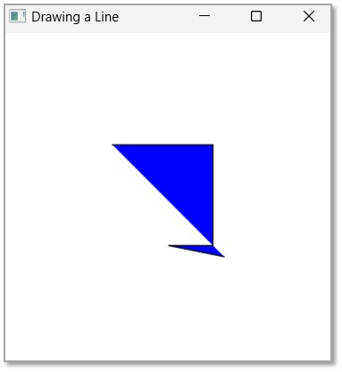

# Java FX

* Tutorial de JavaFX
* [JavaFX - Página de inicio](https://www.tutorialspoint.com/javafx/index.htm)
* [JavaFX - Descripción general](https://www.tutorialspoint.com/javafx/javafx_overview.htm)
* Instalación y arquitectura de JavaFX
* [JavaFX - Entorno](https://www.tutorialspoint.com/javafx/javafx_environment.htm)
* [JavaFX - Instalación mediante Netbeans](https://www.tutorialspoint.com/javafx/javafx_installation_using_netbeans.htm)
* [JavaFX - Instalación mediante Eclipse](https://www.tutorialspoint.com/javafx/javafx_installation_using_eclipse.htm)
* [JavaFX - Instalación mediante Visual Studio Code](https://www.tutorialspoint.com/javafx/javafx_installation_using_visual_studio_code.htm)
* [JavaFX - Arquitectura](https://www.tutorialspoint.com/javafx/javafx_architecture.htm)
* [JavaFX - Aplicación](https://www.tutorialspoint.com/javafx/javafx_application.htm)
* Formas 2D de JavaFX
* [JavaFX - Formas 2D](https://www.tutorialspoint.com/javafx/javafx_2d_shapes.htm)
* [JavaFX - Dibujar una línea](https://www.tutorialspoint.com/javafx/javafx_drawing_line.htm)
* [JavaFX - Cómo dibujar un rectángulo](https://www.tutorialspoint.com/javafx/javafx_drawing_rectangle.htm)
* [JavaFX - Cómo dibujar un rectángulo redondeado](https://www.tutorialspoint.com/javafx/javafx_drawing_rounded_rectangle.htm)
* [JavaFX - Dibujar un círculo](https://www.tutorialspoint.com/javafx/javafx_drawing_circle.htm)
* [JavaFX - Dibujar una elipse](https://www.tutorialspoint.com/javafx/javafx_drawing_ellipse.htm)
* [JavaFX - Dibujar un polígono](https://www.tutorialspoint.com/javafx/javafx_drawing_polygon.htm)
* [JavaFX - Dibujar una polilínea](https://www.tutorialspoint.com/javafx/javafx_drawing_polyline.htm)
* [JavaFX - Cómo dibujar una curva cúbica](https://www.tutorialspoint.com/javafx/javafx_drawing_cubic_curve.htm)
* [JavaFX - Cómo dibujar una curva cuadrática](https://www.tutorialspoint.com/javafx/javafx_drawing_quad_curve.htm)
* [JavaFX - Dibujar un arco](https://www.tutorialspoint.com/javafx/javafx_drawing_arc.htm)
* [JavaFX - Dibujar una ruta SVG](https://www.tutorialspoint.com/javafx/javafx_svgpath.htm)
* Propiedades de objetos 2D en JavaFX
* [JavaFX - Propiedad de tipo de trazo](https://www.tutorialspoint.com/javafx/javafx_stroke_type_property.htm)
* [JavaFX - Propiedad de ancho de trazo](https://www.tutorialspoint.com/javafx/javafx_stroke_width_property.htm)
* [JavaFX - Propiedad de relleno de trazo](https://www.tutorialspoint.com/javafx/javafx_stroke_fill_property.htm)
* [JavaFX - Propiedad de trazo](https://www.tutorialspoint.com/javafx/javafx_stroke_property.htm)
* [JavaFX - Propiedad de unión de líneas de trazo](https://www.tutorialspoint.com/javafx/javafx_stroke_line_join_property.htm)
* [JavaFX - Propiedad de límite de inglete de trazo](https://www.tutorialspoint.com/javafx/javafx_stroke_miter_limit_property.htm)
* [JavaFX - Propiedad de límite de línea de trazo](https://www.tutorialspoint.com/javafx/javafx_stroke_line_cap_property.htm)
* [JavaFX - Propiedad Smooth](https://www.tutorialspoint.com/javafx/javafx_smooth_property.htm)
* Operaciones sobre objetos 2D
* [JavaFX - Operaciones con formas 2D](https://www.tutorialspoint.com/javafx/javafx_operations_on_2d_objects.htm)
* [JavaFX - Operación Unión](https://www.tutorialspoint.com/javafx/javafx_union_operation.htm)
* [JavaFX - Operación de intersección](https://www.tutorialspoint.com/javafx/javafx_intersection_operation.htm)
* [JavaFX - Operación de resta](https://www.tutorialspoint.com/javafx/javafx_subtraction_operation.htm)
* Objetos de ruta de JavaFX
* [JavaFX - Objetos de ruta](https://www.tutorialspoint.com/javafx/javafx_path_objects.htm)
* [JavaFX - Objeto de ruta LineTo](https://www.tutorialspoint.com/javafx/javafx_lineto_path_object.htm)
* [JavaFX - Objeto de ruta HLineTo](https://www.tutorialspoint.com/javafx/javafx_hlineto_path_object.htm)
* [JavaFX - Objeto de ruta VLineTo](https://www.tutorialspoint.com/javafx/javafx_vlineto_path_object.htm)
* [JavaFX - Objeto de ruta QuadCurveTo](https://www.tutorialspoint.com/javafx/javafx_quadcurveto_path_object.htm)
* [JavaFX - Objeto de ruta CubicCurveTo](https://www.tutorialspoint.com/javafx/javafx_cubiccurveto_path_object.htm)
* [JavaFX - Objeto de ruta de ArcTo](https://www.tutorialspoint.com/javafx/javafx_arcto_path_object.htm)
* Color y textura de JavaFX
* [JavaFX - Colores](https://www.tutorialspoint.com/javafx/javafx_colors.htm)
* [JavaFX - Patrón de degradado lineal](https://www.tutorialspoint.com/javafx/javafx_linear_gradient_pattern.htm)
* [JavaFX - Patrón de degradado radial](https://www.tutorialspoint.com/javafx/javafx_radial_gradient_pattern.htm)
* Texto JavaFX
* [JavaFX - Texto](https://www.tutorialspoint.com/javafx/javafx_text.htm)
* Efectos JavaFX
* [JavaFX - Efectos](https://www.tutorialspoint.com/javafx/javafx_effects.htm)
* [JavaFX - Efecto de ajuste de color](https://www.tutorialspoint.com/javafx/javafx_color_adjust_effect.htm)
* [JavaFX - Efecto de entrada de color](https://www.tutorialspoint.com/javafx/javafx_color_input_effect.htm)
* [JavaFX - Efecto de entrada de imagen](https://www.tutorialspoint.com/javafx/javafx_image_input_effect.htm)
* [JavaFX - Efecto de mezcla](https://www.tutorialspoint.com/javafx/javafx_blend_effect.htm)
* [JavaFX - Efecto Bloom](https://www.tutorialspoint.com/javafx/javafx_bloom_effect.htm)
* [JavaFX - Efecto de resplandor](https://www.tutorialspoint.com/javafx/javafx_glow_effect.htm)
* [JavaFX - Efecto de desenfoque de cuadro](https://www.tutorialspoint.com/javafx/javafx_box_blur_effect.htm)
* [JavaFX - Efecto de desenfoque gaussiano](https://www.tutorialspoint.com/javafx/javafx_gaussianblur_effect.htm)
* [JavaFX - Efecto de desenfoque de movimiento](https://www.tutorialspoint.com/javafx/javafx_motionblur_effect.htm)
* [JavaFX - Efecto de reflexión](https://www.tutorialspoint.com/javafx/javafx_reflection_effect.htm)
* [JavaFX - Efecto SepiaTone](https://www.tutorialspoint.com/javafx/javafx_sepiatone_effect.htm)
* [JavaFX - Efecto de sombra](https://www.tutorialspoint.com/javafx/javafx_shadow_effect.htm)
* [JavaFX - Efecto de sombra proyectada](https://www.tutorialspoint.com/javafx/javafx_dropshadow_effect.htm)
* [JavaFX - Efecto de sombra interior](https://www.tutorialspoint.com/javafx/javafx_innershadow_effect.htm)
* [JavaFX - Efecto de iluminación](https://www.tutorialspoint.com/javafx/javafx_lighting_effect.htm)
* [JavaFX - Efecto de luz distante](https://www.tutorialspoint.com/javafx/javafx_light_distant_effect.htm)
* [JavaFX - Efecto de luz puntual](https://www.tutorialspoint.com/javafx/javafx_light_spot_effect.htm)
* [JavaFX - Efecto punto-punto](https://www.tutorialspoint.com/javafx/javafx_point_spot_effect.htm)
* [JavaFX - Mapa de desplazamiento](https://www.tutorialspoint.com/javafx/javafx_displacementmap.htm)
* [JavaFX - Transformación de perspectiva](https://www.tutorialspoint.com/javafx/javafx_perspectivetransform.htm)
* Transformaciones JavaFX
* [JavaFX - Transformaciones](https://www.tutorialspoint.com/javafx/javafx_transformations.htm)
* [JavaFX - Transformación de rotación](https://www.tutorialspoint.com/javafx/javafx_rotation_transformation.htm)
* [JavaFX - Transformación de escalado](https://www.tutorialspoint.com/javafx/javafx_scaling_transformation.htm)
* [JavaFX - Transformación de traducción](https://www.tutorialspoint.com/javafx/javafx_translation_transformation.htm)
* [JavaFX - Transformación de corte](https://www.tutorialspoint.com/javafx/javafx_shearing_transformation.htm)
* Animaciones JavaFX
* [JavaFX - Animaciones](https://www.tutorialspoint.com/javafx/javafx_animations.htm)
* [JavaFX - Transición de rotación](https://www.tutorialspoint.com/javafx/javafx_rotate_transition.htm)
* [JavaFX - Transición de escala](https://www.tutorialspoint.com/javafx/javafx_scale_transition.htm)
* [JavaFX - Transición de traducción](https://www.tutorialspoint.com/javafx/javafx_translate_transition.htm)
* [JavaFX - Transición de desvanecimiento](https://www.tutorialspoint.com/javafx/javafx_fade_transition.htm)
* [JavaFX - Rellenar transición](https://www.tutorialspoint.com/javafx/javafx_fill_transition.htm)
* [JavaFX - Transición de trazo](https://www.tutorialspoint.com/javafx/javafx_stroke_transition.htm)
* [JavaFX - Transición secuencial](https://www.tutorialspoint.com/javafx/javafx_sequential_transition.htm)
* [JavaFX - Transición paralela](https://www.tutorialspoint.com/javafx/javafx_parallel_transition.htm)
* [JavaFX - Pausa la transición](https://www.tutorialspoint.com/javafx/javafx_pause_transition.htm)
* [JavaFX - Transición de ruta](https://www.tutorialspoint.com/javafx/javafx_path_transition.htm)
* Imágenes de JavaFX
* [JavaFX - Imágenes](https://www.tutorialspoint.com/javafx/javafx_images.htm)
* Formas 3D de JavaFX
* [JavaFX - Formas 3D](https://www.tutorialspoint.com/javafx/javafx_3d_shapes.htm)
* [JavaFX - Creación de un cuadro](https://www.tutorialspoint.com/javafx/javafx_creating_box.htm)
* [JavaFX - Creación de un cilindro](https://www.tutorialspoint.com/javafx/javafx_creating_cylinder.htm)
* [JavaFX - Creando una esfera](https://www.tutorialspoint.com/javafx/javafx_creating_sphere.htm)
* Propiedades de los objetos 3D
* [JavaFX - Propiedad Cull Face](https://www.tutorialspoint.com/javafx/javafx_cull_face_property.htm)
* [JavaFX - Propiedad de modos de dibujo](https://www.tutorialspoint.com/javafx/javafx_drawing_modes_property.htm)
* [JavaFX - Propiedad del material](https://www.tutorialspoint.com/javafx/javafx_material_property.htm)
* Manejo de eventos de JavaFX
* [JavaFX - Manejo de eventos](https://www.tutorialspoint.com/javafx/javafx_event_handling.htm)
* [JavaFX - Uso de métodos de conveniencia](https://www.tutorialspoint.com/javafx/javafx_using_convenience_methods.htm)
* [JavaFX - Filtros de eventos](https://www.tutorialspoint.com/javafx/javafx_event_filters.htm)
* [JavaFX - Controladores de eventos](https://www.tutorialspoint.com/javafx/javafx_event_handlers.htm)
* Controles de interfaz de usuario de JavaFX
* [JavaFX - Controles de interfaz de usuario](https://www.tutorialspoint.com/javafx/javafx_ui_controls.htm)
* [JavaFX - Vista de lista](https://www.tutorialspoint.com/javafx/javafx_listview.htm)
* [JavaFX - Acordeón](https://www.tutorialspoint.com/javafx/javafx_accordion.htm)
* [JavaFX - Barra de botones](https://www.tutorialspoint.com/javafx/javafx_buttonbar.htm)
* [JavaFX - Cuadro de selección](https://www.tutorialspoint.com/javafx/javafx_choicebox.htm)
* [JavaFX - Editor HTML](https://www.tutorialspoint.com/javafx/javafx_htmleditor.htm)
* [JavaFX - Barra de menú](https://www.tutorialspoint.com/javafx/javafx_menubar.htm)
* [JavaFX - Paginación](https://www.tutorialspoint.com/javafx/javafx_pagination.htm)
* [JavaFX - Indicador de progreso](https://www.tutorialspoint.com/javafx/javafx_progressindicator.htm)
* [JavaFX - Panel de desplazamiento](https://www.tutorialspoint.com/javafx/javafx_scrollpane.htm)
* [JavaFX - Separador](https://www.tutorialspoint.com/javafx/javafx_separator.htm)
* [JavaFX - Control deslizante](https://www.tutorialspoint.com/javafx/javafx_slider.htm)
* [JavaFX - Spinner](https://www.tutorialspoint.com/javafx/javafx_spinner.htm)
* [JavaFX - Panel dividido](https://www.tutorialspoint.com/javafx/javafx_splitpane.htm)
* [JavaFX - Vista de tabla](https://www.tutorialspoint.com/javafx/javafx_tableview.htm)
* [JavaFX - Panel de pestañas](https://www.tutorialspoint.com/javafx/javafx_tabpane.htm)
* [JavaFX - Barra de herramientas](https://www.tutorialspoint.com/javafx/javafx_toolbar.htm)
* [JavaFX - Vista de árbol](https://www.tutorialspoint.com/javafx/javafx_treeview.htm)
* [JavaFX - Etiqueta](https://www.tutorialspoint.com/javafx/javafx_label.htm)
* [JavaFX - Casilla de verificación](https://www.tutorialspoint.com/javafx/javafx_checkbox.htm)
* [JavaFX - Botón de opción](https://www.tutorialspoint.com/javafx/javafx_radiobutton.htm)
* [JavaFX - Campo de texto](https://www.tutorialspoint.com/javafx/javafx_textfield.htm)
* [JavaFX - Campo de contraseña](https://www.tutorialspoint.com/javafx/javafx_passwordfield.htm)
* [JavaFX - Selector de archivos](https://www.tutorialspoint.com/javafx/javafx_filechooser.htm)
* [JavaFX - Hipervínculo](https://www.tutorialspoint.com/javafx/javafx_hyperlink.htm)
* [JavaFX - Información sobre herramientas](https://www.tutorialspoint.com/javafx/javafx_tooltip.htm)
* [JavaFX - Alert](https://www.tutorialspoint.com/javafx/javafx_alert.htm)
* [JavaFX - Selector de fechas](https://www.tutorialspoint.com/javafx/javafx_datepicker.htm)
* [JavaFX - Área de texto](https://www.tutorialspoint.com/javafx/javafx_textarea.htm)
* Gráficos de JavaFX
* [JavaFX - Gráficos](https://www.tutorialspoint.com/javafx/javafx_charts.htm)
* [JavaFX - Creación de un gráfico circular](https://www.tutorialspoint.com/javafx/javafx_creating_pie_chart.htm)
* [JavaFX - Creación de un gráfico de líneas](https://www.tutorialspoint.com/javafx/javafx_creating_line_chart.htm)
* [JavaFX - Creación de un gráfico de áreas](https://www.tutorialspoint.com/javafx/javafx_creating_area_chart.htm)
* [JavaFX - Creación de un gráfico de barras](https://www.tutorialspoint.com/javafx/javafx_creating_bar_chart.htm)
* [JavaFX - Creación de un gráfico de burbujas](https://www.tutorialspoint.com/javafx/javafx_creating_bubble_chart.htm)
* [JavaFX - Creación de un gráfico de dispersión](https://www.tutorialspoint.com/javafx/javafx_creating_scatter_chart.htm)
* [JavaFX - Creación de un gráfico de áreas apiladas](https://www.tutorialspoint.com/javafx/javafx_creating_stacked_chart.htm)
* [JavaFX - Creación de un gráfico de barras apiladas](https://www.tutorialspoint.com/javafx/javafx_creating_stacked_bar_chart.htm)
* Paneles de diseño de JavaFX
* [JavaFX - Paneles de diseño](https://www.tutorialspoint.com/javafx/javafx_layout_panes.htm)
* [JavaFX - Diseño de HBox](https://www.tutorialspoint.com/javafx/javafx_hbox_layout.htm)
* [JavaFX - Diseño de VBox](https://www.tutorialspoint.com/javafx/javafx_vbox_layout.htm)
* [JavaFX - Diseño de BorderPane](https://www.tutorialspoint.com/javafx/javafx_borderpane_layout.htm)
* [JavaFX - Diseño de StackPane](https://www.tutorialspoint.com/javafx/javafx_stackpane_layout.htm)
* [JavaFX - Diseño de flujo de texto](https://www.tutorialspoint.com/javafx/javafx_textflow_layout.htm)
* [JavaFX - Diseño de AnchorPane](https://www.tutorialspoint.com/javafx/javafx_anchorpane_layout.htm)
* [JavaFX - Diseño de TilePane](https://www.tutorialspoint.com/javafx/javafx_tilepane_layout.htm)
* [JavaFX - Diseño de GridPane](https://www.tutorialspoint.com/javafx/javafx_gridpane_layout.htm)
* [JavaFX - Diseño de FlowPane](https://www.tutorialspoint.com/javafx/javafx_flowpane_layout.htm)
* CSS de JavaFX
* [JavaFX-CSS](https://www.tutorialspoint.com/javafx/javafx_css.htm)
* Medios con JavaFX
* [JavaFX - Manejo de medios](https://www.tutorialspoint.com/javafx/javafx_handling_media.htm)
* [JavaFX - Reproducción de vídeo](https://www.tutorialspoint.com/javafx/javafx_playing_video.htm)

### Tutorial de JavaFX <a href="#introduction" id="introduction"></a>

JavaFX es una biblioteca Java que se utiliza para crear aplicaciones de Internet enriquecidas. Las aplicaciones escritas con esta biblioteca pueden ejecutarse de forma uniforme en varias plataformas. Las aplicaciones desarrolladas con JavaFX pueden ejecutarse en varios dispositivos, como computadoras de escritorio, teléfonos móviles, televisores, tabletas, etc.

Para desarrollar aplicaciones GUI con el lenguaje de programación Java, los programadores se apoyan en bibliotecas como Advanced Windowing Tool Kit y Swing . Después de la llegada de JavaFX, estos programadores Java ahora pueden desarrollar aplicaciones GUI de manera eficaz con contenido enriquecido.

Nuestro tutorial de JavaFX le ayuda a aprender JavaFX en pasos sencillos y fáciles para que pueda comenzar a crear la interfaz de usuario de su aplicación rápidamente. Abarca todos los elementos de interfaz de usuario necesarios de JavaFX para una comprensión básica y avanzada de JavaFX y para tener una idea de cómo funciona JavaFX.

### Controles de interfaz de usuario básicos de JavaFX <a href="#javafx_ui_controls" id="javafx_ui_controls"></a>

JavaFx ofrece una variedad de controles de interfaz de usuario que permiten una interacción fluida entre los usuarios y las aplicaciones. Estos controles se enumeran a continuación:

| N.º S.      | Control y descripción                                                                                                                                |
| ----------- | ---------------------------------------------------------------------------------------------------------------------------------------------------- |
| 1 Label     | <p>Etiqueta</p><p>Es un componente para mostrar texto.</p>                                                                                           |
| 2 Button    | <p>Botón</p><p>Es una clase utilizada para crear botones.</p>                                                                                        |
| 3 Menu      | <p>Menú</p><p>Contiene una lista de comandos u opciones.</p>                                                                                         |
| 4 ToolTip   | <p>Información sobre herramientas</p><p>Una ventana emergente que muestra información adicional sobre otros elementos de la interfaz de usuario.</p> |
| 5 TextField | <p>Campo de texto</p><p>Acepta y muestra la entrada del usuario.</p>                                                                                 |

### Formas JavaFX <a href="#javafx_shapes" id="javafx_shapes"></a>

Las formas son figuras geométricas que se pueden dibujar en el plano XY o XYZ. Las que se construyen en el plano XY se denominan formas 2D, mientras que las que se dibujan en el plano XYZ se denominan formas 3D. JavaFx proporciona varias clases predefinidas que representan diferentes tipos de formas. Estas clases son las siguientes:

| N.º S.      | Clase y descripción                                                                                                                                                                       |
| ----------- | ----------------------------------------------------------------------------------------------------------------------------------------------------------------------------------------- |
| 1 Line      | <p>Línea</p><p>Es una clase que representa una línea. En general, una línea es una forma geométrica bidimensional formada por dos puntos.</p>                                             |
| 2 Rectangle | <p>Rectángulo</p><p>Es una clase que se utiliza para crear una forma rectangular en 2D. En términos matemáticos, un rectángulo es un polígono de cuatro lados.</p>                        |
| 3 Box       | <p>Caja</p><p>Esta clase JavaFX representa una forma tridimensional que tiene largo, ancho y alto.</p>                                                                                    |
| 4 Cylinder  | <p>Cilindro</p><p>Es una clase JavaFX que se utiliza para crear un cilindro. En general, un cilindro es una figura sólida cerrada que tiene dos propiedades, a saber, radio y altura.</p> |

### Efectos JavaFX <a href="#javafx_effects" id="javafx_effects"></a>

En JavaFx, se utilizan efectos para mejorar la apariencia visual de los nodos. La lista de efectos utilizados en JavaFx es la siguiente:

| N.º S.        | Efecto y descripción                                                                                         |
| ------------- | ------------------------------------------------------------------------------------------------------------ |
| 1 ColorAdjust | <p>Ajuste de color</p><p>Se utiliza para aplicar efectos de color a los nodos JavaFx.</p>                    |
| 2 Blend       | <p>Mezcla</p><p>En este efecto, combinamos dos o más elementos para realzar lo visual.</p>                   |
| 3 Bloom       | <p>Floración</p><p>Cuando aplicamos este efecto a cualquier nodo JavaFx, una parte de ese nodo brillará.</p> |
| 4 Reflection  | <p>Reflexión</p><p>Este efecto agregará un reflejo en la parte inferior del nodo.</p>                        |

### Animaciones JavaFX <a href="#javafx_animations" id="javafx_animations"></a>

Generalmente, las animaciones se utilizan para crear efectos visuales especiales para elementos como imágenes, texto, dibujos, etc. Las animaciones más utilizadas en JavaFx se enumeran a continuación:

| N.º S.              | Animación y descripción                                                                                                       |
| ------------------- | ----------------------------------------------------------------------------------------------------------------------------- |
| 1 Rotate Transition | <p>Transición de rotación</p><p>Se utiliza para tratar la posición de un objeto conservando su forma y propiedades.</p>       |
| 2 Fade Transition   | <p>Transición de desvanecimiento</p><p>Este tipo de animación se realiza cambiando la propiedad de opacidad de los nodos.</p> |
| 3 Stroke Transition | <p>Transición de accidente cerebrovascular</p><p>Se aplica para cambiar el color del trazo de una forma determinada.</p>      |
| 4 Scale Transition  | <p>Transición de escala</p><p>Es un tipo de animación en la que aumentamos o disminuimos el tamaño de un objeto.</p>          |

### Ventajas de JavaFX <a href="#javafx_advantages" id="javafx_advantages"></a>

JavaFX ofrece muchas ventajas sobre otros frameworks de interfaz de usuario, como Swing o AWT. Algunas de estas ventajas son las siguientes:

* JavaFX admite una sintaxis declarativa para definir componentes de UI, denominada FXML , que los diseñadores o desarrolladores pueden editar fácilmente.
* Admite CSS para diseñar y animar elementos de la interfaz de usuario, lo que proporciona más flexibilidad y control sobre la apariencia de la aplicación.
* Nos permite utilizar una amplia gama de formatos multimedia, como imágenes, audio, vídeo y gráficos 3D, que pueden integrarse perfectamente en la interfaz de usuario.
* Dado que es una tecnología basada en Java, también tiene soporte integrado para simultaneidad y subprocesamiento múltiple, lo que permite que la aplicación gestione tareas complejas sin bloquear el subproceso de la interfaz de usuario.
* JavaFX también admite enlaces y propiedades, lo que simplifica la comunicación entre la interfaz de usuario y la lógica empresarial.

### ¿Por qué aprender JavaFX? <a href="#why_javafx" id="why_javafx"></a>

JavaFX es un marco multiplataforma y portátil que permite a los desarrolladores escribir una aplicación una vez y ejecutarla en cualquier plataforma que admita Java. Simplifica el desarrollo de la interfaz de usuario con su sintaxis declarativa, FXML y un amplio conjunto de bibliotecas.

Podemos personalizar una aplicación JavaFX mediante CSS. Además, admite la creación de efectos de interfaz de usuario dinámicos. Como proyecto de código abierto, JavaFX es desarrollado y mantenido activamente por Oracle y la enorme comunidad Java.

JavaFX es bastante fácil de aprender, por lo que si estás empezando a aprender a desarrollar la interfaz de usuario de una aplicación, es muy recomendable que también te familiarices con JavaFX.

### ¿Quién debería aprender JavaFX? <a href="#audience" id="audience"></a>

Este tutorial de JavaFX ayudará tanto a estudiantes como a profesionales que deseen desarrollar aplicaciones de Internet enriquecidas. Recomendamos leer este tutorial en el orden indicado en el menú del lado izquierdo. Este tutorial ha sido preparado para cubrir temas desde el nivel principiante hasta el avanzado.

### Prerrequisitos para aprender JavaFX <a href="#prerequisites" id="prerequisites"></a>

Si bien hemos hecho todo lo posible para preparar este tutorial de JavaFX de una manera sencilla y fácil, antes de comenzar a aprender los conceptos de JavaFX dados en este tutorial, se supone que los lectores tienen un conocimiento previo del lenguaje de programación Java.

Este tutorial le brindará una comprensión suficiente de los diversos conceptos de JavaFX junto con ejemplos adecuados para que pueda comenzar su viaje de desarrollo de interfaz de usuario inmediatamente después de finalizar este tutorial.

### Empleos y oportunidades en JavaFX <a href="#javafx_jobs" id="javafx_jobs"></a>

Los profesionales capacitados en JavaFX tienen una gran demanda a medida que crece la necesidad de desarrollar interfaces de usuario ricas e interactivas. Muchas empresas líderes están contratando profesionales de TI con un sólido conocimiento de JavaFX.

El salario anual promedio de un profesional de JavaFX es de entre 3 y 6 L, aunque puede variar según su ubicación y experiencia. Si ha desarrollado habilidades en JavaFX, puede postularse para varios puestos de trabajo, como desarrollador front-end, desarrollador de UI, desarrollador web Java, ingeniero de software y muchos más. Puede intentar buscar trabajos de JavaFX en las siguientes empresas:

* Google
* Amazonas
* JP Morgan
* Sistemas de información
* TCS
* Tecnología Mahindra
* Wipro
* Consultoría Infinizi Pvt Ltd
* Tecnologías Cogniter
* Soluciones Truechip
* Muchos más...

Por lo tanto, usted podría ser el próximo empleado potencial de cualquiera de estas importantes empresas. Hemos desarrollado un excelente material de aprendizaje para JavaFX que lo ayudará a prepararse para las entrevistas técnicas y los exámenes de certificación basados ​​en JavaFX. Por lo tanto, comience a aprender JavaFX con nuestro sencillo y efectivo tutorial en cualquier lugar y en cualquier momento, absolutamente a su ritmo.

## JavaFX - Descripción general

***

***

Las aplicaciones de Internet enriquecidas son aquellas aplicaciones web que ofrecen características y una experiencia similares a las de las aplicaciones de escritorio. Ofrecen a los usuarios una mejor experiencia visual en comparación con las aplicaciones web normales. Estas aplicaciones se entregan como complementos del navegador o como una máquina virtual y se utilizan para transformar las aplicaciones estáticas tradicionales en aplicaciones más mejoradas, fluidas, animadas y atractivas.

A diferencia de las aplicaciones de escritorio tradicionales, las RIA no requieren ningún software adicional para funcionar. Como alternativa, debe instalar software como ActiveX, Java, Flash, según la aplicación.

En una RIA, la presentación gráfica se maneja en el lado del cliente, ya que cuenta con un complemento que brinda soporte para gráficos enriquecidos. En pocas palabras, la manipulación de datos en una RIA se lleva a cabo en el lado del servidor, mientras que la manipulación de objetos relacionados se lleva a cabo en el lado del cliente.

Contamos con tres tecnologías principales que nos permiten desarrollar un RIA. Estas incluyen las siguientes:

* Adobe Flash
* Microsoft Silverlight
* JavaFX

### Adobe Flash

Esta plataforma de software está desarrollada por Adobe Systems y se utiliza para crear aplicaciones de Internet enriquecidas. Además de estas, también se pueden crear otras aplicaciones, como aplicaciones vectoriales, de animación, juegos de navegador, aplicaciones de escritorio, aplicaciones y juegos móviles, etc.

Esta es la plataforma más utilizada para desarrollar y ejecutar RIA, con una tasa de penetración en el navegador de escritorio del 96 %.

### Microsoft Silverlight

Al igual que Adobe Flash, Microsoft Silverlight también es un marco de aplicación de software para desarrollar y ejecutar aplicaciones de Internet enriquecidas. Inicialmente, este marco se utilizó para la transmisión de contenido multimedia. Las versiones actuales también admiten contenido multimedia, gráficos y animación.

Esta plataforma rara vez se utiliza con una tasa de penetración del navegador de escritorio del 66%.

### JavaFX

JavaFX es una biblioteca Java con la que se pueden desarrollar aplicaciones de Internet enriquecidas. Al utilizar la tecnología Java, estas aplicaciones tienen una tasa de penetración en navegadores del 76%.

### ¿Qué es JavaFX?

JavaFX es una biblioteca Java que se utiliza para crear aplicaciones de Internet enriquecidas. Las aplicaciones escritas con esta biblioteca pueden ejecutarse de forma uniforme en varias plataformas. Las aplicaciones desarrolladas con JavaFX pueden ejecutarse en varios dispositivos, como computadoras de escritorio, teléfonos móviles, televisores, tabletas, etc.

Para desarrollar aplicaciones GUI con el lenguaje de programación Java, los programadores se apoyan en bibliotecas como Advanced Windowing Toolkit y Swing . Después de la llegada de JavaFX, estos programadores Java ahora pueden desarrollar aplicaciones GUI de manera eficaz con contenido enriquecido.

### Necesidad de JavaFX

Para desarrollar aplicaciones del lado del cliente con funciones avanzadas, los programadores solían depender de varias bibliotecas para agregar funciones como multimedia, controles de interfaz de usuario, web, 2D y 3D, etc. JavaFX incluye todas estas funciones en una sola biblioteca. Además de esto, los desarrolladores también pueden acceder a las funciones existentes de una biblioteca Java como Swing .

JavaFX ofrece un amplio conjunto de API de gráficos y multimedia y aprovecha la moderna unidad de procesamiento gráfico a través de gráficos acelerados por hardware. JavaFX también ofrece interfaces mediante las cuales los desarrolladores pueden combinar la animación de gráficos y el control de la interfaz de usuario.

Se puede utilizar JavaFX con tecnologías basadas en JVM como Java, Groovy y JRuby. Si los desarrolladores optan por JavaFX, no es necesario aprender tecnologías adicionales, ya que el conocimiento previo de cualquiera de las tecnologías mencionadas anteriormente será suficiente para desarrollar RIA utilizando JavaFX.

### Características de JavaFX

A continuación se presentan algunas de las características importantes de JavaFX:

* Escrito en Java : la biblioteca JavaFX está escrita en Java y está disponible para los lenguajes que se pueden ejecutar en una JVM, entre los que se incluyen Java, Groovy y JRuby . Estas aplicaciones JavaFX también son independientes de la plataforma.
* FXML : JavaFX cuenta con un lenguaje conocido como FXML, que es un lenguaje de marcado declarativo similar a HTML. El único propósito de este lenguaje es definir una interfaz de usuario.
* Scene Builder : JavaFX ofrece una aplicación llamada Scene Builder. Al integrar esta aplicación en entornos de desarrollo integrados (IDE) como Eclipse y NetBeans, los usuarios pueden acceder a una interfaz de diseño de arrastrar y soltar, que se utiliza para desarrollar aplicaciones FXML (como Swing Drag & Drop y DreamWeaver Applications).
* Interoperabilidad con Swing : en una aplicación JavaFX, puede incorporar contenido Swing mediante la clase Swing Node . De manera similar, puede actualizar las aplicaciones Swing existentes con funciones JavaFX, como contenido web incorporado y medios gráficos enriquecidos.
* Controles de UI integrados : la biblioteca JavaFX proporciona controles de UI con los que podemos desarrollar una aplicación con todas las funciones.
* Estilo similar a CSS : JavaFX ofrece un estilo similar a CSS. Al usarlo, puede mejorar el diseño de su aplicación con un conocimiento básico de CSS.
* API de Canvas e impresión : JavaFX ofrece Canvas, un estilo de API de renderizado de modo inmediato. Dentro del paquete javafx.scene.canvas se incluye un conjunto de clases para Canvas, con las que podemos dibujar directamente dentro de un área de la escena de JavaFX. JavaFX también ofrece clases para fines de impresión en el paquete javafx.print .
* Amplio conjunto de API : la biblioteca JavaFX ofrece un amplio conjunto de API para desarrollar aplicaciones GUI, gráficos 2D y 3D, etc. Este conjunto de API también incluye capacidades de la plataforma Java. Por lo tanto, al utilizar esta API, puede acceder a las funciones de los lenguajes Java, como genéricos, anotaciones, subprocesamiento múltiple y expresiones Lambda. La biblioteca tradicional de colecciones de Java se mejoró y se incluyeron en ella conceptos como listas y mapas observables. Al utilizarlos, los usuarios pueden observar los cambios en los modelos de datos.
* Biblioteca de gráficos integrada : JavaFX proporciona clases para gráficos 2D y 3D .
* Canal de gráficos : JavaFX admite gráficos basados ​​en el canal de gráficos acelerado por hardware conocido como Prism. Cuando se utiliza con una tarjeta gráfica o GPU compatible, ofrece gráficos fluidos. En caso de que el sistema no admita una tarjeta gráfica, Prism utiliza de forma predeterminada la pila de renderizado de software.

### Historia de JavaFX

JavaFX fue desarrollado originalmente por Chris Oliver , cuando trabajaba para una empresa llamada See Beyond Technology Corporation , que luego fue adquirida por Sun Microsystems en el año 2005.

Los siguientes puntos nos brindan más información sobre este proyecto:

* Inicialmente, este proyecto se denominó F3 (Form Follows Functions) y se desarrolló con la intención de proporcionar interfaces más ricas para desarrollar aplicaciones GUI.
* Sun Microsystems adquirió la empresa See Beyond en junio de 2005 y adaptó el proyecto F3 como JavaFX .
* En el año 2007, JavaFX se anunció oficialmente en Java One , una conferencia web mundial que se celebra anualmente.
* En el año 2008, Net Beans integrado con JavaFX estaba disponible. Ese mismo año, se lanzó el Java Standard Development Kit para JavaFX 1.0.
* En el año 2009, Oracle Corporation adquirió Sun Microsystems y ese mismo año también se lanzó la siguiente versión de JavaFX (1.2).
* En el año 2010, salió JavaFX 1.3 y en el año 2011 se lanzó JavaFX 2.0.
* La versión JavaFX8 se lanzó como parte integral de Java el 18 de marzo de 2014, después del aumento de versión.
* Las características de JavaFX 9 se centraron en extraer API privadas útiles del código JavaFX para hacer que estas API sean públicas.
* Oracle anunció que dejará de enviar JavaFX con JDK 11 y versiones posteriores.
* JavaFX 11 se envió por primera vez en septiembre de 2018.
* JavaFX 12 se envió por primera vez en marzo de 2019, JavaFX 13 en septiembre de 2019.
* JavaFX 14 se lanzó en marzo de 2020 y la versión 15 se lanzó en septiembre de 2020.
* JavaFX 16 se lanzó en marzo de 2021 y la versión 17 se lanzó en septiembre de 2021.
* JavaFX 18 se lanzó en marzo de 2022 y la versión 19 se lanzó en septiembre de 2022.
* La última versión, JavaFX 20, se lanzará en marzo de 2023.

## JavaFX - Entorno

***

***

A partir de Java8, el JDK (Java Development Kit) incluye la biblioteca JavaFX . Por lo tanto, para ejecutar aplicaciones JavaFX, simplemente es necesario instalar Java8 o una versión posterior en el sistema.

La última versión de JDK, a día de hoy, es la 20.0.1. Por lo tanto, este tutorial funcionará con las versiones de JavaFX compatibles con JDK20.

Además, los IDE como Eclipse y NetBeans brindan soporte para JavaFX. Este capítulo le enseña cómo configurar el entorno para ejecutar aplicaciones JavaFX localmente .

### Instalación de Java20

En primer lugar, tendrás que verificar si hay Java instalado en tu sistema o no abriendo el símbolo del sistema y escribiendo el comando “Java” en él.

Si no ha instalado Java en su sistema, el símbolo del sistema muestra el mensaje que se muestra en la siguiente captura de pantalla.

<figure><figcaption></figcaption></figure>

Puede instalar Java siguiendo los pasos que se indican a continuación.

Paso 1 : visite la página [de descargas de JavaSE , haga clic en el botón ](https://www.oracle.com/java/technologies/downloads/)Descargar JDK como se resalta en la siguiente captura de pantalla

<figure><figcaption></figcaption></figure>

Paso 2 : Al hacer clic en el enlace resaltado, se descargará en su sistema el Kit de desarrollo Java20 adecuado para el sistema operativo Windows de 64 bits.

Paso 3 − Ejecute el archivo ejecutable binario descargado para iniciar la instalación de JDK20.

<figure><figcaption></figcaption></figure>

Paso 4 − Cambie el directorio de instalación si es necesario, de lo contrario mantenga los predeterminados y continúe.

<figure><figcaption></figcaption></figure>

Paso 5 − Al seleccionar la carpeta de destino y hacer clic en Siguiente, el proceso de instalación de JavaFX comienza a mostrar la barra de progreso.

<figure><figcaption></figcaption></figure>

Paso 6 − Finalice el proceso de instalación haciendo clic en el botón Cerrar como se muestra en la siguiente captura de pantalla.

<figure><figcaption></figcaption></figure>

Paso 7 − Para verificar si la instalación se realizó correctamente, vaya al símbolo del sistema y ejecute el comando 'java -version' como se muestra a continuación −

<figure><figcaption></figcaption></figure>

### Configuración de la ruta para Windows

Después de instalar Java, debe configurar las variables de ruta. Supongamos que ha instalado Java en el directorio C:\Program Files\java\jdk-20 .

Ahora puedes seguir los pasos que se detallan a continuación:

* Haga clic derecho en “Mi PC/Esta PC” y seleccione “Propiedades”.
* Luego, seleccione “Configuración avanzada del sistema”.
* Haga clic en el botón “Variables de entorno” en la pestaña “Avanzado”.
* Ahora, modifique la variable 'Path' para que también contenga la ruta al ejecutable de Java. Por ejemplo, si la ruta está establecida actualmente en 'C:\WINDOWS\SYSTEM32', cambie la ruta para que diga 'C:\WINDOWS\SYSTEM32; C:\Program Files\java\jdk-20\bin'.

<figure><figcaption></figcaption></figure>

Además, cree una nueva variable del sistema haciendo clic en “Nuevo” en Variables del sistema como se muestra a continuación.

<figure><figcaption></figcaption></figure>

Nombra la nueva variable como "JAVA\_HOME" y apúntala al directorio de instalación del JDK.

<figure><figcaption></figcaption></figure>

### Instalación del SDK de JavaFX

Ahora, debe instalar el SDK de JavaFX para acceder a las herramientas y tecnologías de la línea de comandos para desarrollar el contenido de la aplicación.

Para utilizar el SDK de JavaFX para ejecutar un programa, siga los pasos que se indican a continuación:

Paso 1 : Descargue un entorno de ejecución de JavaFX apropiado para su sistema operativo (aquí, estamos descargando JavaFX 20) desde la página [JavaFX - Gluon](https://gluonhq.com/products/javafx/) .

<figure><figcaption></figcaption></figure>

Paso 2 : se descargará una carpeta .zip que contiene las herramientas necesarias para desarrollar contenido para las aplicaciones. Descomprima esta carpeta en la ubicación que desee (por ejemplo, "C:/JavaFX").

Paso 3 : ahora, haz clic derecho en "Mi PC/Esta PC" y selecciona "Propiedades". Luego, selecciona "Configuración avanzada del sistema". Haz clic en el botón "Variables de entorno" en la pestaña "Avanzado". Crea una nueva variable de entorno y nómbrala "PATH\_TO\_FX" que apunte al directorio _lib_ del entorno de ejecución de JavaFX.

<figure><figcaption></figcaption></figure>

Esto ahora le permitirá compilar y ejecutar aplicaciones JavaFX desde la línea de comandos utilizando el entorno de ejecución JavaFX descargado.

## JavaFX - Instalación mediante Netbeans

***

***

Apache Netbeans es un entorno de desarrollo integrado (IDE) gratuito y de código abierto para desarrollar aplicaciones utilizando Java. Además, permite crear aplicaciones utilizando JavaFX.

En este capítulo se muestra cómo crear una aplicación JavaFX en Netbeans. Instalaremos las últimas versiones de JavaFX SDK y Apache Netbeans.

### Configuración del entorno NetBeans de JavaFX

NetBeans18 ofrece compatibilidad integrada con JavaFX. Al instalarlo, puede crear una aplicación JavaFX sin complementos adicionales ni archivos JAR. Para configurar el entorno NetBeans, deberá seguir los pasos que se indican a continuación.

Paso 1 : Visite el sitio web [de NetBeans](https://netbeans.org/) y haga clic en el botón Descargar para descargar el software de NetBeans.

<figure><figcaption></figcaption></figure>

Paso 2 : al hacer clic en este botón, se descargará en su sistema un archivo llamado Apache-NetBeans-18-bin-windows-x64.exe . Ejecute este archivo para instalarlo. Al ejecutar este archivo, se iniciará un instalador de NetBeans como se muestra en la siguiente captura de pantalla.

Una vez completada la configuración, verá la página de bienvenida del instalador .

Paso 3 − Haga clic en el botón Siguiente y continúe con la instalación.

<figure><figcaption></figcaption></figure>

Paso 4 : La siguiente ventana contiene el contrato de licencia de NETBEANS IDE 18. Léalo detenidamente y acéptelo marcando la casilla “Acepto los términos del contrato de licencia” y luego haga clic en el botón Siguiente .

<figure><figcaption></figcaption></figure>

Paso 5 : Elija el directorio de destino donde desea instalar Netbeans 18. Además, también puede buscar en el directorio donde está instalado Java Development Kit en su sistema y hacer clic en el botón Siguiente .

<figure><figcaption></figcaption></figure>

Paso 6 − Marque la casilla Buscar actualizaciones para obtener actualizaciones automáticas y haga clic en el botón Instalar para iniciar la instalación.

<figure><figcaption></figcaption></figure>

Paso 7 − Luego, el asistente comenzará a preparar los datos de instalación.

Paso 8 : Este paso inicia la instalación de NetBeans IDE 18 y puede demorar un tiempo.

Paso 9 − Una vez completado el proceso, haga clic en el botón Finalizar para finalizar la instalación.

<figure><figcaption></figcaption></figure>

Paso 10 : Una vez que inicie el IDE de NetBeans, verá la página de inicio como se muestra en la siguiente captura de pantalla.

<figure><figcaption></figcaption></figure>

Paso 11 − En el menú Archivo, seleccione Nuevo Proyecto … para abrir el asistente Nuevo Proyecto como se muestra en la siguiente captura de pantalla.

<figure><figcaption></figcaption></figure>

Paso 12 : en el asistente Nuevo proyecto , seleccione Java con Ant y haga clic en Siguiente . Se iniciará la creación de una nueva aplicación Java.

<figure><figcaption></figcaption></figure>

Paso 13 : seleccione el nombre del proyecto y la ubicación del mismo en la ventana Nueva aplicación Java y luego haga clic en Finalizar . Se creará una aplicación de muestra con el nombre indicado.

<figure><figcaption></figcaption></figure>

En este caso, se crea una aplicación con el nombre SampleJavaApplication . Dentro de esta aplicación, el IDE de NetBeans generará un programa Java con el nombre SampleJavaApplication.java . Como se muestra en la siguiente captura de pantalla, este programa se creará dentro de NetBeans Source Packages → samplejavaapplication .

<figure><figcaption></figcaption></figure>

Paso 14 − Haga clic derecho en el archivo y seleccione Ejecutar proyecto para ejecutar este código como se muestra en la siguiente captura de pantalla.

<figure><figcaption></figcaption></figure>

Este programa creado automáticamente contiene el código que genera una ventana JavaFX simple que tiene un botón con la etiqueta "Di 'Hola mundo'" . Cada vez que haga clic en este botón, la cadena "Hola mundo" se mostrará en la consola como se muestra a continuación.

<figure><figcaption></figcaption></figure>

Nota : Aprenderemos sobre el código en próximos capítulos.

## JavaFX - Instalación mediante Eclipse

***

***

Eclipse es un entorno de desarrollo integrado (IDE) utilizado en la programación Java. Contiene un espacio de trabajo y un sistema de complementos extensibles para personalizar el entorno. También puedes utilizar JavaFX con Eclipse.

En este capítulo se explican los pasos para crear una aplicación JavaFX en Eclipse IDE. Utilizaremos las últimas versiones de JavaFX SDK y Eclipse.

### Instalación de JavaFX en Eclipse

Hay disponible un complemento llamado e(fx)clipse en Eclipse IDE para admitir JavaFX. Puede utilizar los siguientes pasos para configurar JavaFX en Eclipse. En primer lugar, asegúrese de tener Eclipse en su sistema. De lo contrario, descargue e instale Eclipse en su sistema.

Para instalar Eclipse IDE, siga los pasos que se indican a continuación:

Paso 1 − Visite el sitio web [eclipse.org](https://www.eclipse.org/downloads/) .

* Haga clic en el botón de descarga para descargar el archivo llamado eclipse-inst-jre-win64.exe .
* Ejecute el archivo descargado para comenzar la instalación de eclipse.

Paso 2 − Seleccione la opción resaltada en la imagen a continuación para que comience la instalación.

<figure><figcaption></figcaption></figure>

Paso 3 : haga clic en el botón de instalación para instalar la versión de Eclipse IDE elegida.

<figure><figcaption></figcaption></figure>

Paso 4 : este paso inicia la instalación de Eclipse IDE y puede demorar un tiempo.

Paso 5 − Por último, inicie la aplicación para ver la página de bienvenida.

<figure><figcaption></figcaption></figure>

#### Instalación del complemento JavaFX

Una vez instalado Eclipse, siga los pasos que se indican a continuación para instalar el complemento e(fx)clipse en su sistema.

Paso 1 : Abra el menú Ayuda en Eclipse y seleccione la opción Eclipse Marketplace como se muestra a continuación.

<figure><figcaption></figcaption></figure>

Al hacer clic, se mostrará la nueva ventana que contiene todos los complementos, como se muestra en la siguiente captura de pantalla.

Paso 2 : En el cuadro de texto Buscar, busque el complemento e(fx)clipse utilizando la palabra clave "fx".

<figure><figcaption></figcaption></figure>

Paso 3 − Una vez recuperado, haga clic en el botón Instalar para instalar el complemento JavaFX en Eclipse.

Paso 4 : en la siguiente ventana verás un acuerdo de licencia para JavaFX que debes aceptar. Selecciona "Acepto" y haz clic en "Finalizar".

<figure><figcaption></figcaption></figure>

Paso 5 : una vez instalado el complemento, será necesario reiniciar Eclipse. Para ello, haga clic en la opción de reinicio, como se muestra a continuación.

<figure><figcaption></figcaption></figure>

Paso 6 − Deberás configurar las preferencias apuntando al directorio de instalación de JavaFX. Para ello, en el menú “Ventana”, haz clic en “Preferencias” como se muestra a continuación.

<figure><figcaption></figcaption></figure>

Paso 7 : haz clic en la opción "JavaFX" y selecciona el directorio "lib" del SDK de JavaFX, como se muestra en la captura de pantalla. Si tienes instalado "Scenebuilder", también puedes seleccionar el directorio de instalación de Scenebuilder, como se muestra.

<figure><figcaption></figcaption></figure>

Paso 8 : ahora que las preferencias de JavaFX están configuradas, está listo para crear un nuevo proyecto de JavaFX. Vaya a "Archivo -> Nuevo -> Otro".

<figure><figcaption></figcaption></figure>

Paso 9 : A continuación, aparecerá una ventana en la que podrá ver una lista de asistentes que ofrece Eclipse para crear un proyecto. Expanda el asistente de JavaFX , seleccione Proyecto JavaFX y haga clic en el botón Siguiente , como se muestra en la siguiente captura de pantalla.

<figure><figcaption></figcaption></figure>

Paso 10 : al hacer clic en Siguiente , se abre el Asistente para crear un nuevo proyecto. Aquí, puede escribir el nombre del proyecto que desee y hacer clic en Finalizar .

<figure><figcaption></figcaption></figure>

Paso 11 − Al hacer clic en Finalizar , se crea una aplicación con el nombre indicado (FirstJavaFXProjectt). También se crea automáticamente un archivo module\_info.java , que debe eliminarse para evitar errores durante la ejecución de nuestro proyecto.

<figure><figcaption></figcaption></figure>

Paso 12 − En el subpaquete llamado aplicación , se crea un programa con el nombre Main.java como se muestra a continuación. Antes de ejecutar este archivo, debemos agregar argumentos de la máquina virtual. Para ello, vaya al símbolo "Ejecutar" y haga clic en "Ejecutar configuraciones" como se muestra en la captura de pantalla a continuación.

<figure><figcaption></figcaption></figure>

Paso 13 − En la pestaña "Argumentos", agregue los siguientes argumentos de VM −

#### En Windows

```
--module-path "\path\to\javafx-sdk-20\lib" --add-modules javafx.controls,javafx.fxml
```

#### En Linux

```
--module-path /path/to/javafx-sdk-20/lib --add-modules javafx.controls,javafx.fxml
```

Mira la captura de pantalla a continuación:

<figure><figcaption></figcaption></figure>

Una vez agregado, haga clic en “Aplicar” y “Cerrar”.

Paso 14 − Ahora, al ejecutar el archivo Main.java, aparece una nueva ventana que contiene la etiqueta dada.

<figure><figcaption></figcaption></figure>

Nota : Aprenderemos sobre el código en próximos capítulos.

## JavaFX - Instalación mediante Visual Studio Code

***

***

Microsoft Visual Studio Code también permite crear una aplicación JavaFX. No es necesario instalar ningún complemento adicional para crear un proyecto no modular. En su lugar, solo actualizamos las configuraciones de ejecución, como Netbeans y Eclipse IDE.

En este capítulo, instalaremos la última versión de Microsoft Visual Studio Code para trabajar con la última versión de JavaFX SDK.

### Instalación de Visual Studio Code

Al igual que NetBeans, Microsoft VSCode también ofrece compatibilidad integrada con JavaFX. De esta forma, puedes crear cualquier aplicación utilizando JavaFX sin necesidad de complementos adicionales. Para configurar el entorno VSCode, debes seguir los pasos que se indican a continuación.

Paso 1 : vaya al sitio web [de Visual Studio Code](https://code.visualstudio.com/download) y haga clic en el enlace de descarga correspondiente.

<figure><figcaption></figcaption></figure>

Se iniciará la descarga de un archivo llamado VSCodeUserSetup-x64-1.73.1.exe . Una vez finalizada la descarga, ejecute este archivo para iniciar la instalación.

Paso 2 : A continuación, aparecerá una nueva ventana de configuración con el contrato de licencia. Puede leer el contrato y hacer clic en "Acepto" para comenzar la instalación.

<figure><figcaption></figcaption></figure>

Paso 3 : Ahora, se le solicita que realice algunas tareas adicionales, como crear un acceso directo en el escritorio para VSCode, etc. Marque las casillas que desea realizar y haga clic en "Siguiente".

<figure><figcaption></figcaption></figure>

Paso 4 : Visual Studio Code ya está listo para instalarse. Haga clic en "Instalar" para comenzar la instalación.

<figure><figcaption></figcaption></figure>

Paso 5 : este paso muestra el proceso de instalación. Puede que tarde un poco en completarse.

Paso 6 − Una vez finalizada la instalación, puedes hacer clic en “Finalizar” como se muestra en la imagen a continuación.

<figure><figcaption></figcaption></figure>

La aplicación se inicia inmediatamente después de hacer clic en "Finalizar". Si no desea iniciarla todavía, puede desmarcar la casilla de verificación Iniciar en este paso.


### Creación de un proyecto JavaFX en Visual Studio Code

Una vez instalado Visual Studio Code, puede crear una aplicación JavaFX siguiendo los pasos a continuación.

Paso 1 : Vaya a "Ayuda -> Mostrar todos los comandos"

<figure><figcaption></figcaption></figure>

Paso 2 − Luego, busque el comando "Java: Crear proyecto Java..." y ejecútelo.

<figure><figcaption></figcaption></figure>

Paso 3 : En este paso, haga clic en el comando "Sin herramientas de compilación" como se muestra en la imagen a continuación, porque no estamos intentando utilizar ninguna herramienta de compilación como Maven y Gradle, etc.

<figure><figcaption></figcaption></figure>

Paso 4 − Ahora, ingrese un nombre de carpeta de proyecto Java para almacenar los códigos para la aplicación JavaFX.

<figure><figcaption></figcaption></figure>

Paso 5 : Debes agregar dependencias de JavaFX a tu proyecto. Para ello, simplemente debes importar todos los archivos JAR dentro de la carpeta "lib" del SDK de JavaFX, haciendo clic en el símbolo "+" junto a Bibliotecas referenciadas.

<figure><figcaption></figcaption></figure>

Paso 6 − Seleccione todos los archivos .jar presentes en el directorio "lib" del SDK de JavaFX.

<figure><figcaption></figcaption></figure>

Paso 7 − Como puedes ver, todos los archivos .jar ahora se importan a las bibliotecas referenciadas.

<figure><figcaption></figcaption></figure>

Paso 8 − Ahora, elimine el archivo App.java preexistente en la biblioteca src para evitar errores de tiempo de ejecución.

<figure><figcaption></figcaption></figure>

Paso 9 : crea los archivos que contienen el código relevante para ejecutar en la biblioteca src . Como ejemplo, estamos creando un paquete "hellofx" y creamos los archivos "Main.java", "hellofx.fxml" y "Controller.java" dentro de él. Observa la captura de pantalla a continuación.

<figure><figcaption></figcaption></figure>

Paso 10 − En la vista "Ejecutar y depurar", haga clic en "crear un archivo launch.json".

<figure><figcaption></figcaption></figure>

Paso 11 : una vez creado el archivo launch.json, actualice la ruta "\<Java\_lib\_path>" por la ruta "lib" del SDK de JavaFX en su sistema y haga clic en el botón verde resaltado en la imagen a continuación. Esto ejecutará su aplicación JavaFX.

<figure><figcaption></figcaption></figure>

Paso 12 − Aparece una nueva ventana que muestra la salida de su aplicación JavaFX de muestra.

<figure><figcaption></figcaption></figure>

Nota − Aprenderemos sobre los códigos en capítulos posteriores.

## JavaFX - Arquitectura

***

***

JavaFX es una plataforma de software que permite a los desarrolladores crear diversas aplicaciones cliente ricas en contenido, que funcionan de manera consistente en varias plataformas. Es una API completa con un amplio conjunto de clases e interfaces para crear aplicaciones GUI con gráficos enriquecidos. Algunos de los paquetes importantes de esta API son:

* javafx.animation : contiene clases para agregar animaciones basadas en transiciones, como relleno, desvanecimiento, rotación, escala y traducción, a los nodos JavaFX.
* javafx.application : contiene un conjunto de clases responsables del ciclo de vida de la aplicación JavaFX.
* javafx.css : contiene clases para agregar estilos similares a CSS a las aplicaciones GUI de JavaFX.
* javafx.event : contiene clases e interfaces para entregar y manejar eventos JavaFX.
* javafx.geometry − Contiene clases para definir objetos 2D y realizar operaciones sobre ellos.
* javafx.stage : este paquete contiene las clases contenedoras de nivel superior para la aplicación JavaFX.
* javafx.scene : este paquete proporciona clases e interfaces para respaldar el gráfico de escena. Además, también proporciona subpaquetes como canvas, chart, control, effect, image, input, layout, media, paint, shape, text, transform, web, etc. Hay varios componentes que respaldan esta rica API de JavaFX.

En este capítulo, aprenderemos el diseño arquitectónico de esta plataforma JavaFX y cómo están interconectados sus componentes.

### Arquitectura de JavaFX

La siguiente ilustración muestra la arquitectura de la API de JavaFX. Aquí puede ver los componentes que admiten la API de JavaFX.

<figure><figcaption></figcaption></figure>

### Gráfica de escena

En JavaFX, las aplicaciones GUI se codificaron utilizando un gráfico de escena. Un gráfico de escena es el punto de partida de la construcción de la aplicación GUI. Contiene los elementos primitivos de la aplicación (GUI) que se denominan nodos.

Un nodo es un objeto visual/gráfico y puede incluir:

* Objetos geométricos (gráficos) (2D y 3D) como círculo, rectángulo, polígono, etc.
* Controles de interfaz de usuario , como botones, casillas de verificación, cuadros de opción, áreas de texto, etc.
* Contenedores (paneles de diseño) como el panel de borde, el panel de cuadrícula, el panel de flujo, etc.
* Elementos multimedia , como objetos de audio, vídeo e imagen.

En general, una colección de nodos forma un gráfico de escena. Todos estos nodos están dispuestos en un orden jerárquico como se muestra a continuación.

<figure><figcaption></figcaption></figure>

Cada nodo del gráfico de escena tiene un solo padre, y el nodo que no contiene ningún padre se conoce como nodo raíz .

De la misma manera, cada nodo tiene uno o más hijos, y el nodo sin hijos se denomina nodo hoja ; un nodo con hijos se denomina nodo rama .

Una instancia de nodo se puede agregar a un gráfico de escena solo una vez. Los nodos de un gráfico de escena pueden tener efectos, opacidad, transformaciones, controladores de eventos, controladores de eventos y estados específicos de la aplicación.

### Prism

Prism es un pipeline gráfico acelerado por hardware de alto rendimiento que se utiliza para renderizar gráficos en JavaFX. Puede renderizar gráficos tanto en 2D como en 3D.

Para renderizar gráficos, un Prism utiliza:

* DirectX 9 en Windows XP y Vista.
* DirectX 11 en Windows 7.
* OpenGL en Mac y Linux, sistemas integrados.

En caso de que el soporte de hardware para gráficos en el sistema no sea suficiente, Prism utiliza la ruta de renderizado del software para procesar los gráficos.

Cuando se utiliza con una tarjeta gráfica o GPU compatible, ofrece gráficos más fluidos. En caso de que el sistema no admita una tarjeta gráfica, Prism utiliza de forma predeterminada la pila de renderización de software (cualquiera de las dos anteriores).

### GWT (Glass Windowing Toolkit)

Como sugiere el nombre, GWT proporciona servicios para administrar ventanas, temporizadores, superficies y colas de eventos. GWT conecta la plataforma JavaFX con el sistema operativo nativo.

### Quantum Toolkit

Es una abstracción de los componentes de bajo nivel de Prism, Glass, Media Engine y Web Engine. Une a Prism y GWT y los pone a disposición de JavaFX.


### WebView

Con JavaFX, también puedes incrustar contenido HTML en un gráfico de escena. WebView es el componente de JavaFX que se utiliza para procesar este contenido. Utiliza una tecnología llamada Web Kit , que es un motor de navegador web interno de código abierto. Este componente admite diferentes tecnologías web como HTML5, CSS, JavaScript, DOM y SVG.

Usando WebView, usted puede:

* Representar contenido HTML desde una URL local o remota.
* Admite historial y proporciona navegación hacia atrás y hacia adelante.
* Recargar el contenido.
* Aplicar efectos al componente web.
* Editar el contenido HTML.
* Ejecutar comandos JavaScript.
* Manejar eventos.

En general, al utilizar WebView, puedes controlar el contenido web desde Java.

### Motor de medios (Media Engine)

El motor multimedia JavaFX se basa en un motor de código abierto conocido como Streamer . Este motor multimedia admite la reproducción de contenido de video y audio.

El motor multimedia JavaFX proporciona soporte para audio para los siguientes formatos de archivo:

| Audio | <ul><li>MP3</li><li>Archivo WAV</li><li>Fondo fiduciario australiano</li></ul> |
| ----- | ------------------------------------------------------------------------------ |
| Video | <ul><li>FLV</li></ul>                                                          |

El paquete javafx.scene.media contiene las clases e interfaces necesarias para proporcionar funciones multimedia en JavaFX. Se proporciona en forma de tres componentes, que son:

* Objeto multimedia : representa un archivo multimedia.
* Reproductor multimedia : para reproducir contenido multimedia.
* Vista de medios : para mostrar medios.

## JavaFX - Aplicación

***

***

Como ya hemos aprendido, JavaFX es una plataforma de software libre de código abierto que permite a los usuarios desarrollar aplicaciones cliente que funcionan de forma coherente en varios dispositivos. Con JavaFX, se pueden crear aplicaciones de interfaz gráfica de usuario (GUI) y también aplicaciones de Internet o de escritorio. Todas estas aplicaciones se desarrollarán en Java.

En este capítulo, analizaremos la estructura de una aplicación JavaFX en detalle y también aprenderemos a crear una aplicación JavaFX con un ejemplo.

### Estructura de la aplicación JavaFX

En general, una aplicación JavaFX tendrá tres componentes principales, a saber, Escena, Escena y Nodos , como se muestra en el siguiente diagrama.

<figure><figcaption></figcaption></figure>

#### Escenario (Stage)

Una etapa (una ventana) contiene todos los objetos de una aplicación JavaFX. Está representada por la clase Stage del paquete javafx.stage . La etapa principal es creada por la propia plataforma. El objeto de etapa creado se pasa como argumento al método start() de la clase Application (explicado en la siguiente sección).

Un escenario tiene dos parámetros que determinan su posición, a saber, Ancho y Alto . Se divide en Área de contenido y Decoraciones (Barra de título y Bordes).

Hay cinco tipos de etapas disponibles:

* Decorado
* Sin decorar
* Transparente
* Unificado
* Utilidad

Debes llamar al método show() para mostrar el contenido de un escenario.

#### Escena (Scene)

Una escena representa el contenido físico de una aplicación JavaFX. Contiene todo el contenido de un gráfico de escena. La clase Scene del paquete javafx.scene representa el objeto de escena. En una instancia, el objeto de escena se agrega solo a una etapa.

Puedes crear una escena instanciando la clase Scene. Puedes elegir el tamaño de la escena pasando sus dimensiones (alto y ancho) junto con el nodo raíz a su constructor.

#### Gráfico de escena y nodos (Scene Graph and Nodes)

Un gráfico de escena es una estructura de datos en forma de árbol (jerárquica) que representa el contenido de una escena. Por el contrario, un nodo es un objeto visual/gráfico de un gráfico de escena.

Un nodo puede incluir:

* Objetos geométricos (gráficos) (2D y 3D) como: círculo, rectángulo, polígono, etc.
* Controles de interfaz de usuario como: botón, casilla de verificación, cuadro de opción, área de texto, etc.
* Contenedores (paneles de diseño) como panel de borde, panel de cuadrícula, panel de flujo, etc.
* Elementos multimedia como objetos de audio, vídeo e imagen.

La clase Node del paquete javafx.scene representa un nodo en JavaFX, esta clase es la superclase de todos los nodos.

Un nodo es de tres tipos:

* Nodo raíz (Node root) : el primer gráfico de escena se conoce como nodo raíz.
* Nodo de rama/Nodo principal (Branch Node/Parent Node) : el nodo con nodos secundarios se conoce como nodos de rama/principal. La clase abstracta denominada Parent del paquete javafx.scene es la clase base de todos los nodos principales, y esos nodos principales serán de los siguientes tipos:
  * Grupo (Group): un nodo de grupo es un nodo colectivo que contiene una lista de nodos secundarios. Siempre que se renderiza el nodo de grupo, todos sus nodos secundarios se renderizan en orden. Cualquier transformación o estado de efecto aplicado al grupo se aplicará a todos los nodos secundarios.
  * Región (Region): es la clase base de todos los controles de interfaz de usuario basados ​​en nodos JavaFX, como gráficos, paneles y controles.
  * WebView : este nodo administra el motor web y muestra su contenido.
* Nodo hoja (Leaf Node): el nodo sin nodos secundarios se conoce como nodo hoja. Por ejemplo, Rectángulo, Elipse, Caja, ImageView y MediaView son ejemplos de nodos hoja.

Es obligatorio pasar el nodo raíz al gráfico de escena. Si el grupo se pasa como raíz, todos los nodos se recortarán a la escena y cualquier modificación en el tamaño de la escena no afectará el diseño de la misma.

### Creación de una aplicación JavaFX

Para crear una aplicación JavaFX, es necesario crear una instancia de la clase Application e implementar su método abstracto start() . En este método, escribiremos el código para la aplicación JavaFX.

#### Clase de aplicación

La clase Application del paquete javafx.application es el punto de entrada de la aplicación en JavaFX. Para crear una aplicación JavaFX, debe heredar esta clase e implementar su método abstracto start() . En este método, debe escribir todo el código para los gráficos JavaFX

En el método principal , debes iniciar la aplicación mediante el método launch() . Este método llama internamente al método start() de la clase Application, como se muestra en el siguiente programa.

**Ejemplo**

```
public class JavafxSample extends Application {  
   @Override     
   public void start(Stage primaryStage) throws Exception { 
      /* 
      Code for JavaFX application. 
      (Stage, scene, scene graph) 
      */       
   }         
   public static void main(String args[]){           
      launch(args);      
   } 
} 
```

Dentro del método start() , para crear una aplicación JavaFX típica, debe seguir los pasos que se detallan a continuación:

* Prepare un gráfico de escena con los nodos necesarios.
* Prepare una escena con las dimensiones requeridas y agréguele el gráfico de escena (nodo raíz del gráfico de escena).
* Preparar un escenario y agregar la escena al escenario y mostrar el contenido del escenario.

#### Preparación del gráfico de escena

Según su aplicación, debe preparar un gráfico de escena con los nodos necesarios. Dado que el nodo raíz es el primer nodo, debe crear un nodo raíz. Como nodo raíz, puede elegir entre Grupo , Región o Vista web .

Grupo : un nodo Grupo está representado por la clase denominada Grupo que pertenece al paquete javafx.scene . Puede crear un nodo Grupo instanciando esta clase como se muestra a continuación.

```
Group root = new Group();
```

El método getChildren() de la clase Group te proporciona un objeto de la clase ObservableList que contiene los nodos. Podemos recuperar este objeto y agregarle nodos como se muestra a continuación.

```
//Retrieving the observable list object 
ObservableList list = root.getChildren(); 
       
//Setting the text object as a node  
list.add(NodeObject); 
```

También podemos agregar objetos Node al grupo, simplemente pasándolos a la clase Group y a su constructor en el momento de la instanciación, como se muestra a continuación.

```
Group root = new Group(NodeObject);
```

Región : es la clase base de todos los controles de interfaz de usuario basados ​​en nodos JavaFX, como:

*   Gráfico : esta clase es la clase base de todos los gráficos y pertenece al paquete javafx.scene.chart .

    Esta clase tiene dos subclases, que son PieChart y XYChart . Estas dos, a su vez, tienen subclases como AreaChart, BarChart, BubbleChart , etc., que se utilizan para dibujar distintos tipos de gráficos de planos XY en JavaFX.

    Puede utilizar estas clases para incrustar gráficos en su aplicación.
*   Panel − Un panel es la clase base de todos los paneles de diseño como AnchorPane, BorderPane, DialogPane , etc. Esta clase pertenece a un paquete llamado − javafx.scene.layout .

    Puede utilizar estas clases para insertar diseños predefinidos en su aplicación.
*   Control − Es la clase base de los controles de la interfaz de usuario como Accordion, ButtonBar, ChoiceBox, ComboBoxBase, HTMLEditor, etc. Esta clase pertenece al paquete javafx.scene.control .

    Puede utilizar estas clases para insertar varios elementos de UI en su aplicación.

En un grupo, puede instanciar cualquiera de las clases mencionadas anteriormente y usarlas como nodos raíz, como se muestra en el siguiente programa.

**Ejemplo**

```
//Creating a Stack Pane 
StackPane pane = new StackPane();       
       
//Adding text area to the pane  
ObservableList list = pane.getChildren(); 
list.add(NodeObject);
```

WebView : este nodo administra el motor web y muestra su contenido.

A continuación se muestra un diagrama que representa la jerarquía de clases de nodo de JavaFX.

<figure><figcaption></figcaption></figure>

#### Preparando la escena

Una escena JavaFX está representada por la clase Scene del paquete javafx.scene . Puedes crear una Scene creando una instancia de esta clase como se muestra en el siguiente bloque de código.

Al crear una instancia, es obligatorio pasar el objeto raíz al constructor de la clase de escena.

```
Scene scene = new Scene(root);
```

También puedes pasar dos parámetros de tipo doble que representan la altura y el ancho de la escena como se muestra a continuación.

```
Scene scene = new Scene(root, 600, 300);
```

#### Preparando el escenario

Este es el contenedor de cualquier aplicación JavaFX y proporciona una ventana para la aplicación. Está representado por la clase Stage del paquete javafx.stage . Un objeto de esta clase se pasa como parámetro del método start() de la clase Application .

Con este objeto, puedes realizar varias operaciones en el escenario. Principalmente puedes realizar lo siguiente:

* Establezca el título del escenario utilizando el método setTitle() .
* Adjunte el objeto de escena al escenario utilizando el método setScene() .
* Muestra el contenido de la escena utilizando el método show() como se muestra a continuación.

```
//Setting the title to Stage. 
primaryStage.setTitle("Sample application"); 
       
//Setting the scene to Stage 
primaryStage.setScene(scene); 
       
//Displaying the stage 
primaryStage.show();
```

### Ciclo de vida de una aplicación JavaFX

La clase de aplicación JavaFX tiene tres métodos de ciclo de vida, que son:

* start() − El método de punto de entrada donde se escribirá el código gráfico JavaFX.
* stop() − Un método vacío que se puede anular, aquí puede escribir la lógica para detener la aplicación.
* init() − Un método vacío que se puede anular, pero no se puede crear un escenario o escena en este método.

Además de esto, proporciona un método estático llamado launch() para iniciar la aplicación JavaFX.

Dado que el método launch() es estático, es necesario llamarlo desde un contexto estático (generalmente main). Siempre que se lanza una aplicación JavaFX, se llevarán a cabo las siguientes acciones (en el mismo orden).

* Se crea una instancia de la clase de aplicación.
* Se llama al método Init() .
* Se llama al método start() .
* El lanzador espera a que finalice la aplicación y llama al método stop() .

#### Terminar la aplicación JavaFX

Cuando se cierra la última ventana de la aplicación, la aplicación JavaFX finaliza de forma implícita. Puede desactivar este comportamiento pasando el valor booleano “False” al método estático setImplicitExit() (debe llamarse desde un contexto estático).

Puede finalizar una aplicación JavaFX explícitamente utilizando los métodos Platform.exit() o System.exit (int).

### Ejemplo: crear una ventana vacía

En esta sección se enseña a crear una aplicación de muestra de JavaFX que muestra una ventana vacía. A continuación se indican los pasos:

#### Paso 1: Crear una clase

Cree una clase Java y herede la clase Application del paquete javafx.application e implemente el método start() de esta clase de la siguiente manera.

```
public class JavafxSample extends Application {  
   @Override     
   public void start(Stage primaryStage) throws Exception {      
   }    
} 
```

#### Paso 2: Creación de un objeto de grupo

En el método start() se crea un objeto de grupo instanciando la clase llamada Group, que pertenece al paquete javafx.scene , de la siguiente manera.

```
Group root = new Group();
```

#### Paso 3: Creación de un objeto de escena

Crea una Scene instanciando la clase llamada Scene que pertenece al paquete javafx.scene . A esta clase, pásale el objeto Group (root) creado en el paso anterior.

Además del objeto raíz, también puedes pasar dos parámetros dobles que representan la altura y el ancho de la pantalla junto con el objeto de la clase Grupo de la siguiente manera.

```
Scene scene = new Scene(root,600, 300);
```

#### Paso 4: Establecer el título del escenario

Puedes establecer el título del escenario mediante el método setTitle() de la clase Stage . primaryStage es un objeto Stage que se pasa al método de inicio de la clase de escena como parámetro.

Utilizando el objeto primaryStage , establezca el título de la escena como Aplicación de muestra como se muestra a continuación.

```
primaryStage.setTitle("Sample Application");
```

#### Paso 5: Agregar una escena al escenario

Puedes agregar un objeto Scene al escenario usando el método setScene() de la clase denominada Stage . Agrega el objeto Scene preparado en los pasos anteriores usando este método como se muestra a continuación.

```
primaryStage.setScene(scene);
```

#### Paso 6: Visualización del contenido del escenario

Muestra el contenido de la escena utilizando el método llamado show() de la clase Stage de la siguiente manera.

```
primaryStage.show();
```

#### Paso 7: Iniciar la aplicación

Inicie la aplicación JavaFX llamando al método estático launch() de la clase Application desde el método principal de la siguiente manera.

```
public static void main(String args[]){   
   launch(args);      
}  
```

El siguiente programa genera una ventana JavaFX vacía. Guarde este código en un archivo con el nombre JavafxSample.java

#### Ejemplo

```
import javafx.application.Application; 
import javafx.scene.Group; 
import javafx.scene.Scene; 
import javafx.scene.paint.Color; 
import javafx.stage.Stage;  

public class JavafxSample extends Application { 
   @Override     
   public void start(Stage primaryStage) throws Exception {            
      //creating a Group object 
      Group group = new Group(); 
       
      //Creating a Scene by passing the group object, height and width   
      Scene scene = new Scene(group ,600, 300); 
      
      //setting color to the scene 
      scene.setFill(Color.BROWN);  
      
      //Setting the title to Stage. 
      primaryStage.setTitle("Sample Application"); 
   
      //Adding the scene to Stage 
      primaryStage.setScene(scene); 
       
      //Displaying the contents of the stage 
      primaryStage.show(); 
   }    
   public static void main(String args[]){          
      launch(args);     
   }         
} 
```

Compile y ejecute el archivo Java guardado desde el símbolo del sistema utilizando los siguientes comandos.

```
javac --module-path %PATH_TO_FX% --add-modules javafx.controls JavafxSample.java 
java --module-path %PATH_TO_FX% --add-modules javafx.controls JavafxSample
```

**Producción**

Al ejecutarse, el programa anterior genera una ventana JavaFX como se muestra a continuación.

<figure><figcaption></figcaption></figure>

### Ejemplo: Dibujar una línea recta

En el ejemplo anterior, vimos cómo crear un escenario vacío, ahora en este ejemplo intentaremos dibujar una línea recta usando la biblioteca JavaFX.

Este código para dibujar una línea también sigue los mismos pasos mencionados en el ejemplo anterior. Sin embargo, la diferencia se produce en el método start(), donde creamos un objeto grupo instanciando la clase llamada Group, que pertenece al paquete javafx.scene. Pasamos el objeto Line (nodo), que se crea mediante métodos setter, como parámetro al constructor de la clase Group, para agregarlo al grupo.

Guarde este código en un archivo con el nombre DrawingLine.java .

```
import javafx.application.Application; 
import javafx.scene.Group; 
import javafx.scene.Scene; 
import javafx.scene.shape.Line; 
import javafx.stage.Stage;  

public class DrawingLine extends Application{ 
   @Override 
   public void start(Stage stage) { 
      //Creating a line object 
      Line line = new Line(); 
         
      //Setting the properties to a line 
      line.setStartX(100.0); 
      line.setStartY(150.0); 
      line.setEndX(500.0); 
      line.setEndY(150.0); 
         
      //Creating a Group 
      Group root = new Group(line); 
         
      //Creating a Scene 
      Scene scene = new Scene(root, 600, 300); 
         
      //Setting title to the scene 
      stage.setTitle("Sample application"); 
         
      //Adding the scene to the stage 
      stage.setScene(scene); 
         
      //Displaying the contents of a scene 
      stage.show(); 
   }      
   public static void main(String args[]){ 
      launch(args); 
   } 
} 
```

Compile y ejecute el archivo Java guardado desde el símbolo del sistema utilizando los siguientes comandos.

```
javac --module-path %PATH_TO_FX% --add-modules javafx.controls DrawingLine.java
java --module-path %PATH_TO_FX% --add-modules javafx.controls DrawingLine
```

#### Producción

Al ejecutarse, el programa anterior genera una ventana JavaFX que muestra una línea recta como se muestra a continuación.

<figure><figcaption></figcaption></figure>

### Ejemplo: Visualización de texto

También podemos incrustar texto en una escena JavaFX. Este ejemplo muestra cómo incrustar texto en JavaFX. Guarde este código en un archivo con el nombre DisplayingText.java .

```
import javafx.application.Application; 
import javafx.collections.ObservableList; 
import javafx.scene.Group; 
import javafx.scene.Scene; 
import javafx.stage.Stage; 
import javafx.scene.text.Font; 
import javafx.scene.text.Text; 
         
public class DisplayingText extends Application { 
   @Override 
   public void start(Stage stage) {       
      //Creating a Text object 
      Text text = new Text(); 
       
      //Setting font to the text 
      text.setFont(new Font(45)); 
       
      //setting the position of the text 
      text.setX(50); 
      text.setY(150);          
      
      //Setting the text to be added. 
      text.setText("Welcome to Tutorialspoint"); 
         
      //Creating a Group object  
      Group root = new Group(); 
       
      //Retrieving the observable list object 
      ObservableList list = root.getChildren(); 
       
      //Setting the text object as a node to the group object 
      list.add(text);       
               
      //Creating a scene object 
      Scene scene = new Scene(root, 600, 300); 
       
      //Setting title to the Stage 
      stage.setTitle("Sample Application"); 
         
      //Adding scene to the stage 
      stage.setScene(scene); 
         
      //Displaying the contents of the stage 
      stage.show(); 
   }   
   public static void main(String args[]){ 
      launch(args); 
   } 
} 
```

Compile y ejecute el archivo Java guardado desde el símbolo del sistema utilizando los siguientes comandos.

```
javac --module-path %PATH_TO_FX% --add-modules javafx.controls DisplayingText.java 
java --module-path %PATH_TO_FX% --add-modules javafx.controls DisplayingText
```

#### Producción

Al ejecutarse, el programa anterior genera una ventana JavaFX que muestra texto como se muestra a continuación.

\


<figure><figcaption></figcaption></figure>

## JavaFX - Formas 2D

***

***

En el capítulo anterior, hemos visto la aplicación básica de JavaFX, donde aprendimos a crear una ventana vacía y a dibujar una línea en un plano XY de JavaFX. Además de la línea, también podemos dibujar otras formas 2D.

### Forma 2D

En general, una forma 2D es una figura geométrica que se puede dibujar en el plano XY, estas incluyen línea, rectángulo, círculo, etc.

Usando la biblioteca JavaFX, puedes dibujar −

* Formas predefinidas como línea, rectángulo, círculo, elipse, polígono, polilínea, curva cúbica, curva cuádruple y arco.(Line, Rectangle, Circle, Ellipse, Polygon, Polyline, Cubic Curve, Quad Curve, Arc.)
* Elementos de ruta como Elemento de ruta MoveTO, Línea, Línea horizontal, Línea vertical, Curva cúbica, Curva cuadrática, Arco.(MoveTO Path Element, Line, Horizontal Line, Vertical Line, Cubic Curve, Quadratic Curve, Arc.)
* Además de esto, también puedes dibujar una forma 2D analizando la ruta SVG.

Cada una de las formas 2D mencionadas anteriormente está representada por una clase y todas estas clases pertenecen al paquete javafx.scene.shape . La clase denominada Shape es la clase base de todas las formas bidimensionales en JavaFX.

### Creación de una forma 2D en JavaFX

Para crear un gráfico, necesitas:

* Instanciar la clase respectiva de la forma requerida.
* Establecer las propiedades de la forma.
* Añade el objeto de forma al grupo.

#### Instanciando la clase respectiva

Para crear una forma bidimensional, primero debes crear una instancia de su clase respectiva. Por ejemplo, si quieres crear un círculo, debes crear una instancia de la clase llamada Circle de la siguiente manera:

```
Circle circle = new Circle();
```

#### Configuración de las propiedades de la forma

Después de crear una instancia de la clase, debe configurar las propiedades de la forma mediante los métodos de configuración. Por ejemplo, puede configurar las coordenadas X e Y del centro de la clase Circle y su radio mediante los siguientes métodos de configuración:

```
// Setting the Properties of a circle
circle.setCenterX(300.0f); 
circle.setCenterY(135.0f); 
circle.setRadius(100.0f);        
```

#### Agregar el objeto de forma al grupo

Por último, debes agregar el objeto círculo al grupo pasándolo como parámetro del constructor como se muestra a continuación.

```
//Creating a Group object  
Group root = new Group(circle);
```

### Varias formas 2D disponibles en JavaFX

La siguiente tabla le proporciona la lista de varias formas (clases) proporcionadas por JavaFX.

| N.º S.                                                                                      | Forma y descripción                                                                                                                                                                                                                                                                                                                                                                                                                                                                      |
| ------------------------------------------------------------------------------------------- | ---------------------------------------------------------------------------------------------------------------------------------------------------------------------------------------------------------------------------------------------------------------------------------------------------------------------------------------------------------------------------------------------------------------------------------------------------------------------------------------- |
| 1 [Line](https://www.tutorialspoint.com/javafx/2dshapes_line.htm)                           | <p><a href="https://www.tutorialspoint.com/javafx/2dshapes_line.htm">Línea</a></p><p>Una línea es una estructura geométrica que une dos puntos. La clase Line del paquete javafx.scene.shape representa una línea en el plano XY.</p>                                                                                                                                                                                                                                                    |
| 2 [Rectangle](https://www.tutorialspoint.com/javafx/2dshapes_rectangle.htm)                 | <p><a href="https://www.tutorialspoint.com/javafx/2dshapes_rectangle.htm">Rectángulo</a></p><p>En general, un rectángulo es un polígono de cuatro lados que tiene dos pares de lados paralelos y concurrentes con todos los ángulos interiores como ángulos rectos. En JavaFX, un rectángulo se representa mediante una clase llamada Rectangle . Esta clase pertenece al paquete javafx.scene.shape .</p>                                                                               |
| 3 [Rounded Rectangle](https://www.tutorialspoint.com/javafx/2dshapes_rounded_rectangle.htm) | <p><a href="https://www.tutorialspoint.com/javafx/2dshapes_rounded_rectangle.htm">Rectángulo redondeado</a></p><p>En JavaFX, puedes dibujar un rectángulo con bordes afilados o con bordes arqueados y el que tiene bordes arqueados se conoce como rectángulo redondeado.</p>                                                                                                                                                                                                           |
| 4 [Circle](https://www.tutorialspoint.com/javafx/2dshapes_circle.htm)                       | <p><a href="https://www.tutorialspoint.com/javafx/2dshapes_circle.htm">Círculo</a></p><p>Un círculo es una línea que forma un bucle cerrado, cada uno de cuyos puntos se encuentra a una distancia fija de un punto central. En JavaFX, un círculo se representa mediante una clase llamada Circle . Esta clase pertenece al paquete javafx.scene.shape .</p>                                                                                                                            |
| 5 [Ellipse](https://www.tutorialspoint.com/javafx/2dshapes_ellipse.htm)                     | <p><a href="https://www.tutorialspoint.com/javafx/2dshapes_ellipse.htm">Elipse</a></p><p>Una elipse se define por dos puntos, cada uno de ellos llamado foco. Si se toma cualquier punto de la elipse, la suma de las distancias a los puntos de foco es constante. El tamaño de la elipse está determinado por la suma de estas dos distancias.</p><p>En JavaFX, una elipse se representa mediante una clase llamada Ellipse . Esta clase pertenece al paquete javafx.scene.shape .</p> |
| 6 [Polygon](https://www.tutorialspoint.com/javafx/2dshapes_polygon.htm)                     | <p><a href="https://www.tutorialspoint.com/javafx/2dshapes_polygon.htm">Polígono</a></p><p>Forma cerrada formada por una serie de segmentos de línea coplanares conectados de extremo a extremo. En JavaFX, un polígono se representa mediante una clase llamada Polygon . Esta clase pertenece al paquete javafx.scene.shape .</p>                                                                                                                                                      |
| 7 [Polyline](https://www.tutorialspoint.com/javafx/2dshapes_polyline.htm)                   | <p><a href="https://www.tutorialspoint.com/javafx/2dshapes_polyline.htm">Polilínea</a></p><p>Una polilínea es lo mismo que un polígono, excepto que no está cerrada en el extremo. O bien, una línea continua compuesta por uno o más segmentos de línea. En JavaFX, una polilínea se representa mediante una clase llamada Polygon . Esta clase pertenece al paquete javafx.scene.shape .</p>                                                                                           |
| 8 [Cubic Curve](https://www.tutorialspoint.com/javafx/2dshapes_cubic_curve.htm)             | <p><a href="https://www.tutorialspoint.com/javafx/2dshapes_cubic_curve.htm">Curva cúbica</a></p><p>Una curva cúbica es una curva paramétrica de Bézier en el plano XY y es una curva de grado 3. En JavaFX, una curva cúbica se representa mediante una clase llamada CubicCurve . Esta clase pertenece al paquete javafx.scene.shape .</p>                                                                                                                                              |
| 9 [QuadCurve](https://www.tutorialspoint.com/javafx/2dshapes_quad_curve.htm)                | <p><a href="https://www.tutorialspoint.com/javafx/2dshapes_quad_curve.htm">Curva cuádruple</a></p><p>Una curva cuadrática es una curva paramétrica de Bézier en el plano XY y es una curva de grado 2. En JavaFX, una QuadCurve se representa mediante una clase llamada QuadCurve. Esta clase pertenece al paquete javafx.scene.shape .</p>                                                                                                                                             |
| 10 [Arc](https://www.tutorialspoint.com/javafx/2dshapes_arc.htm)                            | <p><a href="https://www.tutorialspoint.com/javafx/2dshapes_arc.htm">Arco</a></p><p>Un arco es parte de una curva. En JavaFX, un arco se representa mediante una clase llamada Arc . Esta clase pertenece al paquete − javafx.scene.shape .</p><p><a href="https://www.tutorialspoint.com/javafx/2dshapes_types_of_arc.htm">Tipos de arco</a></p><p>Además de esto podemos dibujar tres tipos de arcos Abierto, Cuerda, Redondo .(Open, Chord, Round)</p>                                 |
| 11 [SVGPath](https://www.tutorialspoint.com/javafx/2dshapes_svgpath.htm)                    | <p><a href="https://www.tutorialspoint.com/javafx/2dshapes_svgpath.htm">Ruta SVG</a></p><p>En JavaFX, podemos construir imágenes analizando rutas SVG. Dichas formas se representan mediante la clase llamada SVGPath . Esta clase pertenece al paquete javafx.scene.shape . Esta clase tiene una propiedad llamada content de tipo de datos String . Esta representa la cadena codificada SVG Path de la que se debe extraer la imagen.</p>                                             |

### Propiedades de los objetos 2D

Para todos los objetos bidimensionales, puede establecer varias propiedades como relleno, trazo, StrokeType, etc. En la siguiente sección se analizan varias propiedades de los objetos 2D.

* [Propiedad de tipo de trazo](https://www.tutorialspoint.com/javafx/stroke_type.htm)
* [Propiedad de ancho de trazo](https://www.tutorialspoint.com/javafx/stroke_width.htm)
* [Propiedad de relleno de trazo](https://www.tutorialspoint.com/javafx/stroke_fill.htm)
* [Propiedad de trazo](https://www.tutorialspoint.com/javafx/stroke.htm)
* [Propiedad de línea de trazo](https://www.tutorialspoint.com/javafx/stroke_line_join.htm)
* [Propiedad de límite de inglete de carrera](https://www.tutorialspoint.com/javafx/stroke_miter_limit.htm)
* [Propiedad de límite de línea de trazo](https://www.tutorialspoint.com/javafx/stroke_line_cap.htm)
* [Propiedad lisa](https://www.tutorialspoint.com/javafx/smooth.htm)

Aprenderemos sobre estas propiedades en detalle en otras secciones de este tutorial.

### Operaciones sobre objetos 2D

Si agregamos más de una forma a un grupo, la primera forma se superpone a la segunda como se muestra a continuación.

<figure><figcaption></figcaption></figure>

Además de las transformaciones (rotar, escalar, trasladar, etc.), transiciones (animaciones), también puedes realizar tres operaciones en objetos 2D, a saber: Unión, Resta e Intersección .

* Operación Unión: Esta operación toma dos o más formas como entradas y devuelve el área ocupada por ellas.
* Operación de intersección: esta operación toma dos o más formas como entradas y devuelve el área de intersección entre ellas.
* Operación de resta: esta operación toma dos o más formas como entrada. Luego, devuelve el área de la primera forma, excluyendo el área superpuesta por la segunda.

## JavaFX - Dibujar una línea

***

***

En general, una línea es una estructura geométrica de longitud infinita en un plano multidimensional (por ejemplo, un plano XY). Esta figura geométrica no tiene puntos de inicio ni de fin, ni dimensiones mensurables como ancho, profundidad, etc. Aunque una línea es un objeto unidimensional, puede existir en planos bidimensionales o de dimensiones superiores.

Sin embargo, en la geometría cotidiana se utiliza un segmento de esta línea con puntos de inicio y fin, llamado "segmento de línea", que es también la figura que aprendemos a crear con JavaFX en este capítulo. Se dibuja como se muestra en la imagen siguiente.

<figure><figcaption></figcaption></figure>

### Line en JavaFX

En JavaFX, una línea o un segmento de línea se representa mediante una clase denominada Line . Esta clase pertenece al paquete javafx.scene.shape . Al crear una instancia de esta clase, puede crear un nodo de línea en JavaFX.

Esta clase tiene 4 propiedades del tipo de datos doble, a saber:

* startX − La coordenada x del punto inicial de la línea.
* startY − La coordenada y del punto inicial de la línea.
* endX − La coordenada x del punto final de la línea.
* endY − La coordenada y del punto final de la línea.

Para dibujar una línea, es necesario pasar valores a estas propiedades, ya sea pasándolos al constructor de esta clase, en el mismo orden, en el momento de la instanciación.

### Pasos para dibujar una línea en JavaFX

Siga los pasos que se indican a continuación para dibujar una línea en JavaFX.

#### Paso 1: Crear una línea

Puedes crear una línea en JavaFX creando una instancia de la clase denominada Line que pertenece a un paquete javafx.scene.shape . Crea una instancia de esta clase como se muestra a continuación:

```
//Creating a line object         
Line line = new Line();
```

Tenga en cuenta que todo el código para implementar gráficos JavaFX, que incluye la instanciación de la clase Line, debe escribirse dentro del método start() de la clase Application , como se muestra a continuación:

```
public class ClassName extends Application {    
   public void start(Stage primaryStage) throws Exception {
      // Write code here
      Line line = new Line();
   }
} 
```

#### Paso 2: Establecer propiedades en la línea

Especifique las coordenadas para dibujar la línea en un plano XY estableciendo las propiedades startX, startY, endX y endY, utilizando sus respectivos métodos de establecimiento como se muestra en el siguiente bloque de código.

```
line.setStartX(100.0); 
line.setStartY(150.0); 
line.setEndX(500.0); 
line.setEndY(150.0); 
```

#### Paso 3: Agregar objeto de línea al grupo

Cree una instancia de la clase Group del paquete javafx.scene , pasando el objeto Line como un valor de parámetro a su constructor de la siguiente manera:

```
Group root = new Group(line);
```

#### Paso 4: Iniciar la aplicación

Una vez creado el objeto 2D, siga los pasos que se indican a continuación para iniciar la aplicación correctamente:

* En primer lugar, crea una instancia de la clase denominada Scene pasando el objeto Group como valor de parámetro a su constructor. A este constructor también puedes pasarle las dimensiones de la pantalla de la aplicación como parámetros opcionales.
* Luego, establezca el título del escenario utilizando el método setTitle() de la clase Stage .
* Ahora, se agrega un objeto Escena al escenario utilizando el método setScene() de la clase llamada Stage .
* Muestra el contenido de la escena utilizando el método llamado show() .
* Por último, la aplicación se inicia con la ayuda del método launch() .

#### Ejemplo

A continuación se muestra el programa que genera una línea recta utilizando JavaFX. Guarde este código en un archivo con el nombre DrawingLine.java .

```
import javafx.application.Application; 
import javafx.scene.Group; 
import javafx.scene.Scene; 
import javafx.scene.shape.Line; 
import javafx.stage.Stage;  

public class DrawingLine extends Application{ 
   @Override
   public void start(Stage stage) { 
      //Creating a line object
      Line line = new Line(); 
         
      //Setting the properties to a line 
      line.setStartX(100.0); 
      line.setStartY(150.0); 
      line.setEndX(500.0); 
      line.setEndY(150.0); 
         
      //Creating a Group 
      Group root = new Group(line); 
         
      //Creating a Scene 
      Scene scene = new Scene(root, 600, 300); 
         
      //Setting title to the scene 
      stage.setTitle("Sample application"); 
         
      //Adding the scene to the stage 
      stage.setScene(scene); 
         
      //Displaying the contents of a scene 
      stage.show(); 
   }      
   public static void main(String args[]){ 
      launch(args); 
   } 
}       
```

Compile y ejecute el archivo Java guardado desde el símbolo del sistema utilizando los siguientes comandos.

```
javac --module-path %PATH_TO_FX% --add-modules javafx.controls DrawingLine.java
java --module-path %PATH_TO_FX% --add-modules javafx.controls DrawingLine
```

**Producción**

Al ejecutarse, el programa anterior genera una ventana JavaFX que muestra una línea recta como se muestra a continuación.

<figure><figcaption></figcaption></figure>

### Dibujar múltiples líneas

También puedes dibujar varias líneas en una sola aplicación agrupando todas las líneas usando la función addAll(). A continuación, se muestra un ejemplo que demuestra lo mismo. Aquí, dibujamos un cuadrado usando cuatro líneas y coloreamos el fondo de "rosa". Guarda este código en un archivo con el nombre DrawingMultipleLines.java .

#### Ejemplo

```
import javafx.application.Application; 
import javafx.scene.Group; 
import javafx.scene.Scene;
import javafx.scene.paint.Color;
import javafx.scene.shape.Line; 
import javafx.stage.Stage;  

public class DrawingMultipleLines extends Application{ 
   @Override
   public void start(Stage stage) { 
      //Creating a line object
      Line line1 = new Line(); 
         
      //Setting the properties to a line 
      line1.setStartX(100.0); 
      line1.setStartY(150.0); 
      line1.setEndX(200.0); 
      line1.setEndY(150.0);
	  
	  // Setting Properties to other lines
	  // without setter methods
	  Line line2 = new Line(200, 150, 200, 250);
	  Line line3 = new Line(200, 250, 100, 250);
	  Line line4 = new Line(100, 250, 100, 150);
         
      //Creating a Group 
      Group root = new Group();
	  
      root.getChildren().addAll(line1,line2,line3,line4);
         
      //Creating a Scene 
      Scene scene = new Scene(root, 400, 400, Color.PINK); 
         
      //Setting title to the scene 
      stage.setTitle("Sample application"); 
         
      //Adding the scene to the stage 
      stage.setScene(scene); 
         
      //Displaying the contents of a scene 
      stage.show(); 
   }      
   public static void main(String args[]){ 
      launch(args); 
   } 
}     
```

Compile y ejecute el archivo Java guardado desde el símbolo del sistema utilizando los siguientes comandos.

```
javac --module-path %PATH_TO_FX% --add-modules javafx.controls DrawingMultipleLines.java
java --module-path %PATH_TO_FX% --add-modules javafx.controls DrawingMultipleLines
```

**Producción**

La ventana de salida del programa anterior se obtendrá como se muestra a continuación.

\


<figure><figcaption></figcaption></figure>

## JavaFX - Cómo dibujar un rectángulo

***

***

En general, un rectángulo es un polígono de cuatro lados que tiene dos pares de lados paralelos y concurrentes con todos los ángulos interiores como ángulos rectos.

Se describe mediante dos parámetros, a saber:

* altura (height)− La longitud vertical del rectángulo se conoce como altura.
* ancho (width) − La longitud horizontal del rectángulo se conoce como ancho.

<figure><figcaption></figcaption></figure>

### Rectangle en JavaFX

En JavaFX, un rectángulo se representa mediante una clase denominada Rectangle . Esta clase pertenece al paquete javafx.scene.shape .

Al crear una instancia de esta clase, puede crear un nodo Rectángulo en JavaFX.

Esta clase tiene 4 propiedades del tipo de datos doble, a saber:

* X − La coordenada x del punto de inicio (arriba a la izquierda) del rectángulo.
* Y − La coordenada y del punto de inicio (arriba a la izquierda) del rectángulo.
* Ancho (Width)− El ancho del rectángulo.
* altura (height)− La altura del rectángulo.

Para dibujar un rectángulo, es necesario pasar valores a estas propiedades, ya sea pasándolos al constructor de esta clase, en el mismo orden, en el momento de la instanciación.


### Pasos para dibujar un rectángulo

Debes seguir los pasos que se detallan a continuación para dibujar un rectángulo en JavaFX.

#### Paso 1: Crear un rectángulo

Para crear un rectángulo en JavaFX, cree una instancia de la clase denominada Rectangle del paquete javafx.scene.shape como se muestra a continuación:

```
//Creating a rectangle object         
Rectangle rectangle = new Rectangle();
```

Como todo el código está escrito dentro del método start() de la clase Application , la clase Rectangle también se instancia dentro de él como se muestra a continuación:

```
public class ClassName extends Application {    
   public void start(Stage primaryStage) throws Exception {
      // Write code here
      Rectangle rectangle = new Rectangle();
   }
} 
```

#### Paso 2: Establecer propiedades para el rectángulo

Especifique las coordenadas x, y del punto de inicio (arriba a la izquierda), la altura y el ancho del rectángulo que se desea dibujar. Puede hacerlo configurando las propiedades x, y, altura y ancho, utilizando sus respectivos métodos de configuración.

```
rectangle.setX(150.0f); 
rectangle.setY(75.0f); 
rectangle.setWidth(300.0f); 
rectangle.setHeight(150.0f);  
```

#### Paso 3: Agregar objeto rectángulo al grupo

En este paso, se crea una instancia de la clase Group del paquete javafx.scene pasando el objeto Rectangle como valor de parámetro a su constructor de la siguiente manera:

```
Group root = new Group(rectangle);
```

#### Paso 4: Iniciar la aplicación

Una vez creado el objeto 2D, siga los pasos que se indican a continuación para iniciar la aplicación correctamente:

* En primer lugar, crea una instancia de la clase denominada Scene pasando el objeto Group como valor de parámetro a su constructor. A este constructor también puedes pasarle las dimensiones de la pantalla de la aplicación como parámetros opcionales.
* Luego, establezca el título del escenario utilizando el método setTitle() de la clase Stage .
* Ahora, se agrega un objeto Escena al escenario utilizando el método setScene() de la clase llamada Stage .
* Muestra el contenido de la escena utilizando el método llamado show() .
* Por último, la aplicación se inicia con la ayuda del método launch() .

#### Ejemplo

A continuación se muestra el programa que genera un rectángulo JavaFX. Guarde este código en un archivo con el nombre RectangleExample.java .

```
import javafx.application.Application; 
import javafx.scene.Group; 
import javafx.scene.Scene; 
import javafx.stage.Stage; 
import javafx.scene.shape.Rectangle;

public class RectangleExample extends Application { 
   @Override 
   public void start(Stage stage) { 
      //Drawing a Rectangle 
      Rectangle rectangle = new Rectangle();  
      
      //Setting the properties of the rectangle 
      rectangle.setX(150.0f); 
      rectangle.setY(75.0f); 
      rectangle.setWidth(300.0f); 
      rectangle.setHeight(150.0f);      
         
      //Creating a Group object  
      Group root = new Group(rectangle); 
         
      //Creating a scene object 
      Scene scene = new Scene(root, 600, 300);  
      
      //Setting title to the Stage 
      stage.setTitle("Drawing a Rectangle"); 
         
      //Adding scene to the stage 
      stage.setScene(scene); 
         
      //Displaying the contents of the stage 
      stage.show(); 
   }      
   public static void main(String args[]){ 
      launch(args); 
   } 
} 
```

Compile y ejecute el archivo Java guardado desde el símbolo del sistema utilizando los siguientes comandos.

```
javac --module-path %PATH_TO_FX% --add-modules javafx.controls RectangleExample.java 
java --module-path %PATH_TO_FX% --add-modules javafx.controls RectangleExample
```

**Producción**

Al ejecutarse, el programa anterior genera una ventana JavaFX que muestra un rectángulo como se muestra en la siguiente captura de pantalla.

<figure><figcaption></figcaption></figure>

#### Ejemplo - Dibujar una casa

Veamos otro ejemplo en el que intentamos dibujar una casa utilizando un rectángulo. Aquí, utilizamos dos rectángulos y dos líneas para terminar una versión básica de una casa de dibujos animados. Llamaremos a este archivo RectangleHouse.java .

```
import javafx.application.Application; 
import javafx.scene.Group; 
import javafx.scene.Scene; 
import javafx.stage.Stage; 
import javafx.scene.shape.Rectangle;
import javafx.scene.shape.Line;
import javafx.scene.paint.Color;

public class RectangleHouse extends Application { 
   @Override 
   public void start(Stage stage) { 
      //Drawing a Rectangle 
      Rectangle rectangle1 = new Rectangle();	
      Rectangle rectangle2 = new Rectangle(200.0f, 120.0f, 50.0f, 30.0f);
      rectangle2.setFill(Color.hsb(50, 1, 1));	  
      
      //Setting the properties of the rectangle 
      rectangle1.setX(150.0f); 
      rectangle1.setY(75.0f); 
      rectangle1.setWidth(150.0f); 
      rectangle1.setHeight(75.0f);

      // Setting the properties of Lines
      // without setter methods
	  Line line1 = new Line(150, 75, 225, 30);
	  Line line2 = new Line(225, 30, 300, 75);          
         
      //Creating a Group object  
      Group root = new Group();
      root.getChildren().addAll(rectangle1, rectangle2, line1, line2);
         
      //Creating a scene object 
      Scene scene = new Scene(root, 600, 300);  
      
      //Setting title to the Stage 
      stage.setTitle("Drawing a House"); 
         
      //Adding scene to the stage 
      stage.setScene(scene); 
         
      //Displaying the contents of the stage 
      stage.show(); 
   }      
   public static void main(String args[]){ 
      launch(args); 
   } 
} 
```

Compile y ejecute el archivo Java guardado desde el símbolo del sistema utilizando los siguientes comandos.

```
javac --module-path %PATH_TO_FX% --add-modules javafx.controls RectangleHouse.java 
java --module-path %PATH_TO_FX% --add-modules javafx.controls RectangleHouse
```

**Producción**

Al ejecutarse, el programa anterior genera una ventana JavaFX que muestra una casa como se muestra en la siguiente captura de pantalla.

\


<figure><figcaption></figcaption></figure>

## JavaFX - Cómo dibujar un rectángulo redondeado

***

***

En geometría, un rectángulo redondeado se define como una forma bidimensional que contiene bordes arqueados en lugar de bordes afilados. Se obtiene colocando cuatro círculos diferentes sobre un rectángulo de bordes afilados con sus vértices como centros. Los bordes de este rectángulo redondeado son tangentes comunes dibujadas sobre estos círculos, como se muestra en la imagen siguiente.

<figure><figcaption></figcaption></figure>

En un rectángulo redondeado, el largo y el ancho tienen la misma medida que el rectángulo de bordes afilados que está encerrado en su interior.

### Rounded Rectangle en JavaFX

En JavaFX, puedes dibujar un rectángulo con bordes afilados o con bordes arqueados como se muestra en el siguiente diagrama.

<figure><figcaption></figcaption></figure>

El que tiene los bordes arqueados se conoce como rectángulo redondeado, ya que no contiene vértices. Esta figura se utiliza principalmente en diversas aplicaciones de diseño y óptica, y tiene dos propiedades adicionales, a saber:

* arcHeight − El diámetro vertical del arco, en las esquinas de un rectángulo redondeado.
* arcWidth − El diámetro horizontal del arco en las esquinas de un rectángulo redondeado.

<figure><figcaption></figcaption></figure>

De forma predeterminada, JavaFX crea un rectángulo con bordes afilados a menos que establezca la altura y el ancho del arco en valores +ve (0<) utilizando sus respectivos métodos de establecimiento setArcHeight() y setArcWidth() .

### Dibujo de un rectángulo redondeado

Para dibujar un rectángulo redondeado en JavaFX, también debes crear una instancia de la clase Rectangle en el paquete javafx.scene.shape . Además de eso, también debes configurar las propiedades de arco de un rectángulo redondeado como se muestra a continuación:

```
rectangle.setX(150.0f); 
rectangle.setY(75.0f); 
rectangle.setWidth(300.0f); 
rectangle.setHeight(150.0f);

rectangle.setArcWidth(30.0); 
rectangle.setArcHeight(20.0); 
```

Siga todos los demás pasos mencionados en el capítulo [Dibujar un rectángulo](https://www.tutorialspoint.com/javafx/2dshapes_rectangle.htm) de este tutorial para iniciar una aplicación JavaFX con un rectángulo redondeado.

#### Ejemplo

A continuación se muestra un programa que genera un rectángulo redondeado utilizando JavaFX. Guarde este código en un archivo con el nombre RoundedRectangle.java .

```
import javafx.application.Application; 
import javafx.scene.Group; 
import javafx.scene.Scene; 
import javafx.stage.Stage; 
import javafx.scene.shape.Rectangle; 
         
public class RoundedRectangle extends Application { 
   @Override 
   public void start(Stage stage) {         
      //Drawing a Rectangle 
      Rectangle rectangle = new Rectangle();  
      
      //Setting the properties of the rectangle 
      rectangle.setX(150.0f); 
      rectangle.setY(75.0f); 
      rectangle.setWidth(300.0f); 
      rectangle.setHeight(150.0f); 
       
      //Setting the height and width of the arc 
      rectangle.setArcWidth(30.0); 
      rectangle.setArcHeight(20.0);  
         
      //Creating a Group object  
      Group root = new Group(rectangle); 
         
      //Creating a scene object 
      Scene scene = new Scene(root, 600, 300);  
      
      //Setting title to the Stage 
      stage.setTitle("Drawing a Rectangle");
      
      //Adding scene to the stage 
      stage.setScene(scene); 
      
      //Displaying the contents of the stage 
      stage.show(); 
   } 
   public static void main(String args[]){ 
      launch(args); 
   } 
}
```

Compile y ejecute el archivo Java guardado desde el símbolo del sistema utilizando los siguientes comandos.

```
javac --module-path %PATH_TO_FX% --add-modules javafx.controls RoundedRectangle.java 
java --module-path %PATH_TO_FX% --add-modules javafx.controls RoundedRectangle
```

**Producción**

Al ejecutarse, el programa anterior genera una ventana JavaFX que muestra un rectángulo redondeado como se muestra a continuación.

<figure><figcaption></figcaption></figure>

#### Ejemplo

Veamos otro ejemplo de cómo dibujar un rectángulo redondeado con JavaFX. Además, apliquemos algunos CSS, como agregar un color de fondo en este ejemplo. Guarde este código en un archivo con el nombre CSSRoundedRectangle.java .

```
import javafx.application.Application; 
import javafx.scene.Group; 
import javafx.scene.Scene; 
import javafx.stage.Stage;
import javafx.scene.paint.Color;
import javafx.scene.shape.Rectangle; 
         
public class CSSRoundedRectangle extends Application { 
   @Override 
   public void start(Stage stage) {         
      //Drawing a Rectangle 
      Rectangle rectangle = new Rectangle();  
      
      //Setting the properties of the rectangle 
      rectangle.setX(50.0f); 
      rectangle.setY(75.0f); 
      rectangle.setWidth(200.0f); 
      rectangle.setHeight(150.0f); 
       
      //Setting the height and width of the arc 
      rectangle.setArcWidth(30.0); 
      rectangle.setArcHeight(20.0);

      //Colour the rounded rectangle
      rectangle.setFill(Color.DARKBLUE);	  
         
      //Creating a Group object  
      Group root = new Group(rectangle);
         
      //Creating a scene object 
      Scene scene = new Scene(root, 300, 300);	
      scene.setFill(Color.RED);		  
      
      //Setting title to the Stage 
      stage.setTitle("Drawing a Rectangle");
      
      //Adding scene to the stage 
      stage.setScene(scene); 
      
      //Displaying the contents of the stage 
      stage.show(); 
   } 
   public static void main(String args[]){ 
      launch(args); 
   } 
}
```

Compile y ejecute el archivo Java guardado desde el símbolo del sistema utilizando los siguientes comandos.

```
javac --module-path %PATH_TO_FX% --add-modules javafx.controls CSSRoundedRectangle.java 
java --module-path %PATH_TO_FX% --add-modules javafx.controls CSSRoundedRectangle
```

**Producción**

Al ejecutarse, el programa anterior genera una ventana JavaFX que muestra un rectángulo redondeado como se muestra a continuación.

\


<figure><figcaption></figcaption></figure>

## JavaFX - Dibujar un círculo

***

***

Un círculo es el lugar geométrico de todos los puntos que se encuentran a una distancia fija (radio del círculo) de un punto fijo (el centro del círculo). En otras palabras, un círculo es una línea que forma un bucle cerrado, cada uno de cuyos puntos se encuentra a una distancia fija de un punto central.

Un círculo se define mediante dos parámetros, a saber:

* Centro (Centre) : es un punto dentro del círculo. Todos los puntos del círculo son equidistantes (a la misma distancia) del punto central.
* Radio (Radius): El radio es la distancia desde el centro hasta cualquier punto del círculo. Es la mitad del diámetro.

<figure><figcaption></figcaption></figure>

### Circle en JavaFX

En JavaFX, un círculo se representa mediante una clase llamada Circle . Esta clase pertenece al paquete javafx.scene.shape .

Al crear una instancia de esta clase, puede crear un nodo Círculo en JavaFX.

Esta clase tiene 3 propiedades del tipo de datos doble, a saber:

* centerX − La coordenada x del centro de un círculo.
* centerY − La coordenada y del centro de un círculo.
* radio (radius)− El radio del círculo en píxeles.

Para dibujar un círculo, es necesario pasar valores a estas propiedades, ya sea pasándolos al constructor de esta clase, en el mismo orden, en el momento de la instanciación o utilizando métodos setter.

### Pasos para dibujar un círculo

Siga los pasos que se indican a continuación para dibujar un círculo en JavaFX.

#### Paso 1: Crear un círculo

Puedes crear un círculo en JavaFX instanciando la clase llamada Circle que pertenece a un paquete javafx.scene.shape . Todo el código JavaFX debe escribirse dentro del método start() de la clase Application como se muestra a continuación:

```
public class ClassName extends Application {      
   public void start(Stage primaryStage) throws Exception {
      // Creating a circle object         
      Circle circle = new Circle();   
   }    
}
```

#### Paso 2: Establecer propiedades para el círculo

Especifique las coordenadas x, y del centro del círculo y el radio del círculo estableciendo las propiedades X, Y y radio utilizando sus respectivos métodos de establecimiento, dentro del método start(), como se muestra en el siguiente bloque de código.

```
circle.setCenterX(300.0f); 
circle.setCenterY(135.0f); 
circle.setRadius(100.0f); 
```

#### Paso 3: Agregar objeto circular al grupo

Cree una instancia de la clase Group del paquete javafx.scene , pasando el objeto Circle como un valor de parámetro a su constructor de la siguiente manera:

```
Group root = new Group(circle);
```

#### Paso 4: Iniciar la aplicación

Una vez creado el objeto 2D, siga los pasos que se indican a continuación para iniciar la aplicación correctamente:

* En primer lugar, crea una instancia de la clase denominada Scene pasando el objeto Group como valor de parámetro a su constructor. A este constructor también puedes pasarle las dimensiones de la pantalla de la aplicación como parámetros opcionales.
* Luego, establezca el título del escenario utilizando el método setTitle() de la clase Stage .
* Ahora, se agrega un objeto Escena al escenario utilizando el método setScene() de la clase llamada Stage .
* Muestra el contenido de la escena utilizando el método llamado show() .
* Por último, la aplicación se inicia con la ayuda del método launch() .

#### Ejemplo

A continuación se muestra un programa que genera un círculo utilizando JavaFX. Guarde este código en un archivo con el nombre CircleExample.java .

```
import javafx.application.Application; 
import javafx.scene.Group; 
import javafx.scene.Scene; 
import javafx.stage.Stage; 
import javafx.scene.shape.Circle; 
         
public class CircleExample extends Application { 
   @Override 
   public void start(Stage stage) { 
      //Drawing a Circle 
      Circle circle = new Circle(); 

      //Setting the properties of the circle 
      circle.setCenterX(300.0f); 
      circle.setCenterY(135.0f); 
      circle.setRadius(100.0f); 

      //Creating a Group object  
      Group root = new Group(circle); 

      //Creating a scene object 
      Scene scene = new Scene(root, 600, 300);  
      //Setting title to the Stage 
      stage.setTitle("Drawing a Circle"); 

      //Adding scene to the stage 
      stage.setScene(scene); 

      //Displaying the contents of the stage 
      stage.show();
   } 
   public static void main(String args[]){ 
      launch(args); 
   } 
}       
```

Compile y ejecute el archivo Java guardado desde el símbolo del sistema utilizando los siguientes comandos.

```
javac --module-path %PATH_TO_FX% --add-modules javafx.controls CircleExample.java 
java --module-path %PATH_TO_FX% --add-modules javafx.controls CircleExample
```

**Producción**

Al ejecutarse, el programa anterior genera una ventana JavaFX que muestra un círculo como se muestra a continuación.

<figure><figcaption></figcaption></figure>

#### Ejemplo

Veamos otro ejemplo para dibujar un círculo como parte del símbolo de los Juegos Olímpicos. Nombre el archivo OlympicCircle.java .

```
import javafx.application.Application; 
import javafx.scene.Group; 
import javafx.scene.Scene;
import javafx.scene.paint.Color; 
import javafx.stage.Stage; 
import javafx.scene.shape.Circle; 
         
public class OlympicCircle extends Application { 
   @Override 
   public void start(Stage stage) { 
      //Drawing a Circle 
      Circle circle1 = new Circle(100.0f, 50.0f, 50.0f);
      circle1.setStroke(Color.BLUE);
      circle1.setFill(Color.WHITE);

      Circle circle2 = new Circle(175.0f, 50.0f, 50.0f);
      circle2.setStroke(Color.BLACK);
      circle2.setFill(Color.WHITE);

      Circle circle3 = new Circle(250.0f, 50.0f, 50.0f);
      circle3.setStroke(Color.RED);
      circle3.setFill(Color.WHITE);

      Circle circle4 = new Circle(75.0f, 125.0f, 50.0f);
      circle4.setStroke(Color.YELLOW);
      circle4.setFill(Color.WHITE);

      Circle circle5 = new Circle(150.0f, 125.0f, 50.0f);
      circle5.setStroke(Color.GREEN);
      circle5.setFill(Color.WHITE);


      //Creating a Group object  
      Group root = new Group();
      root.getChildren().addAll(circle1,circle2,circle3,circle4,circle5);

      //Creating a scene object 
      Scene scene = new Scene(root, 600, 300);  
      //Setting title to the Stage 
      stage.setTitle("Drawing the Olympics Symbol"); 

      //Adding scene to the stage 
      stage.setScene(scene); 

      //Displaying the contents of the stage 
      stage.show();
   } 
   public static void main(String args[]){ 
      launch(args); 
   } 
}       
```

Compile y ejecute el archivo Java guardado desde el símbolo del sistema utilizando los siguientes comandos.

```
javac --module-path %PATH_TO_FX% --add-modules javafx.controls OlympicCircle.java 
java --module-path %PATH_TO_FX% --add-modules javafx.controls OlympicCircle
```

**Producción**

Al ejecutarse, el programa anterior genera una ventana JavaFX que muestra un símbolo olímpico como se muestra a continuación.

\


<figure><figcaption></figcaption></figure>

## JavaFX - Dibujar una elipse

***

***

Una elipse se define por dos puntos, cada uno de ellos llamado foco. Si se toma cualquier punto de la elipse, la suma de las distancias a los puntos de enfoque es constante. El tamaño de la elipse se determina por la suma de estas dos distancias. La suma de estas distancias es igual a la longitud del eje mayor (el diámetro más largo de la elipse). Un círculo es, de hecho, un caso especial de elipse.

Una elipse tiene tres propiedades que son:

* Centro (Centre) : punto dentro de la elipse que es el punto medio del segmento de línea que une los dos focos. La intersección de los ejes mayor y menor.
* Eje mayor (Major axis) : El diámetro más largo de una elipse.
* Eje menor (Minor axis) : El diámetro más corto de una elipse.


### Ellipse en JavaFX

En JavaFX, una elipse se representa mediante una clase llamada Ellipse . Esta clase pertenece al paquete javafx.scene.shape .

Al crear una instancia de esta clase, puede crear un nodo Ellipse en JavaFX.

Esta clase tiene 4 propiedades del tipo de datos doble, a saber:

* centerX − La coordenada x del centro de la elipse en píxeles.
* centerY − La coordenada y del centro de la elipse en píxeles.
* radiusX − El ancho de los píxeles de la elipse.
* radiusY − La altura de los píxeles de la elipse.

Para dibujar una elipse, es necesario pasar valores a estas propiedades, ya sea pasándolos al constructor de esta clase en el mismo orden o utilizando métodos setter.

### Pasos para dibujar una elipse

Siga los pasos que se indican a continuación para dibujar una elipse en JavaFX.

#### Paso 1: Crear una elipse

Puedes crear una elipse en JavaFX instanciando la clase llamada Ellipse que pertenece a un paquete javafx.scene.shape , dentro del método start(). Puedes instanciar esta clase de la siguiente manera.

```
public class ClassName extends Application {   
   public void start(Stage primaryStage) throws Exception {
      //Creating an Ellipse object         
      Ellipse ellipse = new Ellipse();   
   }    
}
```

#### Paso 2: Establecer propiedades para la elipse

Especifique las coordenadas x, y del centro de la elipse → el ancho de la elipse a lo largo del eje x y el eje y (ejes mayor y menor), del círculo estableciendo las propiedades X, Y, RadiusX y RadiusY.

Esto se puede hacer utilizando sus respectivos métodos de establecimiento como se muestra en el siguiente bloque de código.

```
ellipse.setCenterX(300.0f); 
ellipse.setCenterY(150.0f); 
ellipse.setRadiusX(150.0f); 
ellipse.setRadiusY(75.0f);
```

#### Paso 3: Creación de un objeto de grupo

En el método start() , crea un objeto de grupo instanciando la clase llamada Group , que pertenece al paquete javafx.scene . Esta clase se instancia pasando el objeto Ellipse (nodo) creado en el paso anterior como parámetro al constructor de la clase Group . Esto se debe hacer para agregarlo al grupo como se muestra en el siguiente bloque de código −

```
Group root = new Group(ellipse);
```

#### Paso 4: Iniciar la aplicación

Una vez creado el objeto 2D, siga los pasos que se indican a continuación para iniciar la aplicación correctamente:

* En primer lugar, crea una instancia de la clase denominada Scene pasando el objeto Group como valor de parámetro a su constructor. A este constructor también puedes pasarle las dimensiones de la pantalla de la aplicación como parámetros opcionales.
* Luego, establezca el título del escenario utilizando el método setTitle() de la clase Stage .
* Ahora, se agrega un objeto Escena al escenario utilizando el método setScene() de la clase llamada Stage .
* Muestra el contenido de la escena utilizando el método llamado show() .
* Por último, la aplicación se inicia con la ayuda del método launch() .

#### Ejemplo

A continuación se muestra un programa que genera una elipse mediante JavaFX. Guarde este código en un archivo con el nombre EllipseExample.java .

```
import javafx.application.Application; 
import javafx.scene.Group; 
import javafx.scene.Scene; 
import javafx.stage.Stage; 
import javafx.scene.shape.Ellipse; 
         
public class EllipseExample extends Application { 
   @Override 
   public void start(Stage stage) { 
      //Drawing an ellipse 
      Ellipse ellipse = new Ellipse(); 
         
      //Setting the properties of the ellipse 
      ellipse.setCenterX(300.0f); 
      ellipse.setCenterY(150.0f); 
      ellipse.setRadiusX(150.0f); 
      ellipse.setRadiusY(75.0f); 
         
      //Creating a Group object  
      Group root = new Group(ellipse); 
         
      //Creating a scene object 
      Scene scene = new Scene(root, 600, 300); 
      
      //Setting title to the Stage 
      stage.setTitle("Drawing an Ellipse"); 
         
      //Adding scene to the stage 
      stage.setScene(scene); 
         
      //Displaying the contents of the stage 
      stage.show();
   } 
   public static void main(String args[]){ 
      launch(args); 
   } 
} 
```

Compile y ejecute el archivo Java guardado desde el símbolo del sistema utilizando los siguientes comandos.

```
javac --module-path %PATH_TO_FX% --add-modules javafx.controls EllipseExample.java 
java --module-path %PATH_TO_FX% --add-modules javafx.controls EllipseExample
```

**Producción**

Al ejecutarse, el programa anterior genera una ventana JavaFX que muestra una elipse como se muestra a continuación.

<figure><figcaption></figcaption></figure>

#### Ejemplo

En otro ejemplo que se muestra a continuación, intentemos dibujar una órbita elíptica de un planeta circular. Denominemos este archivo PlanetOrbit.java .

```
import javafx.application.Application; 
import javafx.scene.Group; 
import javafx.scene.Scene; 
import javafx.stage.Stage; 
import javafx.scene.shape.Ellipse;
import javafx.scene.shape.Circle;
import javafx.scene.paint.Color;
import javafx.animation.PathTransition; 
import javafx.application.Application; 
import javafx.stage.Stage; 
import javafx.util.Duration; 
         
public class PlanetOrbit extends Application { 
   @Override 
   public void start(Stage stage) { 
      //Drawing an orbit 
      Ellipse orbit = new Ellipse();
      orbit.setFill(Color.WHITE);
      orbit.setStroke(Color.BLACK);      
         
      //Setting the properties of the ellipse 
      orbit.setCenterX(300.0f); 
      orbit.setCenterY(150.0f); 
      orbit.setRadiusX(150.0f); 
      orbit.setRadiusY(100.0f);
      
      // Drawing a circular planet
      Circle planet = new Circle(300.0f, 50.0f, 40.0f);      
      
      //Creating the animation
      PathTransition pathTransition = new PathTransition();       
      pathTransition.setDuration(Duration.millis(1000));  
      pathTransition.setNode(planet);       
      pathTransition.setPath(orbit);      
      pathTransition.setOrientation(PathTransition.OrientationType.ORTHOGONAL_TO_TANGENT);      
      pathTransition.setCycleCount(50); 
      pathTransition.setAutoReverse(false); 
      pathTransition.play();       
         
      //Creating a Group object  
      Group root = new Group();
      root.getChildren().addAll(orbit, planet);      
         
      //Creating a scene object 
      Scene scene = new Scene(root, 600, 300); 
      
      //Setting title to the Stage 
      stage.setTitle("Drawing a Planet Orbit"); 
         
      //Adding scene to the stage 
      stage.setScene(scene); 
         
      //Displaying the contents of the stage 
      stage.show();
   } 
   public static void main(String args[]){ 
      launch(args); 
   } 
}
```

Compile y ejecute el archivo Java guardado desde el símbolo del sistema utilizando los siguientes comandos.

```
javac --module-path %PATH_TO_FX% --add-modules javafx.controls PlanetOrbit.java 
java --module-path %PATH_TO_FX% --add-modules javafx.controls PlanetOrbit
```

**Producción**

Al ejecutarse, el programa anterior genera una ventana JavaFX que muestra una órbita como se muestra a continuación.

\


<figure><figcaption></figcaption></figure>

## JavaFX - Dibujar un polígono

***

***

El polígono se define geométricamente como una forma cerrada formada por una serie de segmentos de línea coplanares conectados de extremo a extremo. El nombre "polígono" se deriva de las palabras griegas "poly", que significa "muchos", y "gonia", que significa "ángulos".

Un polígono se describe mediante dos parámetros, a saber, la longitud de sus lados y las medidas de sus ángulos interiores.

Existen varios tipos de polígonos según la cantidad de lados y ángulos. Se enumeran a continuación:

* Si un polígono tiene tres lados, entonces se denomina triángulo.
* Si un polígono tiene cuatro lados, se lo conoce como cuadrilátero. Las figuras como rectángulos, cuadrados, paralelogramos, etc., son todos tipos de cuadriláteros.
* Si un polígono tiene cinco lados, se le llama pentágono. De manera similar, el polígono con seis lados se llama hexágono, el de siete lados es heptágono, el de ocho lados es octógono, etc.

<figure><figcaption></figcaption></figure>

### Polygon en JavaFX

En JavaFX, un polígono se representa mediante una clase llamada Polygon . Esta clase pertenece al paquete javafx.scene.shape.

Al crear una instancia de esta clase, puede crear un nodo de polígono en JavaFX. Debe pasar las coordenadas x, y de los puntos por los que se debe definir el polígono en forma de una matriz doble.

Puede pasar la matriz doble como parámetro del constructor de esta clase como se muestra a continuación:

```
Polygon polygon = new Polygon(doubleArray);
```

O bien, utilizando el método getPoints() de la siguiente manera:

```
polygon.getPoints().addAll(new Double[]{ List of XY coordinates separated by commas });
```

### Pasos para dibujar un polígono

Para dibujar un polígono en JavaFX, siga los pasos que se indican a continuación.

#### Paso 1: Crear un polígono

Cree un polígono en JavaFX creando una instancia de la clase llamada Polygon que pertenece a un paquete javafx.scene.shape dentro del método start(). Puede crear una instancia de esta clase de la siguiente manera.

```
public class ClassName extends Application {     
   public void start(Stage primaryStage) throws Exception {
      //Creating an object of the class Polygon 
      Polygon hexagon = new Polygon();   
   }    
}
```

#### Paso 2: Establecer propiedades para el polígono

Especifique una matriz doble que contenga las coordenadas XY de los puntos del polígono requerido (hexágono en este ejemplo) separados por comas, utilizando el método getPoints() de la clase Polygon , de la siguiente manera.

```
//Adding coordinates to the hexagon 
hexagon.getPoints().addAll(new Double[]{        
   200.0, 50.0, 
   400.0, 50.0, 
   450.0, 150.0,          
   400.0, 250.0, 
   200.0, 250.0,                   
   150.0, 150.0, 
})
```

#### Paso 3: Agregar objeto de polígono al grupo

En el método start() , instancia la clase llamada Group , que pertenece al paquete javafx.scene , pasando el objeto Polygon, creado en el paso anterior, como un valor de parámetro a su constructor.

```
Group root = new Group(hexagon);
```

#### Paso 4: Iniciar la aplicación

Una vez creado el objeto 2D, siga los pasos que se indican a continuación para iniciar la aplicación correctamente:

* En primer lugar, crea una instancia de la clase denominada Scene pasando el objeto Group como valor de parámetro a su constructor. A este constructor también puedes pasarle las dimensiones de la pantalla de la aplicación como parámetros opcionales.
* Luego, establezca el título del escenario utilizando el método setTitle() de la clase Stage .
* Ahora, se agrega un objeto Escena al escenario utilizando el método setScene() de la clase llamada Stage .
* Muestra el contenido de la escena utilizando el método llamado show() .
* Por último, la aplicación se inicia con la ayuda del método launch() .

#### Ejemplo

A continuación se muestra un programa que genera un polígono (hexágono) utilizando JavaFX. Guarde este código en un archivo con el nombre PolygonExample.java .

```
import javafx.application.Application; 
import javafx.scene.Group; 
import javafx.scene.Scene; 
import javafx.scene.shape.Polygon; 
import javafx.stage.Stage;  

public class PolygonExample extends Application { 
   @Override 
   public void start(Stage stage) {        
      //Creating a Polygon 
      Polygon polygon = new Polygon();  
       
      //Adding coordinates to the polygon 
      polygon.getPoints().addAll(new Double[]{ 
         200.0, 50.0, 
         400.0, 50.0, 
         450.0, 150.0,          
         400.0, 250.0, 
         200.0, 250.0,                   
         150.0, 150.0, 
      }); 
          
      //Creating a Group object  
      Group root = new Group(polygon); 
         
      //Creating a scene object 
      Scene scene = new Scene(root, 600, 300);  
      
      //Setting title to the Stage 
      stage.setTitle("Drawing a Polygon"); 
         
      //Adding scene to the stage 
      stage.setScene(scene); 
      
      //Displaying the contents of the stage 
      stage.show(); 
   } 
   public static void main(String args[]){ 
      launch(args); 
   } 
}
```

Compile y ejecute el archivo Java guardado desde el símbolo del sistema utilizando los siguientes comandos.

```
javac --module-path %PATH_TO_FX% --add-modules javafx.controls PolygonExample.java 
java --module-path %PATH_TO_FX% --add-modules javafx.controls PolygonExample
```

**Producción**

Al ejecutarse, el programa anterior genera una ventana JavaFX que muestra un polígono como se muestra a continuación.

<figure><figcaption></figcaption></figure>

#### Ejemplo

Ahora, intentemos dibujar polígonos que no sean hexágonos, como por ejemplo un rombo. Guarde este código en un archivo con el nombre RhombusExample.java .

```
import javafx.application.Application; 
import javafx.scene.Group; 
import javafx.scene.Scene; 
import javafx.scene.shape.Polygon; 
import javafx.stage.Stage;  

public class RhombusExample extends Application { 
   @Override 
   public void start(Stage stage) {        
      //Creating a Polygon 
      Polygon polygon = new Polygon();  
       
      //Adding coordinates to the polygon 
      polygon.getPoints().addAll(new Double[]{ 
         300.0, 50.0, 
         450.0, 150.0, 
         300.0, 250.0, 
         150.0, 150.0, 
      }); 
          
      //Creating a Group object  
      Group root = new Group(polygon); 
         
      //Creating a scene object 
      Scene scene = new Scene(root, 600, 300);  
      
      //Setting title to the Stage 
      stage.setTitle("Drawing a Polygon"); 
         
      //Adding scene to the stage 
      stage.setScene(scene); 
      
      //Displaying the contents of the stage 
      stage.show(); 
   } 
   public static void main(String args[]){ 
      launch(args); 
   } 
}
```

Compile y ejecute el archivo Java guardado desde el símbolo del sistema utilizando los siguientes comandos.

```
javac --module-path %PATH_TO_FX% --add-modules javafx.controls RhombusExample.java 
java --module-path %PATH_TO_FX% --add-modules javafx.controls RhombusExample
```

**Producción**

Al ejecutarse, el programa anterior genera una ventana JavaFX que muestra un rombo como se muestra a continuación.

Imprimir página

<figure><figcaption></figcaption></figure>

## JavaFX - Dibujar una polilínea

***

***

Una polilínea se define como una estructura continua que se forma combinando varios segmentos de línea con algunos vértices. Estos vértices se denominan puntos finales. Por lo tanto, una polilínea se puede construir especificando estos puntos finales a través de los cuales se dibujarán estos segmentos de línea.

Consta de varias propiedades como puntos, ancho, color, tapas iniciales y finales, tipo de unión, patrón de trazo, etc. Una polilínea es lo mismo que un polígono, excepto que una polilínea no está cerrada en el extremo. O bien, una línea continua compuesta por uno o más segmentos de línea.

En resumen, podemos decir que un polígono es una figura abierta formada por segmentos de recta coplanares.

<figure><figcaption></figcaption></figure>

### Polyline en JavaFX

En JavaFX, una polilínea se representa mediante una clase llamada Polygon . Esta clase pertenece al paquete javafx.scene.shape .

Al crear una instancia de esta clase, puede crear un nodo de polilínea en JavaFX. Debe pasar las coordenadas x, y de los puntos por los que se debe definir la polilínea en forma de una matriz doble.

Puede pasar la matriz doble como parámetro del constructor de esta clase como se muestra a continuación:

```
Polyline polyline = new Polyline(doubleArray);
```

O bien, utilizando el método getPoints() de la siguiente manera:

```
polyline.getPoints().addAll(new Double[]{List of XY coordinates separated by commas }); 
```

### Pasos para dibujar una polilínea

Para dibujar una polilínea en JavaFX, siga los pasos que se indican a continuación.

#### Paso 1: Crear una polilínea

Puede crear una línea en JavaFX instanciando la clase denominada Line que pertenece a un paquete javafx.scene.shape . Puede instanciar esta clase en el método start() de la siguiente manera.

```
public class ClassName extends Application { 
   @Override     
   public void start(Stage primaryStage) throws Exception {
      //Creating an object of the class Polyline 
      Polyline polyline = new Polyline();
   }    
}   
```

#### Paso 2: Establecer propiedades para la polilínea

Especifique una matriz doble que contenga las coordenadas XY de los puntos de la polilínea requerida (hexágono en este ejemplo) separados por comas. Puede hacerlo utilizando el método getPoints() de la clase Polyline como se muestra en el siguiente bloque de código.

```
//Adding coordinates to the hexagon 
polyline.getPoints().addAll(new Double[]{        
   200.0, 50.0, 
   400.0, 50.0, 
   450.0, 150.0,          
   400.0, 250.0, 
   200.0, 250.0,                   
   150.0, 150.0, 
}); 
```

#### Paso 3: Agregar objeto de polilínea al grupo

En el método start() , instancia la clase llamada Group , que pertenece al paquete javafx.scene , pasando el objeto Polyline, creado en el paso anterior, como un valor de parámetro a su constructor.

```
Group root = new Group(polyline);
```

#### Paso 4: Iniciar la aplicación

Una vez creado el objeto 2D, siga los pasos que se indican a continuación para iniciar la aplicación correctamente:

* En primer lugar, crea una instancia de la clase denominada Scene pasando el objeto Group como valor de parámetro a su constructor. A este constructor también puedes pasarle las dimensiones de la pantalla de la aplicación como parámetros opcionales.
* Luego, establezca el título del escenario utilizando el método setTitle() de la clase Stage .
* Ahora, se agrega un objeto Escena al escenario utilizando el método setScene() de la clase llamada Stage .
* Muestra el contenido de la escena utilizando el método llamado show() .
* Por último, la aplicación se inicia con la ayuda del método launch() .

#### Ejemplo

A continuación se muestra un programa que genera una polilínea utilizando JavaFX. Guarde este código en un archivo con el nombre PolylineExample1.java .

```
import javafx.application.Application; 
import javafx.scene.Group; 
import javafx.scene.Scene; 
import javafx.stage.Stage; 
import javafx.scene.shape.Polyline

public class PolylineExample1 extends Application {  
   @Override 
   public void start(Stage stage) {        
      //Creating a polyline 
      Polyline polyline = new Polyline();  
       
      //Adding coordinates to the polygon 
      polyline.getPoints().addAll(new Double[]{        
         200.0, 50.0, 
         400.0, 50.0, 
         450.0, 150.0,          
         400.0, 250.0, 
         200.0, 250.0,                   
         150.0, 150.0, 
      }); 
          
      //Creating a Group object  
      Group root = new Group(polyline); 
         
      //Creating a scene object 
      Scene scene = new Scene(root, 600, 300);  
      
      //Setting title to the Stage 
      stage.setTitle("Drawing a Polyline"); 
         
      //Adding scene to the stage 
      stage.setScene(scene); 
         
      //Displaying the contents of the stage 
      stage.show(); 
   }    
   public static void main(String args[]){ 
      launch(args); 
   } 
}
```

Compile y ejecute el archivo Java guardado desde el símbolo del sistema utilizando los siguientes comandos.

```
javac --module-path %PATH_TO_FX% --add-modules javafx.controls PolylineExample1.java 
java --module-path %PATH_TO_FX% --add-modules javafx.controls PolylineExample1
```

**Producción**

Al ejecutarse, el programa anterior genera una ventana JavaFX que muestra una polilínea como se muestra a continuación.

<figure><figcaption></figcaption></figure>

#### Ejemplo

En este ejemplo, vamos a intentar dibujar una polilínea de 4 vértices. Puedes guardar el archivo con el nombre PolylineExample2.java .

```
import javafx.application.Application; 
import javafx.scene.Group; 
import javafx.scene.Scene; 
import javafx.scene.shape.Polyline; 
import javafx.stage.Stage;  

public class PolylineExample2 extends Application { 
   @Override 
   public void start(Stage stage) {        
      //Creating a Polyline 
      Polyline polyline = new Polyline();  
       
      //Adding coordinates to the polygon 
      polyline.getPoints().addAll(new Double[]{ 
         300.0, 50.0, 
         450.0, 150.0, 
         300.0, 250.0, 
         150.0, 150.0, 
      }); 
          
      //Creating a Group object  
      Group root = new Group(polyline); 
         
      //Creating a scene object 
      Scene scene = new Scene(root, 600, 300);  
      
      //Setting title to the Stage 
      stage.setTitle("Drawing a Polyline"); 
         
      //Adding scene to the stage 
      stage.setScene(scene); 
      
      //Displaying the contents of the stage 
      stage.show(); 
   } 
   public static void main(String args[]){ 
      launch(args); 
   } 
}
```

Compile y ejecute el archivo Java guardado desde el símbolo del sistema utilizando los siguientes comandos.

```
javac --module-path %PATH_TO_FX% --add-modules javafx.controls PolylineExample2.java 
java --module-path %PATH_TO_FX% --add-modules javafx.controls PolylineExample2
```

**Producción**

Al ejecutarse, el programa anterior genera una ventana JavaFX que muestra una polilínea de 4 vértices como se muestra a continuación.

\


<figure><figcaption></figcaption></figure>

## JavaFX - Cómo dibujar una curva cúbica

***

***

Una curva cúbica se describe mediante una función polinomial de tercer grado de dos variables y se puede escribir de la siguiente forma:

<figure><figcaption></figcaption></figure>

Estas curvas de Bézier se utilizan generalmente en gráficos por ordenador. Son curvas paramétricas que parecen razonablemente suaves en todas las escalas. Estas curvas se dibujan en función de puntos en el plano XY.

Una curva cúbica es una curva paramétrica de Bézier en el plano XY es una curva de grado 3. Se dibuja utilizando cuatro puntos: (Start Point, End Point, Control Point and Control Point2)punto de inicio, punto final, punto de control y punto de control 2, como se muestra en el siguiente diagrama.

<figure><figcaption></figcaption></figure>

### Cubic Curve en JavaFX

En JavaFX, una curva cúbica se representa mediante una clase llamada CubicCurve . Esta clase pertenece al paquete javafx.scene.shape .

Al crear una instancia de esta clase, puede crear un nodo CubicCurve en JavaFX.

Esta clase tiene 8 propiedades del tipo de datos doble, a saber:

* startX − La coordenada x del punto inicial de la curva.
* startY − La coordenada y del punto inicial de la curva.
* controlX1 − La coordenada x del primer punto de control de la curva.
* controlY1 − La coordenada y del primer punto de control de la curva.
* controlX2 − La coordenada x del segundo punto de control de la curva.
* controlY2 − La coordenada y del segundo punto de control de la curva.
* endX − La coordenada x del punto final de la curva.
* endY − La coordenada y del punto final de la curva.

Para dibujar una curva cúbica, es necesario pasar valores a estas propiedades, ya sea pasándolos al constructor de esta clase, en el mismo orden, en el momento de la instanciación, o utilizando sus respectivos métodos de establecimiento.

### Pasos para dibujar una curva cúbica

Para dibujar una curva cúbica de Bézier en JavaFX, siga los pasos que se indican a continuación.

#### Paso 1: Creación de una curva cúbica

Puede crear una curva cúbica en JavaFX instanciando la clase llamada CubicCurve que pertenece a un paquete javafx.scene.shape . Puede instanciar esta clase dentro del método start() de la clase Application de la siguiente manera.

```
public class ClassName extends Application {  
   @Override     
   public void start(Stage primaryStage) throws Exception {
      //Creating an object of the class CubicCurve         
      CubicCurve cubiccurve = new CubicCurve();   
   }    
} 
```

#### Paso 2: Establecer propiedades para la curva cúbica

Especifique las coordenadas x, y de los cuatro puntos: punto inicial, punto final, punto de control 1 y punto de control 2 de la curva requerida, utilizando sus respectivos métodos de establecimiento como se muestra en el siguiente bloque de código.

```
//Setting properties to cubic curve 
cubicCurve.setStartX(100.0f); 
cubicCurve.setStartY(150.0f); 
cubicCurve.setControlX1(400.0f); 
cubicCurve.setControlY1(40.0f); 
cubicCurve.setControlX2(175.0f); 
cubicCurve.setControlY2(250.0f); 
cubicCurve.setEndX(500.0f); 
cubicCurve.setEndY(150.0f);
```

#### Paso 3: Agregar una curva cúbica al grupo

Cree una instancia de una clase Group en el método start() pasando el objeto CubicCurve previamente creado como parámetro a su constructor.

```
Group root = new Group(cubiccurve);
```

#### Paso 4: Iniciar la aplicación

Una vez creado el objeto 2D, siga los pasos que se indican a continuación para iniciar la aplicación correctamente:

* En primer lugar, crea una instancia de la clase denominada Scene pasando el objeto Group como valor de parámetro a su constructor. A este constructor también puedes pasarle las dimensiones de la pantalla de la aplicación como parámetros opcionales.
* Luego, establezca el título del escenario utilizando el método setTitle() de la clase Stage .
* Ahora, se agrega un objeto Escena al escenario utilizando el método setScene() de la clase llamada Stage .
* Muestra el contenido de la escena utilizando el método llamado show() .
* Por último, la aplicación se inicia con la ayuda del método launch() .

#### Ejemplo

A continuación se muestra un programa que genera una curva cúbica de Bézier mediante JavaFX. Guarde este código en un archivo con el nombre CubicCurveExample.java .

```
import javafx.application.Application; 
import javafx.scene.Group; 
import javafx.scene.Scene; 
import javafx.stage.Stage; 
import javafx.scene.shape.CubicCurve; 
         
public class CubicCurveExample extends Application {  
   @Override 
   public void start(Stage stage) { 
      //Drawing a cubic curve 
      CubicCurve cubicCurve = new CubicCurve(); 
       
      //Setting properties to cubic curve
      cubicCurve.setStartX(100.0f); 
      cubicCurve.setStartY(150.0f); 
      cubicCurve.setControlX1(400.0f); 
      cubicCurve.setControlY1(40.0f); 
      cubicCurve.setControlX2(175.0f); 
      cubicCurve.setControlY2(250.0f); 
      cubicCurve.setEndX(500.0f); 
      cubicCurve.setEndY(150.0f);      
         
      //Creating a Group object  
      Group root = new Group(cubicCurve); 
         
      //Creating a scene object 
      Scene scene = new Scene(root, 600, 300);  
      
      //Setting title to the Stage 
      stage.setTitle("Drawing a cubic curve"); 
         
      //Adding scene to the stage
      stage.setScene(scene); 
         
      //Displaying the contents of the stage 
      stage.show(); 
   }      
   public static void main(String args[]){ 
      launch(args); 
   } 
}
```

Compile y ejecute el archivo Java guardado desde el símbolo del sistema utilizando los siguientes comandos.

```
javac --module-path %PATH_TO_FX% --add-modules javafx.controls CubicCurveExample.java 
java --module-path %PATH_TO_FX% --add-modules javafx.controls CubicCurveExample
```

**Producción**

Al ejecutarse, el programa anterior genera una ventana JavaFX que muestra una curva cúbica de Bézier como se muestra a continuación.

<figure><figcaption></figcaption></figure>

#### Ejemplo

En el siguiente ejemplo, intentamos aplicar el efecto DropShadow a una curva cúbica dibujada. Guarde este código en un archivo con el nombre CubicCurveEffect.java .

```
import javafx.application.Application; 
import javafx.scene.Group; 
import javafx.scene.Scene;
import javafx.scene.effect.DropShadow; 
import javafx.stage.Stage; 
import javafx.scene.paint.Color; 
import javafx.scene.shape.CubicCurve; 
         
public class CubicCurveEffect extends Application {  
   @Override 
   public void start(Stage stage) { 
      //Drawing a cubic curve 
      CubicCurve cubicCurve = new CubicCurve(); 
       
      //Setting properties to cubic curve
      cubicCurve.setStartX(50.0f); 
      cubicCurve.setStartY(100.0f); 
      cubicCurve.setControlX1(200.0f); 
      cubicCurve.setControlY1(40.0f); 
      cubicCurve.setControlX2(150.0f); 
      cubicCurve.setControlY2(200.0f); 
      cubicCurve.setEndX(200.0f); 
      cubicCurve.setEndY(50.0f);
	  
	  cubicCurve.setFill(Color.RED);  

      //Instantiating the DropShadow class 
      DropShadow ds = new DropShadow();  
      
      //Applying DropShadow effect to cubicCurve 
      cubicCurve.setEffect(ds); 	  
         
      //Creating a Group object  
      Group root = new Group(cubicCurve); 
         
      //Creating a scene object 
      Scene scene = new Scene(root, 300, 300);  
      
      //Setting title to the Stage 
      stage.setTitle("Drawing a cubic curve"); 
         
      //Adding scene to the stage
      stage.setScene(scene); 
         
      //Displaying the contents of the stage 
      stage.show(); 
   }      
   public static void main(String args[]){ 
      launch(args); 
   } 
}
```

Compile y ejecute el archivo Java guardado desde el símbolo del sistema utilizando los siguientes comandos.

```
javac --module-path %PATH_TO_FX% --add-modules javafx.controls CubicCurveEffect.java 
java --module-path %PATH_TO_FX% --add-modules javafx.controls CubicCurveEffect
```

**Producción**

Al ejecutarse, el programa anterior genera una ventana JavaFX que muestra una curva cúbica de Bézier como se muestra a continuación.

\


<figure><figcaption></figcaption></figure>

## JavaFX - Cómo dibujar una curva cuadrática

***

***

Matemáticamente, una curva cuadrática es aquella que se describe mediante una función cuadrática como − y = ax 2 + bx + c.

En los gráficos por ordenador se utilizan curvas de Bézier, que son curvas paramétricas que parecen bastante suaves en todas las escalas. Estas curvas de Bézier se dibujan a partir de puntos en un plano XY.

Una curva cuadrática es una curva paramétrica de Bézier en el plano XY que es una curva de grado 2. Se dibuja utilizando tres puntos: (start point, end point and control point) punto inicial, punto final y punto de control como se muestra en el siguiente diagrama.

<figure><figcaption></figcaption></figure>

### Quad Curve en JavaFX

En JavaFX, una curva cuádruple se representa mediante una clase llamada QuadCurve . Esta clase pertenece al paquete javafx.scene.shape .

Al crear una instancia de esta clase, puede crear un nodo QuadCurve en JavaFX.

Esta clase tiene 6 propiedades del tipo de datos doble, a saber:

* startX − La coordenada x del punto inicial de la curva.
* startY − La coordenada y del punto inicial de la curva.
* controlX − La coordenada x del punto de control de la curva.
* controlY − La coordenada y del punto de control de la curva.
* endX − La coordenada x del punto final de la curva.
* endY − La coordenada y del punto final de la curva.

Para dibujar una curva cuádruple, es necesario pasar valores a estas propiedades. Esto se puede hacer pasándolos al constructor de esta clase, en el mismo orden, en el momento de la instanciación, o utilizando métodos de configuración adecuados.

### Pasos para dibujar una curva cuádruple

Para dibujar una curva cuadrilátera de Bézier en JavaFX, siga los pasos que se indican a continuación.

#### Paso 1: Creación de una curva cuádruple

Puede crear una curva cuádruple en JavaFX creando una instancia de la clase denominada QuadCurve que pertenece a un paquete javafx.scene.shape . Luego, puede crear una instancia de esta clase en el método start() de la clase Application como se muestra en el siguiente bloque de código.

```
public class ClassName extends Application {      
   public void start(Stage primaryStage) throws Exception { 
      //Creating an object of the class QuadCurve 
      QuadCurve quadcurve = new QuadCurve();   
   }    
}
```

#### Paso 2: Configuración de propiedades para la curva cuádruple

Especifique las coordenadas x, y de los tres puntos: punto inicial, punto final y puntos de control, de la curva requerida, utilizando sus respectivos métodos de establecimiento como se muestra en el siguiente bloque de código.

```
//Adding properties to the Quad Curve 
quadCurve.setStartX(100.0); 
quadCurve.setStartY(220.0f); 
quadCurve.setEndX(500.0f); 
quadCurve.setEndY(220.0f);
quadCurve.setControlX(250.0f); 
quadCurve.setControlY(0.0f);
```

O bien, utilizando sus respectivos métodos de configuración de la siguiente manera:

```
QuadCurve quadcurve = new QuadCurve(startX, startY, controlX, controlY, endX, endY);
```

#### Paso 3: Agregar objeto de curva cuádruple al grupo

En el método start() , crea una instancia de una clase Group pasando el objeto QuadCurve creado previamente como un valor de parámetro a su constructor −

```
Group root = new Group(quadcurve);
```

#### Paso 4: Iniciar la aplicación

Una vez creado el objeto 2D, siga los pasos que se indican a continuación para iniciar la aplicación correctamente:

* En primer lugar, crea una instancia de la clase denominada Scene pasando el objeto Group como valor de parámetro a su constructor. A este constructor también puedes pasarle las dimensiones de la pantalla de la aplicación como parámetros opcionales.
* Luego, establezca el título del escenario utilizando el método setTitle() de la clase Stage .
* Ahora, se agrega un objeto Escena al escenario utilizando el método setScene() de la clase llamada Stage .
* Muestra el contenido de la escena utilizando el método llamado show() .
* Por último, la aplicación se inicia con la ayuda del método launch() .

#### Ejemplo

A continuación se muestra un programa que genera una curva cuadrilátera utilizando JavaFX. Guarde este código en un archivo con el nombre QuadCurveExample.java.

```
import javafx.application.Application; 
import javafx.scene.Group; 
import javafx.scene.Scene; 
import javafx.stage.Stage; 
import javafx.scene.shape.QuadCurve;  

public class QuadCurveExample extends Application {  
   @Override 
   public void start(Stage stage) {        
      //Creating a QuadCurve 
      QuadCurve quadCurve = new QuadCurve();  
       
      //Adding properties to the Quad Curve 
      quadCurve.setStartX(100.0); 
      quadCurve.setStartY(220.0f); 
      quadCurve.setEndX(500.0f); 
      quadCurve.setEndY(220.0f); 
      quadCurve.setControlX(250.0f); 
      quadCurve.setControlY(0.0f);       
               
      //Creating a Group object  
      Group root = new Group(quadCurve);
      
      //Creating a scene object 
      Scene scene = new Scene(root, 600, 300);  
      
      //Setting title to the Stage 
      stage.setTitle("Drawing a Quad curve"); 
         
      //Adding scene to the stage 
      stage.setScene(scene); 
         
      //Displaying the contents of the stage 
      stage.show(); 
   }    
   public static void main(String args[]){ 
      launch(args); 
   } 
}        
```

Compile y ejecute el archivo Java guardado desde el símbolo del sistema utilizando los siguientes comandos.

```
javac --module-path %PATH_TO_FX% --add-modules javafx.controls QuadCurveExample.java 
java --module-path %PATH_TO_FX% --add-modules javafx.controls QuadCurveExample
```

**Producción**

Al ejecutarse, el programa anterior genera una ventana JavaFX que muestra una curva cuadrilátera de Bézier como se muestra en la siguiente captura de pantalla.

<figure><figcaption></figcaption></figure>

#### Ejemplo

Ahora, también puedes dibujar esta curva cuadrilátera aplicando cualquier efecto, por ejemplo, el efecto Bloom, como se muestra en el ejemplo siguiente. Guarda el código en un archivo llamado QuadCurveEffect.java .

```
import javafx.application.Application; 
import javafx.scene.Group; 
import javafx.scene.Scene;
import javafx.scene.effect.Bloom; 
import javafx.stage.Stage; 
import javafx.scene.paint.Color;
import javafx.scene.shape.QuadCurve;  

public class QuadCurveEffect extends Application {  
   @Override 
   public void start(Stage stage) {        
      //Creating a QuadCurve 
      QuadCurve quadCurve = new QuadCurve();  
       
      //Adding properties to the Quad Curve 
      quadCurve.setStartX(100.0); 
      quadCurve.setStartY(220.0f); 
      quadCurve.setEndX(300.0f); 
      quadCurve.setEndY(220.0f); 
      quadCurve.setControlX(250.0f); 
      quadCurve.setControlY(0.0f);
	  
	  quadCurve.setFill(Color.RED);  

      //Instantiating the Bloom class 
      Bloom bloom = new Bloom(); 
      
      //setting threshold for bloom 
      bloom.setThreshold(0.1); 
      
      //Applying bloom effect to quadCurve 
      quadCurve.setEffect(bloom);       
               
      //Creating a Group object  
      Group root = new Group(quadCurve);
      
      //Creating a scene object 
      Scene scene = new Scene(root, 400, 300);  
      
      //Setting title to the Stage 
      stage.setTitle("Drawing a Quad curve"); 
         
      //Adding scene to the stage 
      stage.setScene(scene); 
         
      //Displaying the contents of the stage 
      stage.show(); 
   }    
   public static void main(String args[]){ 
      launch(args); 
   } 
}
```

Compile y ejecute el archivo Java guardado desde el símbolo del sistema utilizando los siguientes comandos.

```
javac --module-path %PATH_TO_FX% --add-modules javafx.controls QuadCurveEffect.java 
java --module-path %PATH_TO_FX% --add-modules javafx.controls QuadCurveEffect
```

**Producción**

Al ejecutarse, el programa anterior genera una ventana JavaFX que muestra una curva cuadrilátera de Bézier como se muestra en la siguiente captura de pantalla.

\


<figure><figcaption></figcaption></figure>

## JavaFX - Dibujar un arco

***

***

En geometría simple, un arco se define como una porción de la circunferencia de una elipse o un círculo. O, dicho de forma más sencilla, es una curva que une dos puntos finales. Un arco también encierra un ángulo menor o igual a 360 grados en el centro del círculo. Se describe mediante las siguientes propiedades:

* longitud (length) − La distancia a lo largo del arco.
* ángulo (angle)− El ángulo que forma la curva en el centro del círculo.
* radiusX − El ancho de la elipse completa de la cual el arco actual es parte.
* radiusY − La altura de la elipse completa de la cual el arco actual es parte.

Si tanto el radio X como el radio Y son iguales, entonces el arco es parte de la circunferencia de un círculo.

<figure><figcaption></figcaption></figure>

### Arc en JavaFX

En JavaFX, un arco se representa mediante una clase llamada Arc . Esta clase pertenece al paquete javafx.scene.shape .

Al crear una instancia de esta clase, puede crear un nodo de arco en JavaFX.

Esta clase tiene algunas propiedades del tipo de datos doble, a saber:

* centerX − La coordenada x del centro del arco.
* centerY − La coordenada y del centro del arco.
* radiusX − El ancho de la elipse completa de la cual el arco actual es parte.
* radiusY − La altura de la elipse completa de la cual el arco actual es parte.
* startAngle − El ángulo inicial del arco en grados.
* longitud (length) − La extensión angular del arco en grados.

Para dibujar un arco, es necesario pasar valores a estas propiedades, ya sea pasándolos al constructor de esta clase, en el mismo orden, en el momento de la instanciación, o bien, utilizando sus respectivos métodos de establecimiento.

### Tipos de arco

En JavaFX, puedes dibujar tres tipos de arcos, a saber:

* Abierto (Open)− Un arco que no está cerrado en absoluto se conoce como arco abierto.
* Cuerda (Chord)− Una cuerda es un tipo de arco que está cerrado por una línea recta.
* Redondo (Round) − El arco redondo es un arco que se cierra uniendo el punto inicial y final al centro de la elipse.

<figure><figcaption></figcaption></figure>

Puede establecer el tipo de arco utilizando el método setType() pasando cualquiera de las siguientes propiedades: ArcType.OPEN, ArcType.CHORD, ArcType.Round .

### Pasos para dibujar un arco

Para dibujar un arco en JavaFX, siga los pasos que se indican a continuación.

#### Paso 1: Crear un arco

Puedes crear un arco en JavaFX instanciando la clase Arc que pertenece a un paquete javafx.scene.shape . Puedes instanciar esta clase dentro del método start() de la clase Application como se muestra a continuación.

```
public class ClassName extends Application {    
   public void start(Stage primaryStage) throws Exception {
      //Creating an object of the class Arc         
      Arc arc = new Arc();
   }    
} 
```

#### Paso 2: Establecer propiedades para el arco

Especifique las coordenadas x, y del centro de la elipse (de la que forma parte este arco). Estas coordenadas incluyen radio X, radio Y, ángulo de inicio y longitud del arco utilizando sus respectivos métodos de configuración, como se muestra en el siguiente bloque de código.

```
//Setting the properties of the arc 
arc.setCenterX(300.0f); 
arc.setCenterY(150.0f); 
arc.setRadiusX(90.0f); 
arc.setRadiusY(90.0f); 
arc.setStartAngle(40.0f); 
arc.setLength(239.0f);
```

#### Paso 3: Configuración del tipo de arco

También puede establecer el tipo de arco (redondo, cuerda abierta) utilizando el método setType() como se muestra en el siguiente bloque de código.

```
//Setting the type of the arc 
arc.setType(ArcType.ROUND);
```

#### Paso 4: Agregar objeto de arco al grupo

En el método start() , crea una instancia de una clase Group pasando el objeto de arco, que se creó en el paso anterior, como un valor de parámetro a su constructor −

```
Group root = new Group(arc);
```

#### Paso 5: Iniciar la aplicación

Una vez creado el objeto 2D, siga los pasos que se indican a continuación para iniciar la aplicación correctamente:

* En primer lugar, crea una instancia de la clase denominada Scene pasando el objeto Group como valor de parámetro a su constructor. A este constructor también puedes pasarle las dimensiones de la pantalla de la aplicación como parámetros opcionales.
* Luego, establezca el título del escenario utilizando el método setTitle() de la clase Stage .
* Ahora, se agrega un objeto Escena al escenario utilizando el método setScene() de la clase llamada Stage .
* Muestra el contenido de la escena utilizando el método llamado show() .
* Por último, la aplicación se inicia con la ayuda del método launch() .

#### Ejemplo

A continuación se muestra un programa que genera un arco. Guarde este código en un archivo con el nombre ArcExample.java .

```
import javafx.application.Application; 
import javafx.scene.Group; 
import javafx.scene.Scene;
import javafx.stage.Stage; 
import javafx.scene.shape.Arc;  
import javafx.scene.shape.ArcType; 
        
public class ArcExample extends Application {  
   public void start(Stage stage) { 
      //Drawing an arc 
      Arc arc = new Arc(); 
         
      //Setting the properties of the arc 
      arc.setCenterX(300.0f); 
      arc.setCenterY(150.0f); 
      arc.setRadiusX(90.0f); 
      arc.setRadiusY(90.0f); 
      arc.setStartAngle(40.0f); 
      arc.setLength(239.0f);  
      
      //Setting the type of the arc 
      arc.setType(ArcType.ROUND);         
         
      //Creating a Group object  
      Group root = new Group(arc); 
         
      //Creating a scene object 
      Scene scene = new Scene(root, 600, 300);  
      
      //Setting title to the Stage 
      stage.setTitle("Drawing an Arc"); 
         
      //Adding scene to the stage 
      stage.setScene(scene); 
         
      //Displaying the contents of the stage
      stage.show(); 
   }   
   public static void main(String args[]){ 
      launch(args); 
   } 
}
```

Compile y ejecute el archivo Java guardado desde el símbolo del sistema utilizando los siguientes comandos.

```
javac --module-path %PATH_TO_FX% --add-modules javafx.controls ArcExample.java 
java --module-path %PATH_TO_FX% --add-modules javafx.controls ArcExample
```

**Producción**

Al ejecutarse, el programa anterior genera una ventana JavaFX que muestra un arco como se muestra en la siguiente captura de pantalla.

<figure><figcaption></figcaption></figure>

#### Ejemplo

Intentemos dibujar otro arco de tipo "Open" en el siguiente ejemplo. Guarde este código en un archivo con el nombre ArcOpen.java .

```
import javafx.application.Application; 
import javafx.scene.Group; 
import javafx.scene.Scene;
import javafx.stage.Stage; 
import javafx.scene.shape.Arc;  
import javafx.scene.shape.ArcType; 
        
public class ArcOpen extends Application {  
   public void start(Stage stage) { 
      //Drawing an arc 
      Arc arc = new Arc(); 
         
      //Setting the properties of the arc 
      arc.setCenterX(300.0f); 
      arc.setCenterY(150.0f); 
      arc.setRadiusX(90.0f); 
      arc.setRadiusY(90.0f); 
      arc.setStartAngle(40.0f); 
      arc.setLength(239.0f);  
      
      //Setting the type of the arc 
      arc.setType(ArcType.OPEN);         
         
      //Creating a Group object  
      Group root = new Group(arc); 
         
      //Creating a scene object 
      Scene scene = new Scene(root, 600, 300);  
      
      //Setting title to the Stage 
      stage.setTitle("Drawing an Open Arc"); 
         
      //Adding scene to the stage 
      stage.setScene(scene); 
         
      //Displaying the contents of the stage
      stage.show(); 
   }   
   public static void main(String args[]){ 
      launch(args); 
   } 
}
```

Compile y ejecute el archivo Java guardado desde el símbolo del sistema utilizando los siguientes comandos.

```
javac --module-path %PATH_TO_FX% --add-modules javafx.controls ArcOpen.java 
java --module-path %PATH_TO_FX% --add-modules javafx.controls ArcOpen
```

**Producción**

Al ejecutarse, el programa anterior genera una ventana JavaFX que muestra un arco como se muestra en la siguiente captura de pantalla.

<figure><figcaption></figcaption></figure>

#### Ejemplo

Ahora intentaremos dibujar otro arco de tipo "Chord" en el siguiente ejemplo. Guarde este código en un archivo con el nombre ArcChord.java .

```
import javafx.application.Application; 
import javafx.scene.Group; 
import javafx.scene.Scene;
import javafx.stage.Stage; 
import javafx.scene.shape.Arc;  
import javafx.scene.shape.ArcType; 
        
public class ArcChord extends Application {  
   public void start(Stage stage) { 
      //Drawing an arc 
      Arc arc = new Arc(); 
         
      //Setting the properties of the arc 
      arc.setCenterX(300.0f); 
      arc.setCenterY(150.0f); 
      arc.setRadiusX(90.0f); 
      arc.setRadiusY(90.0f); 
      arc.setStartAngle(40.0f); 
      arc.setLength(239.0f);  
      
      //Setting the type of the arc 
      arc.setType(ArcType.CHORD);         
         
      //Creating a Group object  
      Group root = new Group(arc); 
         
      //Creating a scene object 
      Scene scene = new Scene(root, 600, 300);  
      
      //Setting title to the Stage 
      stage.setTitle("Drawing a Chord Arc"); 
         
      //Adding scene to the stage 
      stage.setScene(scene); 
         
      //Displaying the contents of the stage
      stage.show(); 
   }   
   public static void main(String args[]){ 
      launch(args); 
   } 
}
```

Compile y ejecute el archivo Java guardado desde el símbolo del sistema utilizando los siguientes comandos.

```
javac --module-path %PATH_TO_FX% --add-modules javafx.controls ArcChord.java 
java --module-path %PATH_TO_FX% --add-modules javafx.controls ArcChord
```

**Producción**

Al ejecutarse, el programa anterior genera una ventana JavaFX que muestra un arco como se muestra en la siguiente captura de pantalla.

\


<figure><figcaption></figcaption></figure>

## JavaFX - Dibujar una ruta SVG

***

***

SVG (Scalable Vector Graphics) es un lenguaje basado en XML para definir gráficos vectoriales. El elemento \<path> de la biblioteca SVG es el más potente a la hora de dibujar formas básicas. Con las rutas, puedes dibujar líneas, curvas, arcos y también varias formas complejas, incluidas estas.

> Si bien una ruta es similar al elemento de polilínea al crear formas complejas, la escala de las formas complejas dibujadas utilizando un elemento de polilínea no es mayor que la de las formas dibujadas utilizando el elemento de ruta.

Una ruta en SVG se define con un solo parámetro. Este parámetro contiene una serie de comandos, como comandos de línea, curva o arco. Y cada uno de estos comandos se instancia utilizando una sola letra; por ejemplo, la letra 'M' llama al comando "Mover a", la letra 'L' llama al comando "línea" y 'C' llama al comando "Curva". Y estas letras se pueden especificar como letras minúsculas o mayúsculas. La letra minúscula especifica coordenadas relativas, mientras que la letra mayúscula especifica coordenadas absolutas.

JavaFX adopta el mismo concepto de SVGPath para crear objetos.

### Ruta SVG en JavaFX

En JavaFX podemos construir imágenes analizando rutas SVG. Dichas formas se representan mediante la clase SVGPath . Esta clase pertenece al paquete javafx.scene.shape .

Al crear una instancia de esta clase, puede crear un nodo que se crea analizando una ruta SVG en JavaFX.

Esta clase tiene una propiedad denominada content de tipo de datos String. Representa la cadena codificada en la ruta SVG de la que se debe extraer la imagen.

Para dibujar una forma analizando una ruta SVG, debe pasar valores a esta propiedad, utilizando el método llamado setContent() de esta clase de la siguiente manera:

```
setContent(value);
```

### Pasos para dibujar SVGPath

Para dibujar una forma analizando un SVGPath en JavaFX, siga los pasos que se detallan a continuación.

#### Paso 1: Creación de un objeto de la clase SVGPath

Puede crear una forma requerida en JavaFX analizando un SVGPath. Para ello, cree una instancia de la clase llamada SVGPath que pertenece a un paquete javafx.scene.shape . Puede crear una instancia de esta clase dentro del método start() de la siguiente manera.

```
public class ClassName extends Application {     
   public void start(Stage primaryStage) throws Exception {
      //Creating an object of the class SVGPath         
      SVGPath svgpath = new SVGPath();   
   }
}
```

#### Paso 2: Configuración de SVGPath

Establezca el contenido del objeto SVG mediante el método setContent() . Para este método, debe pasar SVGPath. Con este método, se debe dibujar una forma en forma de cadena, como se muestra en el siguiente bloque de código.

```
String path = "M 100 100 L 300 100 L 200 300 z";
//Setting the SVGPath in the form of string 
svgPath.setContent(path);
```

#### Paso 3: Agregar SVGPath al grupo

En el método start() , crea una instancia de la clase Group pasando el objeto SVGPath como un valor de parámetro a su constructor −

```
Group root = new Group(svgpath);
```

#### Paso 4: Iniciar la aplicación

Una vez creado el objeto 2D, siga los pasos que se indican a continuación para iniciar la aplicación correctamente:

* En primer lugar, crea una instancia de la clase denominada Scene pasando el objeto Group como valor de parámetro a su constructor. A este constructor también puedes pasarle las dimensiones de la pantalla de la aplicación como parámetros opcionales.
* Luego, establezca el título del escenario utilizando el método setTitle() de la clase Stage .
* Ahora, se agrega un objeto Escena al escenario utilizando el método setScene() de la clase llamada Stage .
* Muestra el contenido de la escena utilizando el método llamado show() .
* Por último, la aplicación se inicia con la ayuda del método launch() .

#### Ejemplo

A continuación se muestra un programa que genera una forma 2D construida con líneas mediante el análisis de la ruta SVG con JavaFX. Guarde este código en un archivo con el nombre SVGExample.java .

```
import javafx.application.Application; 
import javafx.scene.Group; 
import javafx.scene.Scene; 
import javafx.scene.shape.SVGPath; 
import javafx.stage.Stage; 
        
public class SVGExample extends Application {  
   @Override 
   public void start(Stage stage) { 
      //Creating a SVGPath object 
      SVGPath svgPath = new SVGPath();       
       
      String path = "M 100 100 L 300 100 L 200 300 z";  
      
      //Setting the SVGPath in the form of string 
      svgPath.setContent(path);             
         
      //Creating a Group object  
      Group root = new Group(svgPath); 
               
      //Creating a scene object 
      Scene scene = new Scene(root, 600, 300);
      
      //Setting title to the Stage
      stage.setTitle("Drawing a Triangle"); 
         
      //Adding scene to the stage 
      stage.setScene(scene); 
         
      //Displaying the contents of the stage 
      stage.show(); 
   }      
   public static void main(String args[]){ 
      launch(args); 
   } 
}    
```

Compile y ejecute el archivo Java guardado desde el símbolo del sistema utilizando los siguientes comandos.

```
javac --module-path %PATH_TO_FX% --add-modules javafx.controls SVGExample.java 
java --module-path %PATH_TO_FX% --add-modules javafx.controls SVGExample
```

**Producción**

Al ejecutarse, el programa anterior genera una ventana JavaFX que muestra un triángulo, que se dibuja analizando la ruta SVG como se muestra a continuación.

<figure><figcaption></figcaption></figure>

#### Ejemplo

También puede construir formas complejas a partir de curvas y arcos utilizando una ruta SVG. El siguiente ejemplo crea una curva cúbica utilizando una ruta SVG. Guarde este código en un archivo con el nombre SVGCurveExample.java .

```
import javafx.application.Application; 
import javafx.scene.Group; 
import javafx.scene.Scene;
import javafx.scene.paint.Color;
import javafx.scene.shape.SVGPath; 
import javafx.stage.Stage; 
        
public class SVGCurveExample extends Application {  
   @Override 
   public void start(Stage stage) { 
      //Creating a SVGPath object 
      SVGPath svgPath = new SVGPath();       
       
      String path = "M 70 110 C 70 180, 210 180, 210 110";
      
      //Setting the SVGPath in the form of string 
      svgPath.setContent(path);

      // Setting the stroke and fill of the path
      svgPath.setStroke(Color.BLACK);
      svgPath.setFill(Color.ORANGE);	  
         
      //Creating a Group object  
      Group root = new Group(svgPath); 
               
      //Creating a scene object 
      Scene scene = new Scene(root, 300, 300);
      
      //Setting title to the Stage
      stage.setTitle("Drawing a Bezier Curve"); 
         
      //Adding scene to the stage 
      stage.setScene(scene); 
         
      //Displaying the contents of the stage 
      stage.show(); 
   }      
   public static void main(String args[]){ 
      launch(args); 
   } 
}
```

Compile y ejecute el archivo Java guardado desde el símbolo del sistema utilizando los siguientes comandos.

```
javac --module-path %PATH_TO_FX% --add-modules javafx.controls SVGCurveExample.java 
java --module-path %PATH_TO_FX% --add-modules javafx.controls SVGCurveExample
```

**Producción**

Al ejecutarse, el programa anterior genera una ventana JavaFX que muestra un triángulo, que se dibuja analizando la ruta SVG como se muestra a continuación.

\


<figure><figcaption></figcaption></figure>

## JavaFX - Propiedad de tipo de trazo

***

***

En geometría, las formas bidimensionales (2D) suelen denominarse estructuras que tienen solo dos dimensiones de medida, generalmente longitud y anchura, y se encuentran en un plano XY. Estas estructuras pueden ser figuras abiertas o cerradas.

Las figuras abiertas incluyen curvas como la curva cúbica, la curva cuadrilátera, etc., mientras que las figuras cerradas incluyen todo tipo de polígonos, círculos, etc.

En JavaFX, estas formas 2D se pueden dibujar en una aplicación importando el paquete javafx.scene.shape . Sin embargo, para mejorar la calidad de una forma, existen varias propiedades y operaciones que se pueden realizar en ella.

En este capítulo, aprenderemos sobre la propiedad Tipo de trazo en detalle.

### Propiedad de tipo de trazo

La propiedad Stroke Type de las formas 2D se utiliza para especificar el tipo de línea de límite que debe tener una forma 2D. En JavaFX, esta propiedad se establece mediante la clase StrokeType. Puede establecer el tipo de trazo mediante el método setStrokeType() de la siguiente manera:

```
Path.setStrokeType(StrokeType.stroke_type);
```

El stroke\_type de una forma puede ser −

* Interior (Inside) : la línea de límite se dibujará dentro del borde (contorno) de la forma (StrokeType.INSIDE).
* Exterior (Outside) : la línea límite se dibujará fuera del borde (contorno) de la forma (StrokeType.OUTSIDE).
* Centrado (Centered)− La línea límite se dibujará de tal manera que el borde (contorno) de la forma pase exactamente por el centro de la línea (StrokeType.CENTERED).

De forma predeterminada, el tipo de trazo de una forma está centrado. A continuación, se muestra el diagrama de un triángulo con diferentes tipos de trazo:

<figure><figcaption></figcaption></figure>

### Ejemplo

Veamos un ejemplo que demuestra el uso de la propiedad StrokeType en una forma 2D. Guarde este archivo con el nombre StrokeTypeExample.java .

```
import javafx.application.Application; 
import javafx.scene.Group; 
import javafx.scene.Scene; 
import javafx.scene.shape.Polygon;
import javafx.scene.shape.StrokeType;
import javafx.scene.paint.Color;
import javafx.stage.Stage;  

public class StrokeTypeExample extends Application { 
   @Override 
   public void start(Stage stage) {        
      //Creating a Triangle 
      Polygon triangle = new Polygon();  

      //Adding coordinates to the polygon 
      triangle.getPoints().addAll(new Double[]{ 
         100.0, 50.0, 
         170.0, 150.0, 
         100.0, 250.0,  
      });
      triangle.setFill(Color.BLUE);
      triangle.setStroke(Color.BLACK);
      triangle.setStrokeWidth(7.0);
      triangle.setStrokeType(StrokeType.CENTERED);

      //Creating a Group object  
      Group root = new Group(triangle); 

      //Creating a scene object 
      Scene scene = new Scene(root, 300, 300);  

      //Setting title to the Stage 
      stage.setTitle("Drawing a Triangle"); 

      //Adding scene to the stage 
      stage.setScene(scene); 

      //Displaying the contents of the stage 
      stage.show(); 
   } 
   public static void main(String args[]){ 
      launch(args); 
   } 
}
```

Compile y ejecute el archivo Java guardado desde el símbolo del sistema utilizando los siguientes comandos.

```
javac --module-path %PATH_TO_FX% --add-modules javafx.controls StrokeTypeExample.java 
java --module-path %PATH_TO_FX% --add-modules javafx.controls StrokeTypeExample
```

#### Producción

Al ejecutarse, el programa anterior genera una ventana JavaFX que muestra un triángulo con un tipo de trazo centrado como se muestra a continuación.

<figure><figcaption></figcaption></figure>

### Ejemplo

Veamos un ejemplo que muestra el uso de la propiedad INSIDE StrokeType en una forma 2D. Aquí usamos un ancho mayor para mostrar correctamente la diferencia entre los tipos de trazo INSIDE y CENTERED del ejemplo anterior. Guarde este archivo con el nombre StrokeTypeEllipse.java .

```
import javafx.application.Application; 
import javafx.scene.Group; 
import javafx.scene.Scene; 
import javafx.scene.shape.Ellipse;
import javafx.scene.shape.StrokeType;
import javafx.scene.paint.Color;
import javafx.stage.Stage;  

public class StrokeTypeEllipse extends Application { 
   @Override 
   public void start(Stage stage) {        
      //Drawing an ellipse 
      Ellipse ellipse = new Ellipse(); 

      //Setting the properties of the ellipse 
      ellipse.setCenterX(150.0f); 
      ellipse.setCenterY(100.0f); 
      ellipse.setRadiusX(100.0f); 
      ellipse.setRadiusY(50.0f); 

      ellipse.setFill(Color.ORANGE);
      ellipse.setStroke(Color.BLACK);
      ellipse.setStrokeWidth(20.0);
      ellipse.setStrokeType(StrokeType.INSIDE);

      //Creating a Group object  
      Group root = new Group(ellipse); 

      //Creating a scene object 
      Scene scene = new Scene(root, 300, 300);  

      //Setting title to the Stage 
      stage.setTitle("Drawing a Ellipse"); 

      //Adding scene to the stage 
      stage.setScene(scene); 

      //Displaying the contents of the stage 
      stage.show(); 
   } 
   public static void main(String args[]){ 
      launch(args); 
   } 
}
```

Compile y ejecute el archivo Java guardado desde el símbolo del sistema utilizando los siguientes comandos.

```
javac --module-path %PATH_TO_FX% --add-modules javafx.controls StrokeTypeEllipse.java 
java --module-path %PATH_TO_FX% --add-modules javafx.controls StrokeTypeEllipse
```

#### Producción

Al ejecutarse, el programa anterior genera una ventana JavaFX que muestra un triángulo con un tipo de trazo centrado como se muestra a continuación.

\


<figure><figcaption></figcaption></figure>

## JavaFX - Propiedad de ancho de trazo

***

***

En los capítulos anteriores, aprendimos sobre varias formas 2D y cómo se dibujan en una aplicación JavaFX. Sin embargo, es necesario hacer que su aplicación sea lo más atractiva posible para una mejor experiencia del usuario. Esto también incluye mejorar la apariencia de sus formas 2D dentro de su aplicación JavaFX.

JavaFX proporciona un conjunto de propiedades para este propósito. Se utilizan para mejorar la calidad de las formas en la aplicación. En este capítulo, aprenderemos en detalle sobre la propiedad Ancho de trazo.

### Propiedad de ancho de trazo

La propiedad Ancho de trazo se utiliza para establecer el grosor de la línea de límite de una forma 2D. Esta propiedad es del tipo double y representa el ancho de la línea de límite de la forma. Puede establecer el ancho del trazo utilizando el método setStrokeWidth() de la siguiente manera:

```
Path.setStrokeWidth(3.0) 
```

De forma predeterminada, el valor del ancho del trazo de una forma es 1,0 . A continuación, se muestra un diagrama de un triángulo con diferentes valores de ancho de trazo.

<figure><figcaption></figcaption></figure>

### Ejemplo

En este ejemplo, intentaremos crear una forma 2D, por ejemplo un círculo, y estableceremos un valor para el ancho del trazo. Guarde este archivo con el nombre StrokeWidthExample.java .

```
import javafx.application.Application; 
import javafx.scene.Group; 
import javafx.scene.Scene; 
import javafx.scene.shape.Circle;
import javafx.scene.shape.Shape;
import javafx.scene.paint.Color;
import javafx.stage.Stage;  

public class StrokeWidthExample extends Application { 
   @Override 
   public void start(Stage stage) {        
      //Creating a Circle 
      Circle circle = new Circle(150.0f, 150.0f, 50.0f);  

      circle.setFill(Color.WHITE);
      circle.setStroke(Color.BLACK);
      circle.setStrokeWidth(6.0);

      //Creating a Group object  
      Group root = new Group(circle); 

      //Creating a scene object 
      Scene scene = new Scene(root, 300, 300);  

      //Setting title to the Stage 
      stage.setTitle("Drawing a Circle"); 

      //Adding scene to the stage 
      stage.setScene(scene); 

      //Displaying the contents of the stage 
      stage.show(); 
   } 
   public static void main(String args[]){ 
      launch(args); 
   } 
}
```

Compile y ejecute el archivo Java guardado desde el símbolo del sistema utilizando los siguientes comandos.

```
javac --module-path %PATH_TO_FX% --add-modules javafx.controls StrokeWidthExample.java 
java --module-path %PATH_TO_FX% --add-modules javafx.controls StrokeWidthExample
```

#### Producción

Al ejecutarse, el programa anterior genera una ventana JavaFX que muestra un círculo con un ancho de trazo como el que se muestra a continuación.

<figure><figcaption></figcaption></figure>

### Ejemplo

Ahora, intentemos dibujar una forma triangular con un ancho relativamente mayor y observemos los resultados. Guarde este archivo con el nombre StrokeWidthTriangle.java .

```
import javafx.application.Application; 
import javafx.scene.Group; 
import javafx.scene.Scene; 
import javafx.scene.shape.Polygon;
import javafx.scene.shape.Shape;
import javafx.scene.paint.Color;
import javafx.stage.Stage;  

public class StrokeWidthTriangle extends Application { 
   @Override 
   public void start(Stage stage) {        
      //Creating a Triangle 
      Polygon triangle = new Polygon();  
       
      //Adding coordinates to the polygon 
      triangle.getPoints().addAll(new Double[]{ 
         150.0, 150.0, 
         220.0, 175.0, 
         150.0, 200.0,  
      });  

      triangle.setFill(Color.WHITE);
      triangle.setStroke(Color.BLACK);
      triangle.setStrokeWidth(100.0);
          
      //Creating a Group object  
      Group root = new Group(triangle); 
         
      //Creating a scene object 
      Scene scene = new Scene(root, 600, 300);  
      
      //Setting title to the Stage 
      stage.setTitle("Drawing a Triangle"); 
         
      //Adding scene to the stage 
      stage.setScene(scene); 
      
      //Displaying the contents of the stage 
      stage.show(); 
   } 
   public static void main(String args[]){ 
      launch(args); 
   } 
}
```

Compile y ejecute el archivo Java guardado desde el símbolo del sistema utilizando los siguientes comandos.

```
javac --module-path %PATH_TO_FX% --add-modules javafx.controls StrokeWidthTriangle.java 
java --module-path %PATH_TO_FX% --add-modules javafx.controls StrokeWidthTriangle
```

#### Producción

Al ejecutarse, el programa anterior genera una ventana JavaFX que muestra un triángulo con un ancho de trazo relativamente mayor, como se muestra a continuación.

<figure><figcaption></figcaption></figure>

## JavaFX - Propiedad de relleno de trazo

***

***

La aplicación JavaFX permite visualizar diversos contenidos, como texto, formas 2D, formas 3D, etc.; y cada objeto tiene una configuración predeterminada para crear una aplicación básica. Por lo tanto, al dibujar formas 2D en una aplicación JavaFX, cada forma también tiene algunas configuraciones predeterminadas que se pueden modificar cuando se configuran por separado. Por ejemplo, el color de relleno predeterminado en una forma 2D siempre es negro.

Se introducen varias propiedades para mejorar la calidad de estas formas; y ya hemos aprendido a cambiar las dimensiones y la ubicación de los límites de las formas en capítulos anteriores. En este capítulo, aprenderemos a cambiar el color predeterminado negro de una forma 2D específica a otros colores.

### Propiedad de Stroke Fill&#x20;

La propiedad Relleno de trazo(Stroke Fill ) en las formas 2D de JavaFX se utiliza para especificar el color con el que se rellenará una forma. Esta propiedad pertenece al paquete javafx.scene.paint. Puede establecer el color de relleno de una forma utilizando el método setFill() de la siguiente manera:

```
path.setFill(COLOR.BLUE);
```

De forma predeterminada, el valor del color del trazo es NEGRO . A continuación se muestra un diagrama de un triángulo con diferentes colores.

<figure><figcaption></figcaption></figure>

### Ejemplo

En este ejemplo, intentaremos crear dos círculos 2D y rellenaremos uno de ellos con el color amarillo y el otro con el color predeterminado. El objetivo es observar la diferencia entre ambas formas. Guarde este archivo con el nombre StrokeFillExample.java .

```
import javafx.application.Application; 
import javafx.scene.Group; 
import javafx.scene.Scene; 
import javafx.scene.shape.Circle;
import javafx.scene.shape.Shape;
import javafx.scene.paint.Color;
import javafx.stage.Stage;  

public class StrokeFillExample extends Application { 
   @Override 
   public void start(Stage stage) {        
      //Creating a Circle 
      Circle circle1 = new Circle(200.0f, 150.0f, 50.0f); 
      Circle circle2 = new Circle(100.0f, 150.0f, 50.0f);

      circle1.setFill(Color.YELLOW);

      //Creating a Group object  
      Group root = new Group();
      root.getChildren().addAll(circle1, circle2);

      //Creating a scene object 
      Scene scene = new Scene(root, 300, 300);  

      //Setting title to the Stage 
      stage.setTitle("Colouring a Circle"); 

      //Adding scene to the stage 
      stage.setScene(scene); 

      //Displaying the contents of the stage 
      stage.show(); 
   } 
   public static void main(String args[]){ 
      launch(args); 
   } 
}
```

Compile y ejecute el archivo Java guardado desde el símbolo del sistema utilizando los siguientes comandos.

```
javac --module-path %PATH_TO_FX% --add-modules javafx.controls StrokeFillExample.java 
java --module-path %PATH_TO_FX% --add-modules javafx.controls StrokeFillExample
```

#### Producción

Al ejecutarse, el programa anterior genera una ventana JavaFX que muestra dos círculos, el de la izquierda tiene su relleno predeterminado mientras que el otro es de color amarillo, como se muestra a continuación.

[Aprenda **Java** en profundidad con proyectos del mundo real a través de nuestro **curso de certificación Java** . Inscríbase y conviértase en un experto certificado para impulsar su carrera.](https://www.tutorialspoint.com/certification/ultimate-guide-to-java-and-spring-boot-for-2022/index.asp?utm_source=tutorialspoint\&utm_medium=spring_boot_tutorial_3p\&utm_campaign=internal)

<figure><figcaption></figcaption></figure>

### Ejemplo

Creamos dos formas 2D simples en el ejemplo anterior, pero también puedes establecer un color de relleno para formas complejas creadas usando el elemento de ruta.

En este ejemplo, intentamos rellenar una forma compleja creada con comandos de línea de SVG Path. Guarde este archivo con el nombre StrokeFillSVGPath.java .

```
import javafx.application.Application; 
import javafx.scene.Group; 
import javafx.scene.Scene;
import javafx.scene.paint.Color;
import javafx.scene.shape.SVGPath; 
import javafx.stage.Stage; 
        
public class StrokeFillSVGPath extends Application {  
   @Override 
   public void start(Stage stage) { 
      //Creating a SVGPath object 
      SVGPath svgPath = new SVGPath();       
       
      String path = "M 100 100 H 190 V 190 H 150 L 200 200";
      
      //Setting the SVGPath in the form of string 
      svgPath.setContent(path);

      // Setting the stroke and fill of the path
      svgPath.setStroke(Color.BLACK);
      svgPath.setFill(Color.BLUE);	  
         
      //Creating a Group object  
      Group root = new Group(svgPath); 
               
      //Creating a scene object 
      Scene scene = new Scene(root, 300, 300);
      
      //Setting title to the Stage
      stage.setTitle("Drawing a Line"); 
         
      //Adding scene to the stage 
      stage.setScene(scene); 
         
      //Displaying the contents of the stage 
      stage.show(); 
   }      
   public static void main(String args[]){ 
      launch(args); 
   } 
}
```

Compile y ejecute el archivo Java guardado desde el símbolo del sistema utilizando los siguientes comandos.

```
javac --module-path %PATH_TO_FX% --add-modules javafx.controls StrokeFillSVGPath.java 
java --module-path %PATH_TO_FX% --add-modules javafx.controls StrokeFillSVGPath
```

#### Producción

Al ejecutarse, el programa anterior genera una ventana JavaFX que muestra dos círculos, el de la izquierda tiene su relleno predeterminado mientras que el otro es de color amarillo, como se muestra a continuación.

<figure><figcaption></figcaption></figure>

## JavaFX - Propiedad de trazo

***

***

La propiedad Relleno de trazo se utiliza para cambiar los colores del propio objeto 2D. Sin embargo, también podemos cambiar el color del borde de un objeto 2D.

En JavaFX, al crear un objeto 2D, solo hay dos partes con las que se puede trabajar si se desea mejorar la calidad de la forma: el área encerrada de la forma y el límite de la forma. Por lo tanto, las propiedades proporcionadas por JavaFX incluyen el diseño de ambas partes.

En este capítulo aprenderemos sobre la propiedad Trazo en detalle.

### Propiedad Stroke

La propiedad Stroke en JavaFX se utiliza para cambiar los colores de los límites de la forma. Esta propiedad es del tipo Paint y representa el color de la línea de límite de la forma. Puede establecer un valor para esta propiedad utilizando el método setStroke() . Este método es parte del paquete javafx.scene.paint y toma el objeto Color como valor de parámetro como se muestra a continuación:

```
path.setStroke(Color.RED)
```

De forma predeterminada, el color del trazo es negro. A continuación, se muestra un diagrama de un triángulo con trazos de distintos colores.

<figure><figcaption></figcaption></figure>

### Ejemplo

Veremos un ejemplo que demuestra cómo colorear el límite de una forma 2D en JavaFX. Aquí, estamos dibujando una forma 2D, digamos un rectángulo. De forma predeterminada, el rectángulo será de color negro; intentaremos cambiar el color de su límite a violeta. Guarde el archivo con el nombre StrokeExample.java .

```
import javafx.application.Application; 
import javafx.scene.Group; 
import javafx.scene.Scene; 
import javafx.scene.shape.Rectangle;
import javafx.scene.shape.Shape;
import javafx.scene.paint.Color;
import javafx.stage.Stage;  

public class StrokeExample extends Application { 
   @Override 
   public void start(Stage stage) {        
      //Creating a Rectangle 
      Rectangle rectangle = new Rectangle(50.0f, 50.0f, 200.0f, 100.0f);  

      rectangle.setStroke(Color.VIOLET);
      rectangle.setStrokeWidth(7.0);

      //Creating a Group object  
      Group root = new Group(rectangle); 

      //Creating a scene object 
      Scene scene = new Scene(root, 300, 300);  

      //Setting title to the Stage 
      stage.setTitle("Drawing a Rectangle"); 

      //Adding scene to the stage 
      stage.setScene(scene); 

      //Displaying the contents of the stage 
      stage.show(); 
   } 
   public static void main(String args[]){ 
      launch(args); 
   } 
}
```

Compile y ejecute el archivo Java guardado desde el símbolo del sistema utilizando los siguientes comandos.

```
javac --module-path %PATH_TO_FX% --add-modules javafx.controls StrokeExample.java 
java --module-path %PATH_TO_FX% --add-modules javafx.controls StrokeExample
```

#### Producción

Al ejecutarse, el programa anterior genera una ventana JavaFX que muestra un rectángulo con un trazo de color violeta como se muestra a continuación.

<figure><figcaption></figcaption></figure>

### Ejemplo

En este ejemplo, dibujamos un polígono y cambiamos el color de su límite a ROJO. Guarde el archivo con el nombre StrokePolygonExample.java .

```
import javafx.application.Application; 
import javafx.scene.Group; 
import javafx.scene.Scene; 
import javafx.scene.shape.Polygon;
import javafx.scene.shape.Shape;
import javafx.scene.paint.Color;
import javafx.stage.Stage;  

public class StrokePolygonExample extends Application { 
   @Override 
   public void start(Stage stage) {        
      //Creating a Polygon 
      Polygon polygon = new Polygon();  

      //Adding coordinates to the polygon 
      polygon.getPoints().addAll(new Double[]{ 
         100.0, 50.0, 
         200.0, 50.0, 
         250.0, 150.0,          
         200.0, 250.0, 
         100.0, 250.0,
      });  

      polygon.setStroke(Color.RED);
      polygon.setStrokeWidth(5.0);

      //Creating a Group object  
      Group root = new Group(polygon); 

      //Creating a scene object 
      Scene scene = new Scene(root, 300, 300);  

      //Setting title to the Stage 
      stage.setTitle("Drawing a Polygon"); 

      //Adding scene to the stage 
      stage.setScene(scene); 

      //Displaying the contents of the stage 
      stage.show(); 
   } 
   public static void main(String args[]){ 
      launch(args); 
   } 
}
```

Compile y ejecute el archivo Java guardado desde el símbolo del sistema utilizando los siguientes comandos.

```
javac --module-path %PATH_TO_FX% --add-modules javafx.controls StrokePolygonExample.java 
java --module-path %PATH_TO_FX% --add-modules javafx.controls StrokePolygonExample
```

#### Producción

Al ejecutarse, el programa anterior genera una ventana JavaFX que muestra un rectángulo con un trazo de color violeta como se muestra a continuación.

\


<figure><figcaption></figcaption></figure>

## JavaFX - Propiedad de unión de líneas de trazo

***

***

JavaFX no solo permite dibujar una única forma 2D a la vez, sino que también permite unir varios objetos de forma 2D para formar otro objeto más grande. Por ejemplo, puede utilizar la clase Rectangle para dibujar un objeto rectángulo y también unir cuatro objetos de línea para formar un rectángulo.

En los casos en los que se utilizan varias líneas para formar una forma 2D, JavaFX admite varias propiedades que se pueden aplicar a estas líneas al combinarlas. Una de estas propiedades es la propiedad de unión de líneas de trazo.

### Propiedad Stroke Line Join

La propiedad de unión de línea de trazo se utiliza para designar la forma de la unión utilizada para combinar dos objetos de línea mientras se forma otra forma.

Esta propiedad es del tipo StrokeLineJoin y representa el tipo de unión que se utiliza en los bordes de la forma.

La unión de líneas de trazo es de tres tipos. Se representa mediante las tres constantes de StrokeLineJoin de la siguiente manera:

* Bevel : en la unión biselada, los bordes exteriores de la intersección están conectados con un segmento de línea.
* Miter : en la unión Miter, los bordes exteriores de la intersección se unen formando un borde afilado.
* Round : en la unión redonda, los bordes exteriores de la intersección se unen redondeando la esquina; el radio de esta será exactamente la mitad del ancho de la unión.

Puede establecer la unión de línea del trazo utilizando el método setStrokeLineJoin() de la siguiente manera:

```
path.setStrokeLineJoin(StrokeLineJoin.[Type_of_Join]);
```

El Type\_of\_Join se puede configurar utilizando cualquiera de las siguientes palabras clave:

* StrokeLineJoin.BEVEL − Para establecer la unión de la línea de trazo en unión biselada.
* StrokeLineJoin.MITER − Para establecer la unión de la línea de trazo en unión en inglete.
* StrokeLineJoin.ROUND − Para establecer la unión de la línea de trazo en unión redondeada.

De forma predeterminada, la línea de trazo que une una forma es en inglete. A continuación, se muestra un diagrama de un triángulo con diferentes tipos de unión de líneas:

<figure><figcaption></figcaption></figure>

### Ejemplo

Veamos un ejemplo que muestra el uso de la propiedad Stroke Line Join en un triángulo. Guarde este archivo con el nombre StrokeLineJoinExample.java .

```
import javafx.application.Application; 
import javafx.scene.Group; 
import javafx.scene.Scene; 
import javafx.scene.shape.Polygon;
import javafx.scene.shape.StrokeLineJoin;
import javafx.scene.paint.Color;
import javafx.stage.Stage;  

public class StrokeLineJoinExample extends Application { 
   @Override 
   public void start(Stage stage) {        
      //Creating a Triangle 
      Polygon triangle = new Polygon();  

      //Adding coordinates to the polygon 
      triangle.getPoints().addAll(new Double[]{ 
         100.0, 50.0, 
         170.0, 150.0, 
         100.0, 250.0,  
      });
      triangle.setFill(Color.BLUE);
      triangle.setStroke(Color.BLACK);
      triangle.setStrokeWidth(7.0);
      triangle.setStrokeLineJoin(StrokeLineJoin.BEVEL);

      //Creating a Group object  
      Group root = new Group(triangle); 

      //Creating a scene object 
      Scene scene = new Scene(root, 300, 300);  

      //Setting title to the Stage 
      stage.setTitle("Drawing a Triangle"); 

      //Adding scene to the stage 
      stage.setScene(scene); 

      //Displaying the contents of the stage 
      stage.show(); 
   } 
   public static void main(String args[]){ 
      launch(args); 
   } 
}
```

Compile y ejecute el archivo Java guardado desde el símbolo del sistema utilizando los siguientes comandos.

```
javac --module-path %PATH_TO_FX% --add-modules javafx.controls StrokeLineJoinExample.java 
java --module-path %PATH_TO_FX% --add-modules javafx.controls StrokeLineJoinExample
```

#### Producción

Al ejecutarse, el programa anterior genera una ventana JavaFX que muestra un triángulo con una línea de unión de trazo biselado como se muestra a continuación.

<figure><figcaption></figcaption></figure>

### Ejemplo

Veamos un ejemplo que muestra el uso de la propiedad ROUND Stroke Line Join en un rectángulo. Guarde este archivo con el nombre StrokeLineJoinRectangle.java .

```
import javafx.application.Application; 
import javafx.scene.Group; 
import javafx.scene.Scene; 
import javafx.scene.shape.Polygon;
import javafx.scene.shape.StrokeLineJoin;
import javafx.scene.paint.Color;
import javafx.stage.Stage;  

public class StrokeLineJoinRectangle extends Application { 
   @Override 
   public void start(Stage stage) {        
      //Creating a Rectangle 
      Polygon rectangle = new Polygon();  

      //Adding coordinates to the polygon 
      rectangle.getPoints().addAll(new Double[]{ 
         100.0, 50.0, 
         170.0, 50.0, 
         170.0, 250.0,
         100.0, 250.0,		 
      });
      rectangle.setFill(Color.ORANGE);
      rectangle.setStroke(Color.BLACK);
      rectangle.setStrokeWidth(5.0);
      rectangle.setStrokeLineJoin(StrokeLineJoin.ROUND);

      //Creating a Group object  
      Group root = new Group(rectangle); 

      //Creating a scene object 
      Scene scene = new Scene(root, 300, 300);  

      //Setting title to the Stage 
      stage.setTitle("Drawing a Rectangle"); 

      //Adding scene to the stage 
      stage.setScene(scene); 

      //Displaying the contents of the stage 
      stage.show(); 
   } 
   public static void main(String args[]){ 
      launch(args); 
   } 
}
```

Compile y ejecute el archivo Java guardado desde el símbolo del sistema utilizando los siguientes comandos.

```
javac --module-path %PATH_TO_FX% --add-modules javafx.controls StrokeLineJoinRectangle.java 
java --module-path %PATH_TO_FX% --add-modules javafx.controls StrokeLineJoinRectangle
```

#### Producción

Al ejecutarse, el programa anterior genera una ventana JavaFX que muestra un triángulo con una línea de unión de trazo biselado como se muestra a continuación.

\


<figure><figcaption></figcaption></figure>

## JavaFX - Propiedad de límite de inglete de trazo

***

***

JavaFX permite al usuario crear un objeto 2D utilizando múltiples líneas, en lugar de tener clases para cada forma 2D existente. Existen varias formas que no entran en la categoría de formas 2D convencionales. En tales casos, puede unir varias líneas para formar una forma 2D no convencional, aplicando varias propiedades compatibles con JavaFX en estas líneas mientras las combina. Una de estas propiedades es la propiedad de unión de líneas de trazo.

La propiedad Unión de líneas de trazo ( Stroke Line Join ) se utiliza para establecer el tipo de unión al combinar varios objetos de línea para formar otra forma 2D. Esta propiedad es de tres tipos:

* Bevel : en la unión biselada, los bordes exteriores de la intersección están conectados con un segmento de línea.
* Miter: en la unión miter, los bordes exteriores de la intersección se unen formando un borde afilado.
* Round : en la unión redonda, los bordes exteriores de la intersección se unen redondeando la esquina; el radio de esta será exactamente la mitad del ancho de la unión.

De forma predeterminada, la línea de trazo que une una forma es en inglete. Sin embargo, esta unión en inglete también tiene propiedades adicionales para mejorar la unión. Esta propiedad se conoce como propiedad de límite de inglete de trazo.

### Propiedad Stroke Miter Limit

Esta propiedad es del tipo double. Representa el límite de la distancia entre el punto interior y el punto exterior de la junta. Si la distancia entre estos dos puntos supera el límite dado, el corte se realiza en el borde.

Puede establecer el valor de esta propiedad utilizando el método setStroke() de la siguiente manera:

```
path.setStrokeMiterLimit(4);
```

De forma predeterminada, el valor límite de inglete del trazo id 10 es negro. A continuación, se muestra un diagrama de un triángulo con diferentes límites de trazo.

<figure><figcaption></figcaption></figure>

### Ejemplo

Veamos un ejemplo que muestra el uso de la propiedad Stroke Line Join en un triángulo. Guarde este archivo con el nombre StrokeMiterLimitExample.java .

```
import javafx.application.Application; 
import javafx.scene.Group; 
import javafx.scene.Scene; 
import javafx.scene.shape.Polygon;
import javafx.scene.shape.StrokeLineJoin;
import javafx.scene.paint.Color;
import javafx.stage.Stage;  

public class StrokeMiterLimitExample extends Application { 
   @Override 
   public void start(Stage stage) {        
      //Creating a Triangle 
      Polygon triangle = new Polygon();  

      //Adding coordinates to the polygon 
      triangle.getPoints().addAll(new Double[]{ 
         100.0, 50.0, 
         170.0, 150.0, 
         100.0, 250.0,  
      });
      triangle.setFill(Color.BLUE);
      triangle.setStroke(Color.BLACK);
      triangle.setStrokeWidth(7.0);
      triangle.setStrokeMiterLimit(4.0);

      //Creating a Group object  
      Group root = new Group(triangle); 

      //Creating a scene object 
      Scene scene = new Scene(root, 300, 300);  

      //Setting title to the Stage 
      stage.setTitle("Drawing a Triangle"); 

      //Adding scene to the stage 
      stage.setScene(scene); 

      //Displaying the contents of the stage 
      stage.show(); 
   } 
   public static void main(String args[]){ 
      launch(args); 
   } 
}
```

Compile y ejecute el archivo Java guardado desde el símbolo del sistema utilizando los siguientes comandos.

```
javac --module-path %PATH_TO_FX% --add-modules javafx.controls StrokeMiterLimitExample.java 
java --module-path %PATH_TO_FX% --add-modules javafx.controls StrokeMiterLimitExample
```

#### Producción

Al ejecutarse, el programa anterior genera una ventana JavaFX que muestra un triángulo con una unión de línea de trazo con un límite de inglete de 4 como se muestra a continuación.

<figure><figcaption></figcaption></figure>

### Ejemplo

Veamos un ejemplo que demuestra el uso de la propiedad Stroke Miter Limit en un polígono. Aquí, intentaremos pasar un valor que sea relativamente más alto que el límite de inglete predeterminado. Guarde este archivo con el nombre StrokeMiterLimitPolygon.java .

```
import javafx.application.Application; 
import javafx.scene.Group; 
import javafx.scene.Scene; 
import javafx.scene.shape.Polygon;
import javafx.scene.shape.StrokeLineJoin;
import javafx.scene.paint.Color;
import javafx.stage.Stage;  

public class StrokeMiterLimitPolygon extends Application { 
   @Override 
   public void start(Stage stage) {        
      //Creating a Polygon 
      Polygon polygon = new Polygon();  

      //Adding coordinates to the polygon 
      polygon.getPoints().addAll(new Double[]{ 
         100.0, 50.0, 
         170.0, 50.0, 
         170.0, 150.0,
         100.0, 150.0,
         135.0, 200.0,		 
      });
      polygon.setFill(Color.ORANGE);
      polygon.setStroke(Color.BLACK);
      polygon.setStrokeWidth(5.0);
      polygon.setStrokeLineJoin(StrokeLineJoin.MITER);
      polygon.setStrokeMiterLimit(1000.0);

      //Creating a Group object  
      Group root = new Group(polygon); 

      //Creating a scene object 
      Scene scene = new Scene(root, 300, 300);  

      //Setting title to the Stage 
      stage.setTitle("Drawing a Polygon"); 

      //Adding scene to the stage 
      stage.setScene(scene); 

      //Displaying the contents of the stage 
      stage.show(); 
   } 
   public static void main(String args[]){ 
      launch(args); 
   } 
}
```

Compile y ejecute el archivo Java guardado desde el símbolo del sistema utilizando los siguientes comandos.

```
javac --module-path %PATH_TO_FX% --add-modules javafx.controls StrokeMiterLimitPolygon.java 
java --module-path %PATH_TO_FX% --add-modules javafx.controls StrokeMiterLimitPolygon
```

#### Producción

Al ejecutarse, el programa anterior genera una ventana JavaFX que muestra un triángulo con una unión de línea de trazo con un límite de inglete de 4 como se muestra a continuación.

\


<figure><figcaption></figcaption></figure>

## JavaFX - Propiedad de límite de línea de trazo

***

***

Una línea en geometría es generalmente una figura unidimensional con un ancho insignificante que existe en un plano bidimensional. Sin embargo, al igual que otras figuras 2D, JavaFX también ofrece formas de mejorar la calidad de una línea. Esto incluye configurar la estructura de sus bordes de diferentes maneras.

Los extremos de una línea también se conocen como tapas finales. Estas tapas finales son puntiagudas de forma predeterminada. Sin embargo, mediante varias propiedades proporcionadas por JavaFX, un usuario puede cambiar la estructura de estas tapas finales. Esta propiedad se conoce como propiedad Stroke Line Cap

### Propiedad Stroke Line Cap

El límite de línea del trazo especifica/define el estilo del límite final de la línea. Esta propiedad es del tipo StrokeLineCap y se puede configurar utilizando el método setStrokeLineCap() de la clase javafx.scene.shape.Shape como se muestra en el siguiente bloque de código:

```
line.setStrokeLineCap(StrokeLineCap.SQUARE);
```

La tapa de la línea de trazo puede ser −

* Tope (Butt)− El tope de la línea de tope se aplica al final de las líneas (StrokeLineCap.BUTT).
* Cuadrado (Square)− El tope de línea cuadrado se aplica al final de las líneas (StrokeLineCap.SQUARE).
* Redondo (Round) : el tope de línea redondeado se aplica al final de las líneas (StrokeLineCap.ROUND).

De forma predeterminada, el límite de línea de trazo de una forma es cuadrado. A continuación, se muestra el diagrama de un triángulo con diferentes tipos de límite de línea.

<figure><figcaption></figcaption></figure>

### Ejemplo

Veamos un ejemplo que demuestra el uso de la propiedad Stroke Line Cap en un rectángulo. No utilizamos esta propiedad en formas sin bordes. Guarde este archivo con el nombre StrokeLineCapExample.java .

```
import javafx.application.Application; 
import javafx.scene.Group; 
import javafx.scene.Scene; 
import javafx.scene.shape.Rectangle;
import javafx.scene.shape.StrokeLineCap;
import javafx.scene.paint.Color;
import javafx.stage.Stage;  

public class StrokeLineCapExample extends Application { 
   @Override 
   public void start(Stage stage) {        
      //Creating a Triangle 
      Rectangle rect = new Rectangle(50.0, 50.0, 200.0, 70.0);  

      rect.setFill(Color.BLUE);
      rect.setStroke(Color.BLACK);
      rect.setStrokeWidth(7.0);
      rect.setStrokeLineCap(StrokeLineCap.BUTT);

      //Creating a Group object  
      Group root = new Group(rect);

      //Creating a scene object 
      Scene scene = new Scene(root, 300, 300);  

      //Setting title to the Stage 
      stage.setTitle("Drawing a Rectangle"); 

      //Adding scene to the stage 
      stage.setScene(scene); 

      //Displaying the contents of the stage 
      stage.show(); 
   } 
   public static void main(String args[]){ 
      launch(args); 
   } 
}
```

Compile y ejecute el archivo Java guardado desde el símbolo del sistema utilizando los siguientes comandos.

```
javac --module-path %PATH_TO_FX% --add-modules javafx.controls StrokeLineCapExample.java 
java --module-path %PATH_TO_FX% --add-modules javafx.controls StrokeLineCapExample
```

#### Producción

Al ejecutarse, el programa anterior genera una ventana JavaFX que muestra un rectángulo con un límite de línea de trazo tipo tope como se muestra a continuación.

<figure><figcaption></figcaption></figure>

Tenga en cuenta que esta propiedad solo se aplica a formas lineales. Si se utiliza en formas curvas, es posible que los resultados no muestren ninguna diferencia.

## JavaFX - Propiedad Smooth

***

***

El suavizado es un proceso más común en estadística o procesamiento de imágenes. Se define como un proceso en el que las coordenadas o los puntos de datos se promedian con sus puntos vecinos de una serie, como una serie temporal o una imagen. Esto da como resultado el efecto de difuminar los bordes nítidos en los datos suavizados. El suavizado a veces se conoce como filtrado, porque el suavizado tiene el efecto de suprimir la señal de alta frecuencia y mejorar la señal de baja frecuencia.

El proceso de suavizado se realiza generalmente para ajustar la escala de una imagen o un conjunto de datos. En JavaFX, el uso de esta propiedad en formas 2D permite ajustar los bordes.

### Propiedad Smooth

La propiedad Smooth de JavaFX se utiliza para suavizar los bordes de una determinada forma 2D. Esta propiedad es del tipo booleano. Si este valor es verdadero, los bordes de la forma serán suaves.

Puede establecer el valor de esta propiedad utilizando el método setSmooth() de la siguiente manera:

```
path.setSmooth(false);
```

De forma predeterminada, el valor suavizado es verdadero. A continuación, se muestra un diagrama de un triángulo con ambos valores suavizados.

<figure><figcaption></figcaption></figure>

### Ejemplo

En el siguiente ejemplo, intentaremos suavizar los bordes de una forma 2D, por ejemplo, un círculo. Guarde este archivo con el nombre SmoothExample.java .

```
import javafx.application.Application; 
import javafx.scene.Group; 
import javafx.scene.Scene; 
import javafx.scene.shape.Circle;
import javafx.scene.shape.StrokeLineCap;
import javafx.scene.paint.Color;
import javafx.stage.Stage;  

public class SmoothExample extends Application { 
   @Override 
   public void start(Stage stage) {        
      //Creating a Circle 
      Circle circle = new Circle(150.0, 150.0, 100.0);  

      circle.setFill(Color.BLUE);
      circle.setStroke(Color.BLACK);
      circle.setStrokeWidth(5.0);
      circle.setSmooth(true);

      //Creating a Group object  
      Group root = new Group(circle);

      //Creating a scene object 
      Scene scene = new Scene(root, 300, 300);  

      //Setting title to the Stage 
      stage.setTitle("Drawing a Circle"); 

      //Adding scene to the stage 
      stage.setScene(scene); 

      //Displaying the contents of the stage 
      stage.show(); 
   } 
   public static void main(String args[]){ 
      launch(args); 
   } 
}
```

Compile y ejecute el archivo Java guardado desde el símbolo del sistema utilizando los siguientes comandos.

```
javac --module-path %PATH_TO_FX% --add-modules javafx.controls SmoothExample.java 
java --module-path %PATH_TO_FX% --add-modules javafx.controls SmoothExample
```

#### Producción

Al ejecutarse, el programa anterior genera una ventana JavaFX que muestra un círculo con un trazo suavizado como se muestra a continuación.

\


<figure><figcaption></figcaption></figure>

## JavaFX - Operaciones con formas (objetos) 2D

***

***

Geométricamente, una forma 2D se define como cualquier figura que se pueda visualizar en un plano bidimensional. Hoy en día, diversas aplicaciones utilizan este tipo de formas para desarrollar un elemento o mejorar el aspecto de su interfaz.

Por ejemplo, considere cualquier aplicación de juego móvil. Estos juegos contienen varias formas 2D en su interfaz para mejorar la experiencia del usuario del juego. O bien, un editor de plantillas donde se utilizan varias formas 2D para brindar opciones al usuario de la aplicación.

JavaFX ofrece varios nodos para crear estas formas 2D, como líneas, círculos, rectángulos, polígonos, etc. Sin embargo, para ofrecer permutaciones y combinaciones de estas formas, JavaFX también permite realizar algunas operaciones con ellas. En este capítulo, aprenderemos brevemente más sobre las operaciones proporcionadas.

### Operaciones JavaFX en formas 2D

JavaFX ofrece varias operaciones principalmente para crear formas complejas a partir de formas más simples. Por ejemplo, aprendimos a dibujar una casa en los capítulos anteriores de formas 2D. Tuvimos que usar varias formas como rectángulos, líneas, etc. para crear la forma compleja final de la casa; al hacer uso de estas operaciones, podemos fusionar dos formas fácilmente o eliminar parte de ellas.

Hay tres operaciones disponibles en JavaFX que se pueden realizar en formas 2D. Se enumeran a continuación:

* [Union Operation](https://www.tutorialspoint.com/javafx/2dshapes_union_operation.htm)
* [Intersection Operation](https://www.tutorialspoint.com/javafx/2dshapes_intersection_operation.htm)
* [Subtraction Operation](https://www.tutorialspoint.com/javafx/2dshapes_subtraction_operation.htm)

Por lo general, las formas 2D tienen un área determinada que cubren en una aplicación. Estas tres operaciones se realizan en el área cubierta por estas formas sumando el área o restando el área de una forma de otra forma, etc.

#### Union Operation

La operación de unión se define generalmente como la combinación de dos o más elementos en una aplicación. En JavaFX, se puede realizar una operación de unión en formas 2D donde se toman dos o más formas como entradas y se combinan sus áreas. Esta operación se representa fundamentalmente en forma de un diagrama de Venn como el siguiente:

<figure><figcaption></figcaption></figure>

#### Intersection Operation

La operación de intersección conserva los elementos comunes de dos o más conjuntos. Cuando se utiliza con formas 2D en JavaFX, se conservará el área común de dos o más formas. Esto también se conoce como el área intersecada de los objetos. Observe la imagen que se muestra a continuación para comprender mejor.

<figure><figcaption></figcaption></figure>

#### Subtraction Operation

La operación de resta, también conocida como operación de diferencia, resta los elementos de un conjunto de otro conjunto. Si algunos elementos no están presentes en el primer conjunto (el conjunto del que se resta otro conjunto), se ignoran. En JavaFX, un área de una forma 2D se resta del área de otra forma 2D siempre que se intersequen.

\


<figure><figcaption></figcaption></figure>

## JavaFX - Operación Unión

***

***

Si lo analizamos matemáticamente, la operación de unión se utilizó fundamentalmente en el concepto de teoría de conjuntos. Esta operación se define como la combinación de dos conjuntos diferentes en uno solo. En este caso, todos los elementos de un conjunto se fusionan en otro conjunto, independientemente de cualquier duplicidad. Este concepto se adoptó posteriormente en diversas técnicas de programación informática.

Por ejemplo, la operación de unión, cuando se realiza en SQL, combina dos o más conjuntos de resultados en un conjunto de resultados común. También se utiliza en lenguajes de programación como C, C++, Java, Python, etc. como operador o método.

De manera similar, JavaFX también proporciona operaciones de unión en formas 2D.

### Operación de unión en JavaFX

JavaFX ofrece una operación de unión que se puede realizar en formas 2D. En ella, las áreas de dos o más formas se combinan para formar una forma más grande y más compleja. Por lo tanto, la operación de unión toma dos o más formas como entradas y devuelve el área combinada que ocupan, como se muestra a continuación.

<figure><figcaption></figcaption></figure>

Puede realizar una operación de unión en las formas utilizando el método llamado union() . Dado que se trata de un método estático, debe llamarlo utilizando el nombre de la clase (Shape o sus subclases) como se muestra a continuación.

```
Shape shape = Shape.subtract(circle1, circle2); 
```

#### Ejemplo

A continuación se muestra un ejemplo de la operación de unión. En este caso, dibujamos dos círculos y realizamos una operación de unión sobre ellos. Guarde este código en un archivo con el nombre unionExample.java .

```
import javafx.application.Application; 
import javafx.scene.Group; 
import javafx.scene.Scene; 
import javafx.scene.paint.Color; 
import javafx.stage.Stage; 
import javafx.scene.shape.Circle; 
import javafx.scene.shape.Shape; 
         
public class UnionExample extends Application {  
   @Override 
   public void start(Stage stage) { 
      //Drawing Circle1 
      Circle circle1 = new Circle();         
      
      //Setting the position of the circle 
      circle1.setCenterX(250.0f); 
      circle1.setCenterY(135.0f); 
      
      //Setting the radius of the circle 
      circle1.setRadius(100.0f); 
      
      //Setting the color of the circle 
      circle1.setFill(Color.DARKSLATEBLUE);     
       
      //Drawing Circle2 
      Circle circle2 = new Circle();         
      
      //Setting the position of the circle 
      circle2.setCenterX(350.0f);
      circle2.setCenterY(135.0f); 
      
      //Setting the radius of the circle 
      circle2.setRadius(100.0f); 
      
      //Setting the color of the circle  
      circle2.setFill(Color.BLUE);  
       
      //Performing union operation on the circle 
      Shape shape = Shape.union(circle1, circle2); 
      
      //Setting the fill color to the result 
      shape.setFill(Color.DARKSLATEBLUE); 
       
      //Creating a Group object  
      Group root = new Group(shape); 
         
      //Creating a scene object 
      Scene scene = new Scene(root, 600, 300);  
      
      //Setting title to the Stage 
      stage.setTitle("Union Example"); 
         
      //Adding scene to the stage  
      stage.setScene(scene); 
         
      //Displaying the contents of the stage 
      stage.show(); 
   }      
   public static void main(String args[]){ 
      launch(args); 
   } 
}       
```

Compile y ejecute el archivo Java guardado desde el símbolo del sistema utilizando los siguientes comandos.

```
javac --module-path %PATH_TO_FX% --add-modules javafx.controls UnionExample.java 
java --module-path %PATH_TO_FX% --add-modules javafx.controls UnionExample
```

**Producción**

Al ejecutarse, el programa anterior genera una ventana JavaFX que muestra el siguiente resultado:

<figure><figcaption></figcaption></figure>

#### Ejemplo

Intentemos realizar una operación de unión en formas distintas a un círculo, como una elipse. Guarde este archivo con el nombre EllipseUnionOperation.java .

```
import javafx.application.Application; 
import javafx.scene.Group; 
import javafx.scene.Scene; 
import javafx.scene.paint.Color; 
import javafx.stage.Stage; 
import javafx.scene.shape.Ellipse; 
import javafx.scene.shape.Shape; 
         
public class EllipseUnionOperation extends Application {  
   @Override 
   public void start(Stage stage) { 
      Ellipse ellipse1 = new Ellipse();               
      ellipse1.setCenterX(250.0f); 
      ellipse1.setCenterY(100.0f); 
      ellipse1.setRadiusX(150.0f); 
      ellipse1.setRadiusY(75.0f); 
      ellipse1.setFill(Color.BLUE);     

      Ellipse ellipse2 = new Ellipse();      
      ellipse2.setCenterX(350.0f); 
      ellipse2.setCenterY(100.0f); 
      ellipse2.setRadiusX(150.0f); 
      ellipse2.setRadiusY(75.0f);     
      ellipse2.setFill(Color.RED);  
 
      Shape shape = Shape.union(ellipse1, ellipse2); 
      
      //Setting the fill color to the result 
      shape.setFill(Color.DARKSLATEBLUE); 
       
      //Creating a Group object  
      Group root = new Group(shape); 
         
      //Creating a scene object 
      Scene scene = new Scene(root, 600, 300);  
      
      //Setting title to the Stage 
      stage.setTitle("Union Example"); 
         
      //Adding scene to the stage  
      stage.setScene(scene); 
         
      //Displaying the contents of the stage 
      stage.show(); 
   }      
   public static void main(String args[]){ 
      launch(args); 
   } 
}      
```

Compile y ejecute el archivo Java guardado desde el símbolo del sistema utilizando los siguientes comandos.

```
javac --module-path %PATH_TO_FX% --add-modules javafx.controls EllipseUnionOperation.java 
java --module-path %PATH_TO_FX% --add-modules javafx.controls EllipseUnionOperation
```

**Producción**

Al ejecutarse, el programa anterior genera una ventana JavaFX que muestra el siguiente resultado:

\


<figure><figcaption></figcaption></figure>

## JavaFX - Operación de intersección

***

***

De manera similar a la operación de unión, la operación de intersección se utilizó fundamentalmente en la teoría de conjuntos. Como sugiere el nombre, esta operación se define como la intersección de dos conjuntos diferentes en uno. Por lo tanto, se recuperan los elementos comunes de dos o más conjuntos, ignorando los elementos duplicados. Este concepto se adoptó luego en diversas técnicas de programación informática.

Por ejemplo, también se utiliza en lenguajes de programación como C, C++, Java, Python, etc. como operador o método. De manera similar, JavaFX también proporciona operaciones de intersección en formas 2D.

### Operación de intersección en JavaFX

JavaFX permite realizar operaciones de intersección en formas 2D, en las que se intersecan las áreas de dos o más formas y se obtiene como resultado el área común de estas formas. Por lo tanto, esta operación toma dos o más formas como entradas y devuelve el área de intersección entre ellas, como se muestra a continuación.

<figure><figcaption></figcaption></figure>

Puede realizar una operación de intersección en las formas utilizando el método llamado intersect() . Dado que se trata de un método estático, debe llamarlo utilizando el nombre de la clase (Shape o sus subclases) como se muestra a continuación.

```
Shape shape = Shape.intersect(circle1, circle2); 
```

A continuación se muestra un ejemplo de la operación de intersección. En este caso, dibujamos dos círculos y realizamos una operación de intersección sobre ellos. Guarde este código en un archivo con el nombre IntersectionExample.java

#### Ejemplo

```
import javafx.application.Application; 
import javafx.scene.Group; 
import javafx.scene.Scene; 
import javafx.scene.paint.Color; 
import javafx.stage.Stage; 
import javafx.scene.shape.Circle; 
import javafx.scene.shape.Shape; 
         
public class IntersectionExample extends Application { 
   @Override 
   public void start(Stage stage) { 
      //Drawing Circle1 
      Circle circle1 = new Circle();
      
      //Setting the position of the circle 
      circle1.setCenterX(250.0f); 
      circle1.setCenterY(135.0f); 
      
      //Setting the radius of the circle 
      circle1.setRadius(100.0f); 
      
      //Setting the color of the circle 
      circle1.setFill(Color.DARKSLATEBLUE);     
       
      //Drawing Circle2 
      Circle circle2 = new Circle();         
      
      //Setting the position of the circle 
      circle2.setCenterX(350.0f); 
      circle2.setCenterY(135.0f); 
      
      //Setting the radius of the circle  
      circle2.setRadius(100.0f); 
      
      //Setting the color of the circle 
      circle2.setFill(Color.BLUE);  
       
      //Performing intersection operation on the circle 
      Shape shape = Shape.intersect(circle1, circle2); 
      
      //Setting the fill color to the result 
      shape.setFill(Color.DARKSLATEBLUE); 
       
      //Creating a Group object  
      Group root = new Group(shape); 
         
      //Creating a scene object 
      Scene scene = new Scene(root, 600, 300);  
      
      //Setting title to the Stage 
      stage.setTitle("Intersection Example"); 
         
      //Adding scene to the stage 
      stage.setScene(scene);
      
      //Displaying the contents of the stage 
      stage.show(); 
   }      
   public static void main(String args[]){ 
      launch(args); 
   } 
}       
```

Compile y ejecute el archivo Java guardado desde el símbolo del sistema utilizando los siguientes comandos.

```
javac --module-path %PATH_TO_FX% --add-modules javafx.controls IntersectionExample.java 
java --module-path %PATH_TO_FX% --add-modules javafx.controls IntersectionExample
```

**Producción**

Al ejecutarse, el programa anterior genera una ventana JavaFX que muestra el siguiente resultado:

<figure><figcaption></figcaption></figure>

#### Ejemplo

Ahora, intentemos realizar una operación de intersección en dos formas elípticas (para recuperar el área común entre ellas). Guarde este archivo con el nombre EllipseIntersectionOperation.java .

```
import javafx.application.Application; 
import javafx.scene.Group; 
import javafx.scene.Scene; 
import javafx.scene.paint.Color; 
import javafx.stage.Stage; 
import javafx.scene.shape.Ellipse; 
import javafx.scene.shape.Shape; 
         
public class EllipseIntersectionOperation extends Application {  
   @Override 
   public void start(Stage stage) { 
      Ellipse ellipse1 = new Ellipse();               
      ellipse1.setCenterX(250.0f); 
      ellipse1.setCenterY(100.0f); 
      ellipse1.setRadiusX(150.0f); 
      ellipse1.setRadiusY(75.0f); 
      ellipse1.setFill(Color.BLUE);     

      Ellipse ellipse2 = new Ellipse();      
      ellipse2.setCenterX(350.0f); 
      ellipse2.setCenterY(100.0f); 
      ellipse2.setRadiusX(150.0f); 
      ellipse2.setRadiusY(75.0f);     
      ellipse2.setFill(Color.RED);  
 
      Shape shape = Shape.intersect(ellipse1, ellipse2); 
      
      //Setting the fill color to the result 
      shape.setFill(Color.DARKSLATEBLUE); 
       
      //Creating a Group object  
      Group root = new Group(shape); 
         
      //Creating a scene object 
      Scene scene = new Scene(root, 600, 300);  
      
      //Setting title to the Stage 
      stage.setTitle("Intersection Example"); 
         
      //Adding scene to the stage  
      stage.setScene(scene); 
         
      //Displaying the contents of the stage 
      stage.show(); 
   }      
   public static void main(String args[]){ 
      launch(args); 
   } 
}      
```

Compile y ejecute el archivo Java guardado desde el símbolo del sistema utilizando los siguientes comandos.

```
javac --module-path %PATH_TO_FX% --add-modules javafx.controls EllipseIntersectionOperation.java 
java --module-path %PATH_TO_FX% --add-modules javafx.controls EllipseIntersectionOperation
```

**Producción**

Al ejecutarse, el programa anterior genera una ventana JavaFX que muestra el siguiente resultado:

\


<figure><figcaption></figcaption></figure>

## JavaFX - Operación de Subtraction

***

***

Como sugiere el nombre, la operación de resta restará los elementos de un conjunto de otro conjunto. La mayoría de las personas generalmente confunden la operación de intersección, las dos operaciones difieren completamente con respecto a sus operaciones. Mientras que la operación de intersección recupera los elementos comunes entre dos conjuntos, la operación de resta encuentra los elementos comunes entre dos conjuntos y los elimina del primer conjunto. Si hay elementos en el segundo conjunto que no están presentes en el primer conjunto, se ignoran.

Al igual que otras operaciones, la operación de resta también se adopta en la programación informática. Está disponible como operador de diferencia en algunos lenguajes de programación; pero en JavaFX, esta operación se puede utilizar en formas 2D.

### Operación de Subtraction en JavaFX

En JavaFX, la operación de resta funciona con el área cubierta por dos o más formas 2D. Elimina el área de la segunda forma del área de la primera forma. Si las áreas de estas dos formas son completamente excluyentes, el área de la primera forma se conserva como resultado. Técnicamente, esta operación toma dos o más formas como entrada. Luego, devuelve el área de la primera forma excluyendo el área superpuesta por la segunda, como se muestra a continuación.

<figure><figcaption></figcaption></figure>

Puede realizar la operación de resta en las formas utilizando el método llamado subtract() . Dado que se trata de un método estático, debe llamarlo utilizando el nombre de la clase (Forma o sus subclases) como se muestra a continuación.

```
Shape shape = Shape.subtract(circle1, circle2);  
```

A continuación se muestra un ejemplo de la operación de resta. En este caso, dibujamos dos círculos y realizamos una operación de resta sobre ellos.

Guarde este código en un archivo con el nombre SubtractionExample.java .

#### Ejemplo

```
import javafx.application.Application; 
import javafx.scene.Group; 
import javafx.scene.Scene; 
import javafx.scene.paint.Color; 
import javafx.stage.Stage; 
import javafx.scene.shape.Circle; 
import javafx.scene.shape.Shape; 
         
public class SubtractionExample extends Application { 
   @Override 
   public void start(Stage stage) {
      //Drawing Circle1 
      Circle circle1 = new Circle();         
      
      //Setting the position of the circle 
      circle1.setCenterX(250.0f); 
      circle1.setCenterY(135.0f); 
      
      //Setting the radius of the circle 
      circle1.setRadius(100.0f); 
      
      //Setting the color of the circle 
      circle1.setFill(Color.DARKSLATEBLUE);     
       
      //Drawing Circle2 
      Circle circle2 = new Circle();         
      
      //Setting the position of the circle 
      circle2.setCenterX(350.0f); 
      circle2.setCenterY(135.0f); 
      
      //Setting the radius of the circle 
      circle2.setRadius(100.0f); 
      
      //Setting the color of the circle 
      circle2.setFill(Color.BLUE);  
       
      //Performing subtraction operation on the circle 
      Shape shape = Shape.subtract(circle1, circle2); 
      
      //Setting the fill color to the result 
      shape.setFill(Color.DARKSLATEBLUE); 
       
      //Creating a Group object  
      Group root = new Group(shape); 
         
      //Creating a scene object 
      Scene scene = new Scene(root, 600, 300);  
      
      //Setting title to the Stage 
      stage.setTitle("Subtraction Example");
      
      //Adding scene to the stage 
      stage.setScene(scene); 
         
      //Displaying the contents of the stage 
      stage.show(); 
   } 
   public static void main(String args[]){ 
      launch(args); 
   } 
}       
```

Compile y ejecute el archivo Java guardado desde el símbolo del sistema utilizando los siguientes comandos.

```
javac --module-path %PATH_TO_FX% --add-modules javafx.controls SubtractionExample.java 
java --module-path %PATH_TO_FX% --add-modules javafx.controls SubtractionExample
```

**Producción**

Al ejecutarse, el programa anterior genera una ventana JavaFX que muestra el siguiente resultado:

<figure><figcaption></figcaption></figure>

#### Ejemplo

Ahora, intentemos realizar una operación de resta en dos elipses, donde restaremos el área de la segunda elipse de la primera. Guarde este archivo con el nombre EllipseSubtractionOperation.java .

```
import javafx.application.Application; 
import javafx.scene.Group; 
import javafx.scene.Scene; 
import javafx.scene.paint.Color; 
import javafx.stage.Stage; 
import javafx.scene.shape.Ellipse; 
import javafx.scene.shape.Shape; 
         
public class EllipseSubtractionOperation extends Application {  
   @Override 
   public void start(Stage stage) { 
      Ellipse ellipse1 = new Ellipse();               
      ellipse1.setCenterX(250.0f); 
      ellipse1.setCenterY(100.0f); 
      ellipse1.setRadiusX(150.0f); 
      ellipse1.setRadiusY(75.0f); 
      ellipse1.setFill(Color.BLUE);     

      Ellipse ellipse2 = new Ellipse();      
      ellipse2.setCenterX(350.0f); 
      ellipse2.setCenterY(100.0f); 
      ellipse2.setRadiusX(150.0f); 
      ellipse2.setRadiusY(75.0f);     
      ellipse2.setFill(Color.RED);  
 
      Shape shape = Shape.subtract(ellipse1, ellipse2); 
      
      //Setting the fill color to the result 
      shape.setFill(Color.DARKSLATEBLUE); 
       
      //Creating a Group object  
      Group root = new Group(shape); 
         
      //Creating a scene object 
      Scene scene = new Scene(root, 600, 300);  
      
      //Setting title to the Stage 
      stage.setTitle("Subtraction Example"); 
         
      //Adding scene to the stage  
      stage.setScene(scene); 
         
      //Displaying the contents of the stage 
      stage.show(); 
   }      
   public static void main(String args[]){ 
      launch(args); 
   } 
}
```

Compile y ejecute el archivo Java guardado desde el símbolo del sistema utilizando los siguientes comandos.

```
javac --module-path %PATH_TO_FX% --add-modules javafx.controls EllipseSubtractionOperation.java 
java --module-path %PATH_TO_FX% --add-modules javafx.controls EllipseSubtractionOperation
```

**Producción**

Al ejecutarse, el programa anterior genera una ventana JavaFX que muestra el siguiente resultado:

\


<figure><figcaption></figcaption></figure>
