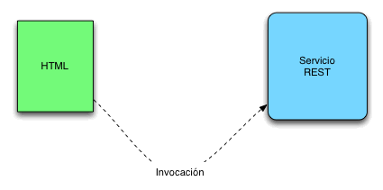

# JAX-RS Client y Servicios REST





**El uso de servicios REST es cada día más común** y han sido construidos para poder gestionar de una forma sencilla el intercambio de información entre sistemas heterogeneos. Estamos muy habituados a utilizar Ajax para comunicarnos con un servicio REST.

<figure><figcaption></figcaption></figure>

Es también bastante habitual invocar servicios REST desde las APIs nativas de nuestras aplicaciones móviles como pueden ser aplicaciones desarrolladas con Android o IOS.

<figure><figcaption></figcaption></figure>

Sin embargo pueden existir otras muchas situaciones en las que podemos querer invocar a un servicio REST, como por ejemplo desde el mundo Java Clásico.

### JAX-RS Client

A partir de  la versión 2.0 del API de REST (JAX-RS) de Java EE se soporta **el uso de un API a nivel de Cliente de tal forma que podamos trabajar de una forma cómoda con ella (JAX-RS Client)** . Vamos a ver un ejemplo sencillo. Para ello lo primero que tendremos que hacer es construirnos un proyecto Maven con Eclipse y añadir las siguientes dependencias.

```
```

```
&amp;lt;dependency&amp;gt;
 &amp;lt;groupId&amp;gt;javax.ws.rs&amp;lt;/groupId&amp;gt;
 &amp;lt;artifactId&amp;gt;javax.ws.rs-api&amp;lt;/artifactId&amp;gt;
 &amp;lt;version&amp;gt;2.0&amp;lt;/version&amp;gt;
 &amp;lt;/dependency&amp;gt;
 
 &amp;lt;dependency&amp;gt;
 &amp;lt;groupId&amp;gt;org.glassfish.jersey.core&amp;lt;/groupId&amp;gt;
 &amp;lt;artifactId&amp;gt;jersey-client&amp;lt;/artifactId&amp;gt;
 &amp;lt;version&amp;gt;2.12&amp;lt;/version&amp;gt;
 &amp;lt;/dependency&amp;gt;
 
 &amp;lt;dependency&amp;gt;
 &amp;lt;groupId&amp;gt;org.glassfish.jersey.media&amp;lt;/groupId&amp;gt;
 &amp;lt;artifactId&amp;gt;jersey-media-json-jackson&amp;lt;/artifactId&amp;gt;
 &amp;lt;version&amp;gt;2.11&amp;lt;/version&amp;gt;
 &amp;lt;/dependency&amp;gt;
 &amp;lt;/dependencies&amp;gt;
```

Estamos añadiendo tres dependencias la primera el API de cliente de REST , la segunda las librerías que lo implementan y por ultimo  las capacidades para trabajar con JSON a nivel de esta API . Una vez tenemos las dependencias definidas podemos construirnos un sencillo programa Java que accede a un servicio REST.

```
package com.arquitecturajava;
 
import java.io.Serializable;
 
public class Factura implements Serializable {
 
private String id;
private String concepto;
private int importe;
public String getId() {
return id;
}
public void setId(String id) {
this.id = id;
}
public String getConcepto() {
return concepto;
}
public void setConcepto(String concepto) {
this.concepto = concepto;
}
public int getImporte() {
return importe;
}
public void setImporte(int importe) {
this.importe = importe;
}
}

```

```
package com.arquitecturajava;
 
import javax.ws.rs.client.Client;
import javax.ws.rs.client.ClientBuilder;
import javax.ws.rs.core.MediaType;
 
public class Principal {
 
public static void main(String[] args) {
 
Client cliente = ClientBuilder.newClient();
Factura f = cliente.target("http://localhost:3000/mifactura")
.request(MediaType.APPLICATION_JSON_TYPE).get(Factura.class);
 
System.out.println(f.getId());
System.out.println(f.getConcepto());
System.out.println(f.getImporte());
 
}
 
}
 
&amp;amp;nbsp;
```

De esta forma estaremos accediendo a la URL /mifactura de n**uestro servidor que nos devolverá una sencilla factura en formato JSON** .

<figure><figcaption></figcaption></figure>

Realizada esta operación simplemente sacamos por pantalla los datos:

<figure><figcaption></figcaption></figure>

Otros artículos relacionados:
